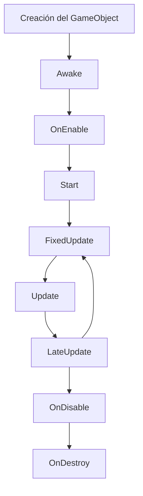

# Arquitectura técnica

Cómo está armado el código, no qué hace el juego (para eso ver `CONTEXTO_JUEGO.md`). Esto es una
foto de la arquitectura tal como quedó tras la sesión de setup + cámara al hombro — revisa
`git log` para lo que cambie después.

## Stack

- **Unity 6000.6.0f1**, **URP** (Universal Render Pipeline).
- **New Input System** (`UnityEngine.InputSystem`) — con fallback manual a `Keyboard`/`Mouse`
  cuando no hay `InputActionReference` asignado (ver sección Input).
- C# puro para toda la lógica de gameplay (sin ECS/DOTS, sin Visual Scripting pese a que el
  paquete está instalado).

## Principios y Buenas Prácticas Obligatorias (Basado en `buenas-practicas.md`)

Este proyecto se rige por reglas estrictas de optimización desde el día 1 para evitar cuellos de botella (stuttering, GC spikes) a futuro. Todo código nuevo **debe** respetarlas:

1. **Gestión de Memoria y Cero Allocations (GC)**: 
   - Está **estrictamente prohibido** usar `new`, `Instantiate()` o `Destroy()` dentro del game loop (`Update`/`FixedUpdate`). Todo objeto que nazca y muera frecuentemente debe usar Object Pooling (ver `ObjectPoolManager`).
   - Evita closures, iteradores ocultos (LINQ) y structs/arrays temporales por frame en código caliente (movimiento, físicas).
2. **Cacheo Obligatorio (Ciclo de vida)**:
   - Todo lookup costoso (`GetComponent<T>()`, `Find()`, `Camera.main`) debe hacerse **una sola vez** en `Awake()` o en constructores, y guardarse en una variable de clase. Nunca los uses dentro de un loop o de `Update()`.
3. **Update Inteligente (Dirty Flags)**:
   - No recalcules lógica matemática cada frame si sus inputs no han cambiado (ej: usa `sqrMagnitude` para flags rápidas, calcula direcciones solo cuando hay input).
4. **Respeto Absoluto al Ciclo de Vida de Unity**:
   - `Awake()`/`Start()` para inicializar y cachear.
   - `Update()` / `LogicUpdate()` para leer input y lógica pura que no altera físicas.
   - `FixedUpdate()` / `PhysicsUpdate()` **exclusivamente** para lógica física, aplicación de fuerzas, y rotación/traslación del personaje.
5. **Física y Colisiones Optimizadas**:
   - Nunca uses fuerza bruta (O(n²)) para físicas. Si haces verificaciones constantes del entorno, usa pre-filtros espaciales baratos (ej: `Physics.OverlapSphereNonAlloc`) antes de disparar múltiples `Raycast` costosos.
6. **Desacople e Interfaces (SRP)**:
   - Cada componente hace una sola cosa (`GroundChecker`, `HealthSystem`, `EnvironmentChecker`).
   - Uso de interfaces (`IInputProvider`, `IDamageable`) para que los sistemas se comuniquen sin depender de clases concretas concretas.

## Jugador: Facade + State Machine

```
Player.cs (Facade)
 ├─ PlayerInputHandler   (IInputProvider) — lee teclado/mouse/Input System
 ├─ PlayerMovement                        — dueño de la StateMachine y la física
 │   └─ PlayerStateMachine
 │       ├─ PlayerIdleState
 │       ├─ PlayerRunState
 │       ├─ PlayerJumpState
 │       ├─ PlayerSlideState
 │       ├─ PlayerLightAttackState / PlayerHeavyAttackState
 │       ├─ PlayerBlockState / PlayerDodgeState
 │       └─ [deshabilitados] PlayerVaultState, PlayerLedgeGrabState,
 │                            PlayerLedgeClimbState, PlayerWallJumpState
 ├─ GroundChecker         (IGroundChecker) — raycast contra CapsuleCollider.bounds
 ├─ EnvironmentChecker                     — raycasts de pared/cornisa (solo usado por
 │                                           los estados deshabilitados de arriba)
 └─ HealthSystem / Hitbox                  — combate
```

- **`Player.cs`** es un Facade: no implementa lógica de movimiento ni de input, solo orquesta —
  cachea referencias en `Awake()` y en `FixedUpdate()` lee del `IInputProvider` y se lo pasa a
  `PlayerMovement.ProcessMovement(...)`. También expone `Player.Instance` (singleton simple) y el
  evento estático `OnPlayerSpawned`, que usa `CameraFollow` para auto-detectar al jugador sin que
  nadie tenga que arrastrar una referencia en el Inspector.
- **`PlayerMovement`** es el dueño real del estado: cachea `Rigidbody`/`CapsuleCollider`, construye
  la `PlayerStateMachine` con todas las instancias de estado en `Awake()`, y expone propiedades de
  solo lectura (`InputX`, `InputZ`, `MoveDirection`, `IsGrounded`, etc.) que los estados leen. Los
  estados nunca tocan el Rigidbody directamente — todo pasa por `SetVelocity(...)`,
  `SetKinematic(...)`, `ShrinkCollider(...)` para que `PlayerMovement` sea el único punto que sabe
  cómo se mueve físicamente el personaje.
- **Movimiento (ver también `docs/CAMBIOS.md`)**: el input crudo (`InputX`/`InputZ`, -1..1 cada
  uno) se proyecta sobre el forward/right "aplanado" (sin componente Y) de `Camera.main` para
  obtener `MoveDirection`, un vector de mundo normalizado. El personaje gira hacia esa dirección
  con `Mathf.SmoothDampAngle` (suaviza el giro; ver `turnSmoothTime` en el Inspector). Esto hace
  que **cámara y movimiento estén acoplados por diseño**: la cámara sigue `transform.forward` del
  jugador, y el jugador interpreta el input según hacia dónde mira la cámara — es el patrón
  estándar de un controlador de tercera persona (el mismo que usan los tutoriales clásicos de
  Brackeys/Unity para este tipo de cámara).
- **Convención de pivote**: el `Transform` raíz del Player representa el **centro del torso**, no
  los pies (`CapsuleCollider.center = (0,0,0)`, con `CenterPoint` en el mismo punto para los
  raycasts de `EnvironmentChecker`, y `HeadPoint` en `height/2` hacia arriba). Si alguna vez
  cambias el modelo o el collider, respeta esta convención o vas a tener que tocar
  `GroundChecker`/`EnvironmentChecker` también.
- **Patrón State**: cada estado (`PlayerState` abstracta: `Enter/LogicUpdate/PhysicsUpdate/Exit`)
  decide sus propias transiciones llamando a `stateMachine.ChangeState(...)`. No hay una tabla de
  transiciones centralizada — las reglas de "de qué estado a cuál" viven dentro de cada estado. Al
  agregar un estado nuevo, decide sus transiciones ahí, no en `PlayerStateMachine` (que es
  deliberadamente genérica y no sabe nada de estados concretos).

### Input

`PlayerInputHandler` implementa `IInputProvider`. Cada acción tiene dos caminos: si hay un
`InputActionReference` asignado en el Inspector, lo usa; si no, cae a leer `Keyboard`/`Mouse`
directamente (`Keyboard.current`, WASD/flechas + Space/Shift/F/E + click izq/der). Ahora mismo el
proyecto usa el camino de fallback (los `InputActionReference` están vacíos en el prefab) — no es
un bug, es la configuración actual. Si en algún momento se migra a Input Actions "de verdad"
(un asset `.inputactions` con un mapa de acciones), solo hay que asignar las referencias; el
código ya soporta ambos caminos sin cambios.

### Combate

- **`HealthSystem`** (`IDamageable`): vida con clamp, i-frames por tiempo (no coroutine),
  eventos (`OnHealthChanged`, `OnDeath`, `OnDamageReceived`) para que UI/VFX se enganchen sin
  acoplarse al combate.
- **`Hitbox`**: overlap por radio contra `targetLayers`, aplica daño a lo que implemente
  `IDamageable`. Los estados de ataque (`PlayerLightAttackState`/`PlayerHeavyAttackState`) todavía
  no disparan animación real (hay comentarios `// TODO: trigger animation` marcando dónde
  conectar un `Animator` cuando exista uno).

## Spawning y Object Pooling

```
GameManager (ObjectPoolManager)
  pools: [ "player" -> Player.prefab, "spawnVFX" -> partícula ]

Spawner (uno por punto de spawn en la escena)
  entityId: "player"  |  triggerType: OnStart / Timer / OnTriggerEnter / Manual
  → ObjectPoolManager.Instance.Spawn(entityId, transform.position, transform.rotation)
```

- **`ObjectPoolManager`** es un singleton (`Instance`) que pre-instancia N copias de cada prefab
  configurado (`pools`), desactivadas, y las entrega/recicla por `poolId` (string). Los objetos
  poolables implementan `IPoolable` (`PoolId`, `OnSpawn()`, `OnDespawn()`) para resetear su propio
  estado al reciclarse — el pool nunca sabe qué tipo de objeto es, solo lo activa/desactiva y
  reposiciona.
- **`Spawner`** es deliberadamente "tonto": no sabe pooling, solo le pide al
  `ObjectPoolManager` que spawnee un `entityId` en su propia posición, según un trigger
  configurable (`OnStart`, `Timer`, `OnTriggerEnter`, `Manual`).
- **El jugador se spawnea así, no está colocado a mano en la escena.** El `Spawner` de
  `Level-1.unity` tiene `entityId: player`, `triggerType: OnStart` — el Player.prefab pooleado en
  `GameManager` aparece en la posición del Spawner apenas arranca la escena. Si quieres mover
  dónde aparece el jugador, mueve el `Spawner`, no busques un Player en la Hierarchy antes de que
  el juego corra (no existe hasta el primer `Spawn()`).

## Cámara

`CameraFollow` (en Main Camera) es standalone respecto al jugador: se engancha al evento estático
`Player.OnPlayerSpawned` para encontrar su target sin referencias manuales, y en `LateUpdate`
calcula una posición "al hombro" (`shoulderHeight`/`shoulderSide`/`distance` desde el target) con
un `SphereCast` de por medio para no atravesar paredes. No conoce `PlayerMovement` ni al revés —
la única relación entre ambos es indirecta: el jugador lee `Camera.main.transform` para su
movimiento relativo a cámara, y la cámara lee `transform.forward` del jugador para su encuadre.

## Herramientas de Editor (`Assets/scripts/Editor/`, no se compilan en build)

- **`SceneAutoLoader`**: `[InitializeOnLoad]` + `SessionState` — carga `Level-1.unity` una vez por
  sesión de Editor si no es la escena activa.
- **`PlayerCharacterSetup`**: `[MenuItem]` — reemplaza el modelo visual de `Player.prefab` y ajusta
  collider/`HeadPoint` a las dimensiones reales del modelo importado. Ver `docs/CAMBIOS.md` para
  el detalle de por qué esto tiene que correr dentro del Editor y no se puede hacer editando YAML
  a mano.

## Dónde vive cada cosa

```
Assets/
  scripts/
    Camera/CameraFollow.cs
    Core/
      Combat/{HealthSystem,Hitbox}.cs
      Interfaces/{IDamageable,IGroundChecker,IInputProvider,IPoolable}.cs
      Spawning/{ObjectPoolManager,Spawner,ReturnToPoolDelay}.cs
    Player/
      Player.cs, PlayerMovement.cs, PlayerInputHandler.cs,
      GroundChecker.cs, EnvironmentChecker.cs
      StateMachine/
        PlayerState.cs, PlayerStateMachine.cs
        States/{PlayerGroundedStates,PlayerAirStates,PlayerParkourStates,PlayerCombatStates}.cs
    Editor/{SceneAutoLoader,PlayerCharacterSetup}.cs
  Prefabs/{Player,Enemy,GameManager,Spawner,Main Camera,...}.prefab
  Characters/Player/character.fbx
  Scenes/Level-1.unity
```

## Deuda técnica conocida (documentada a propósito, no escondida)

- **Parkour deshabilitado**: `PlayerVaultState`, `PlayerLedgeGrabState`, `PlayerLedgeClimbState`,
  `PlayerWallJumpState` y buena parte de `EnvironmentChecker` siguen escritos pero inalcanzables
  desde que el movimiento pasó a 3D libre (asumen raycasts en un eje mundial fijo). Rehacerlos
  implica decidir cómo se detectan paredes/cornisas en un mundo abierto, no es un simple ajuste.
- **Sin animaciones conectadas todavía**: los estados de combate tienen comentarios
  `// TODO: trigger animation` señalando dónde falta un `Animator Controller` una vez que el
  modelo importado traiga (o se le agreguen) clips.
- **`FacingDirection` (escalar ±1)** se mantiene solo por compatibilidad con los estados de
  parkour deshabilitados — el movimiento real ya no lo usa, usa `MoveDirection`
  (`Vector3`) y `transform.forward`. Si algún día se borra el código de parkour, este campo
  también se puede borrar.

---

## Anexo: Manual de Buenas Prácticas y Optimización

*El siguiente texto es el estándar obligatorio de optimización y ciclo de vida para todo el proyecto, integrado desde `buenas-practicas.md`.*

Buenas prácticas de optimización a nivel de código, para llevarlas desde el día 1 (no como parche al final):

1. Gestión de memoria — evitar el Garbage Collector
Object pooling obligatorio para todo lo que se crea/destruye seguido (balas, partículas, enemigos, popups de daño). Nunca Instantiate()/new dentro del game loop.
Evitá crear structs/arrays temporales dentro de Update() — cada allocation dentro del loop principal genera presión sobre el GC y causa micro-stutters.
Analogía: esto es al frame rate lo que un memory leak es a un servidor Node.js: invisible al principio, catastrófico bajo carga.

2. Cachear referencias, nunca buscarlas en el loop
GetComponent(), Find(), document.querySelector() — todo lookup costoso se hace una sola vez (en Awake/Start/constructor) y se guarda en una variable.
Analogía: es a como vos no harías una query a la DB dentro de un for en un endpoint — cacheás el resultado antes del loop.

3. Update solo lo que necesita actualizarse
No pongas lógica en Update() si puede vivir en eventos o corrutinas/timers. Si algo cambia cada 0.5s, no lo chequees cada frame.
Usá dirty flags: marcá un objeto como "necesita recalcularse" en vez de recalcular todo siempre.
Analogía: es al game loop lo que la invalidación de caché es a un backend: recalculás solo cuando algo realmente cambió.

4. Estructuras de datos según acceso, no por comodidad
Arrays/listas contiguas (data-oriented) para lo que se itera masivamente (miles de enemigos, partículas) en vez de listas de objetos con referencias dispersas.
Diccionarios/hashmaps solo para lookups por clave, no para iterar.
Esto es la base de ECS "real" (Unity DOTS, Bevy): separar datos (arrays planos) de comportamiento (sistemas que iteran esos arrays) para aprovechar cache de CPU.

5. Batching de renderizado
Minimizá draw calls: combiná sprites en atlas/spritesheets, usá materiales compartidos, agrupá por textura.
Static batching para geometría que no se mueve, GPU instancing para muchos objetos iguales (árboles, balas).
Analogía: un draw call es a la GPU como una request HTTP es a un servidor: menos requests grandes > muchas requests chicas.

6. Físicas y colisiones
Nunca chequees colisiones por fuerza bruta (todos contra todos, O(n²)). Usá spatial partitioning: grillas, quadtrees u octrees.
Simplificá los colliders: cápsulas/cajas en vez de mesh colliders exactos siempre que se pueda.
Fixed timestep para física (FixedUpdate), separado del framerate variable de render.

7. Profiling antes de optimizar (regla de oro)
Nunca optimices "a ojo". Usá el profiler del motor (Unity Profiler, Godot Profiler, Chrome DevTools si es web/Phaser) para encontrar el cuello de botella real.
Medí: CPU vs GPU bound, memory allocations por frame, draw calls.
Analogía: esto es al código de juego lo que un APM (New Relic, etc.) es a tu backend en producción: no adivinás, medís.

8. LOD y culling
Frustum culling: no proceses/renders lo que la cámara no ve (la mayoría de motores lo hace automático, pero tu lógica de gameplay no).
Level of Detail (LOD): menos polígonos/detalle a mayor distancia.
Occlusion culling para no renderizar lo que está tapado por otros objetos.

9. Asincronía sin bloquear el hilo principal
Carga de niveles, assets pesados o generación procedural → siempre async/streaming, nunca en el frame principal (causa freezes).
Analogía: es exactamente al game loop lo que un await no bloqueante es a un endpoint de Node: nunca bloqueás el hilo que atiende todo lo demás.

10. Compilación y builds
Compilá en modo Release/optimizado para medir rendimiento real (Debug builds mienten sobre performance).
Stripping de código no usado y compresión de assets (texturas comprimidas, audio en formatos livianos) antes de shippear.

Checklist mental por feature que programás:

¿Esto se ejecuta cada frame o solo cuando cambia algo?
¿Estoy creando objetos nuevos aquí, o reutilizando del pool?
¿Esta búsqueda/lookup está cacheada?
¿Esto se puede batchear o agrupar con algo similar?

Profundizando específicamente en reducir milisegundos de CPU y GPU — la diferencia entre 60fps sólidos y stuttering:

Diagnóstico: primero identificá si sos CPU-bound o GPU-bound
Si bajás la resolución y el framerate sube → sos GPU-bound.
Si bajás la resolución y el framerate NO cambia → sos CPU-bound (o bound por el hilo principal/lógica).
Todo lo que sigue se separa en base a esto, porque optimizar lo que no es el cuello de botella es tiempo perdido.

🖥️ Reducir ms de CPU

1. Multithreading real, no solo async
Separá el trabajo en jobs paralelos cuando el motor lo permita (Unity Job System + Burst, Godot con threads, Web Workers en JS/Phaser).
Física, pathfinding, IA y generación procedural son candidatos ideales para correr en threads separados del render.

2. Evitá el "one big Update()"
Si tenés 1000 enemigos, no llames Update() en cada uno por separado (overhead de invocación de método). Agrupá la lógica en un solo sistema que itere un array plano.
Analogía: esto es a CPU lo que N+1 queries es a una API: mil llamadas chicas cuestan más que una llamada que procesa mil registros.

3. Evitá reflection, boxing/unboxing y allocations ocultas
Cuidado con LINQ dentro de loops calientes (genera allocations invisibles), con closures que capturan variables (generan garbage), y con string concatenados en el loop (usá StringBuilder/pooled strings).
Cacheá tipos y evitá GetComponent<T>() con reflection repetida.

4. Batchear el trabajo de IA y pathfinding
No recalcules pathfinding de todos los NPCs el mismo frame. Distribuí el cálculo en varios frames (time-slicing): 50 enemigos, 10 por frame.
Usá "flow fields" en vez de A* individual si tenés muchísimos agentes moviéndose al mismo destino.

5. Fixed timestep desacoplado del render
Física y lógica de simulación a timestep fijo (ej. 50Hz), render a la tasa que dé la GPU. Así no gastás CPU recalculando física más veces de las necesarias.

🎮 Reducir ms de GPU

1. Draw calls: la métrica número uno
Cada draw call tiene overhead fijo de CPU→GPU. Combiná mallas estáticas (static batching), usá GPU instancing para objetos repetidos, y atlas de texturas para reducir cambios de material.
Un cambio de shader/material = rompe el batch. Ordená el renderizado por material cuando puedas.

2. Overdraw — el enemigo silencioso
Overdraw = pintar el mismo píxel varias veces (partículas superpuestas, UI transparente en capas, sprites que se solapan). Cada capa transparente extra cuesta fillrate.
Reducí partículas transparentes superpuestas, usá additive blending con cuidado, y activá el visualizador de overdraw del motor para verlo directamente.

3. Shaders: complejidad y branching
Evitá if/branching dentro de shaders cuando se pueda resolver con matemática (lerp, step) — las GPUs ejecutan mal las ramas condicionales en paralelo (warp divergence).
Reducí cálculos por-pixel que podés precalcular por-vértice o en CPU una sola vez.

4. Resolución de texturas y mipmaps
Texturas del tamaño real necesario, no 4K para un ícono de 64px. Mipmaps activados siempre (evita aliasing y ahorra ancho de banda de memoria a distancia).
Compresión de textura específica de plataforma (ASTC, ETC2, BC7) en vez de formatos sin comprimir.

5. Shadows y post-processing: los que más cuestan
Sombras dinámicas son de lo más caro en GPU: reducí resolución de shadow maps, distancia de sombras, o usá sombras horneadas (baked) para geometría estática.
Post-processing (bloom, SSAO, motion blur) se apila: cada efecto es un pase extra sobre toda la pantalla. Perfilá cada uno individualmente, apagalos de a uno para medir impacto real.

6. Resolución dinámica
Técnica usada en consolas: bajar la resolución de render dinámicamente cuando el frametime sube, y subirla cuando hay margen. Mantiene el framerate estable a costa de nitidez momentánea.

Herramientas para medir esto en concreto:
Motor: Unity -> Profiler (CPU/GPU timeline), Frame Debugger (draw calls)
Motor: Godot -> Monitor de rendimiento integrado + Debugger > Visual Profiler
Motor: Web/Phaser -> Chrome DevTools > Performance + Rendering tab (overdraw, layers)
General GPU: RenderDoc (gratis, multiplataforma, inspecciona frame por frame)

Regla de oro final: medí el frametime en milisegundos (no solo FPS), porque FPS es engañoso — la diferencia entre 300fps y 200fps es irrelevante (1.3ms), pero la diferencia entre 60fps y 30fps es enorme (16ms extra reales por frame).

## Ciclo de vida en Unity

| Método | ¿Cuándo ocurre? | ¿Para qué sirve? |
|---|---|---|
| Awake() | Cuando se carga/crea el objeto | Inicializar variables o referencias internas. Ocurre antes de Start(). |
| OnEnable() | Cada vez que el objeto o componente se activa | Ejecutar lógica cada vez que el componente entra en funcionamiento. |
| Start() | Antes de su primera actualización | Inicialización que necesita que otros objetos ya hayan sido creados. Se ejecuta una sola vez. |
| Update() | Una vez por cada frame | Lógica general del juego: movimiento, input, temporizadores, etc. |
| FixedUpdate() | En intervalos de tiempo fijos | Principalmente lógica relacionada con física y Rigidbody. |
| LateUpdate() | Después de Update() | Lógica que debe ocurrir después de que los demás objetos se hayan actualizado, como cámaras. |
| OnDisable() | Cuando el objeto o componente se desactiva | Detener procesos, eventos o lógica temporal. |
| OnDestroy() | Cuando el objeto es destruido | Limpieza final antes de que el objeto deje de existir. |



Es muy importante tomar en cuenta que FixedUpdate() no ocurre necesariamente una vez por cada Update(). Tiene su propio intervalo de tiempo, así que puede ejecutarse cero, una o incluso varias veces entre frames.

Los métodos del ciclo de vida permiten indicar a Unity **en qué momento debe ejecutarse determinada lógica**.

No todos los métodos están pensados para hacer lo mismo:
- `Awake()` y `Start()` se utilizan principalmente para inicialización.
- `Update()` está relacionado directamente con los frames.
- `FixedUpdate()` está especializado principalmente en física.
- `LateUpdate()` permite ejecutar lógica después de las actualizaciones normales.
- `OnEnable()` y `OnDisable()` reaccionan al estado activo del objeto.
- `OnDestroy()` permite realizar acciones finales antes de eliminar un objeto.
