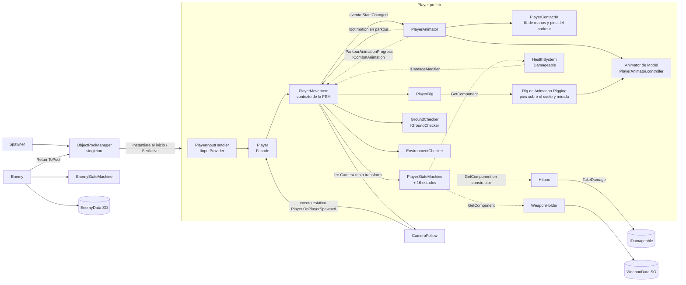

# Awakened Warrior — Arquitectura técnica

> Parte de la documentación del proyecto: [`contexto.md`](contexto.md) (qué es el juego) ·
> **`arquitectura.md`** (cómo está construido) · [`features.md`](features.md) (qué hay
> implementado y buenas prácticas). Los estados (✅ 🟡 🔧 📋 ⬜ ⚠️ ⏸️) y las marcas ✔/❓ se
> definen en `contexto.md` §1.
>
> Este documento describe el **estado real del código** al 2026-10-02 (Parkour Obstacle Standard,
> prefabs de obstáculos, Parkour Test Area reconstruida con ellos y segunda pasada de calidad de
> movimiento y **reconstrucción del movimiento y del parkour (P28)**: cámara orbital, locomoción
> direccional con marchas, agacharse, slide con clips nuevos, mantle, drop y salto de cornisa, roll
> de aterrizaje; ver el historial en `features.md` §5). Lo que todavía no existe
> aparece marcado como 📋 Planeado o ⬜ Pendiente. Desde el 2026-10-08 el jugador **se mueve con un
> `CharacterController` y su locomoción es motion matching (MxM)** sobre el mocap de Kinematica y
> 100STYLE (fases 1–2 de §7.2, P29–P33); el parkour y el combate siguen como acciones del Animator.
> Desde el 2026-10-09 (Fase 3) el **vault** es un clip de mocap elegido de un catálogo y warpeado por
> código propio (P36, §5.17) y el **combate desarmado** sigue fases medidas de sus clips, busca el
> objetivo, golpea por contacto real y tiene reacciones al daño (P37, §5.4). También desde el 2026-10-09
> (fase 3 de §7.2) un rig de **Animation Rigging** pone los pies sobre el terreno, bloquea el pie de apoyo
> y gira la cabeza (P31, §5.10), y (fase 4) **el root motion del parkour también pasa por
> `CharacterController.Move`**: el controller ya no se apaga y solo deja pasar el obstáculo de la acción.

---

## 1. Stack y configuración del proyecto

| Elemento | Valor real | Dónde se ve |
|---|---|---|
| Unity | 6000.6.0f1 | `ProjectSettings/ProjectVersion.txt` |
| Render | URP 17.6.0 (`Universal Render Pipeline Asset.asset`) | `Packages/manifest.json` |
| Input | **Input System 1.20.0**, `activeInputHandler: 1` (solo el nuevo; `UnityEngine.Input` legacy **no** está disponible). Sin asset `.inputactions` ni project-wide actions registradas | `ProjectSettings/ProjectSettings.asset`, `EditorBuildSettings.asset` |
| Identidad del build | `productName: Awakened Warrior`, `companyName: SUNUX GAMES`, `com.SUNUXGAMES.AwakenedWarrior` | `ProjectSettings/ProjectSettings.asset` |
| Física | 3D (PhysX). Fixed Timestep **0.02 s** (50 Hz). Gravedad −9.81 | `TimeManager.asset`, `DynamicsManager.asset` |
| Navegación | `com.unity.ai.navigation` 2.0.14 instalado, **sin uso todavía** | manifest |
| Otros paquetes relevantes | ProBuilder 6.1.2, Timeline 6.6.0, uGUI 2.6.0, Test Framework 1.8.0, Profile Analyzer 1.4.0 | manifest |
| Motion matching | **MxM 2.3.3** (fork de Frost-Blade, MIT, commit `b84345b`) **embebido** en `Packages/com.frost-blade-studios.motion-matching` con parches para este proyecto (T26). Trae Burst, Collections y Mathematics. Mueve la locomoción del jugador (§5.1, §7.2) | `Packages/`, `packages-lock.json` |
| Animation Rigging | `com.unity.animation.rigging` **6.6.0** (paquete core de Unity 6.6, desde el 2026-10-09): el rig de pies y mirada del jugador, con dos constraints propios (P31, §5.10) | manifest |
| Paquetes instalados sin uso | Visual Scripting, AI Assistant (preview) / Inference, Collab Proxy, Device Simulator Devices, `com.unity.pipeline` 0.6.0-exp.1 (experimental), uGUI, Adaptive Performance settings | manifest / `Assets/` |
| Serialización | Force Text | `EditorSettings.asset` |
| Color space | Linear (`m_ActiveColorSpace: 1`) | `ProjectSettings.asset` |
| Lenguaje | C# puro, sin ECS/DOTS ni Visual Scripting | — |
| Namespaces | Solo las herramientas de Editor (`WarriorWoke.EditorTools`). El runtime está en el namespace global | — |
| Assembly definitions | Ninguna propia (todo compila en `Assembly-CSharp`). MxM trae las suyas (`MxM.Runtime`, `MxM.Editor`, `UTIL.*`); `MxM.Runtime` se referencia sola | — |
| Tests | Sin assembly de Test Framework. Pruebas propias de Editor: validación en batch y recorrido en Play Mode real (§5.9) | `scripts/Editor/` |

### Capas y tags (`ProjectSettings/TagManager.asset`)

| # | Layer | Uso actual |
|---|---|---|
| 6 | `Ground` | Suelo y edificios. Lo leen `GroundChecker` (Player) y `Enemy.groundLayer`. |
| 7 | `Obstacle` | Geometría de parkour. `EnvironmentChecker.obstacleLayer` en el Player. |
| 8 | `Player` | Objetos del Player.prefab. |
| 9 | `Enemy` | Enemy.prefab. `Hitbox.targetLayers` del Player apunta aquí (bits 512). |

Tags: solo los integrados (`Player`, `Untagged`, …). No hay tags personalizados.

## 2. Estructura de carpetas

```
Assets/
  scripts/                    ← todo el código del juego
    Camera/                   CameraFollow.cs
    Core/
      Combat/                 HealthSystem, Hitbox, WeaponData (SO), WeaponHolder, EnemyData (SO),
                              TrainingDummy (fixture de pruebas)
      Interfaces/             IDamageable, IDamageModifier, IGroundChecker, IInputProvider, IPoolable
      Spawning/               ObjectPoolManager, Spawner, ReturnToPoolDelay
    Enemy/
      Enemy.cs
      StateMachine/           EnemyState, EnemyStateMachine, States/EnemyGroundedStates.cs
    Player/
      Player.cs, PlayerMovement.cs, PlayerInputHandler.cs,
      PlayerAnimator.cs, PlayerAnimatorIds.cs, PlayerAnimatorIK.cs, PlayerContactIK.cs,
      IParkourAnimationProgress.cs, ICombatAnimation.cs, ParkourTimings.cs, CombatTimings.cs,
      VaultInfo.cs, LedgeInfo.cs, GroundChecker.cs, EnvironmentChecker.cs, PlayerMxMLocomotion.cs,
      PlayerRig.cs
      Rigging/                GroundContactConstraint, HeadLookConstraint (constraints de Animation
                              Rigging propios, P31)
      StateMachine/           PlayerState, PlayerStateMachine,
                              States/{PlayerGroundedStates, PlayerAirStates,
                                      PlayerParkourStates, PlayerCombatStates}.cs
    Game/                     KillZone (caída mortal, P38)
    Parkour/                  ParkourStandard (estándar de obstáculos, ParkourObstacleType, ParkourActions),
                              ParkourObstacle (componente de los obstáculos estándar),
                              VaultCatalog (SO de los vaults medidos), VaultPlanner (elige el vault)
    Editor/                   SceneAutoLoader, PlayerCharacterSetup, PlayerAnimationSetup, PlayerRigSetup,
                              ClipMeasurement, ParkourObstaclePrefabs, ParkourTestCircuitBuilder,
                              ParkourPlayModeTest, MocapRetargetProbe, MxMLocomotionBuilder,
                              MxMLocomotionProbe, VaultCatalogBuilder, CombatClipReview,
                              PoseSheetRenderer (no van al build)
  Data/MxM/                   MxM_Locomotion_PreProcess.asset (generado) + MxM_Locomotion_AnimData.asset
                              (base horneada, ~30 MB, Git LFS; §7.2)
  Data/Parkour/               VaultCatalog.asset (generado por VaultCatalogBuilder; §5.17)
  Prefabs/                    Player, Enemy, GameManager, Spawner, Main Camera,
                              Directional Light, Particle System
    Parkour/                  ParkourObstacle_{Step, LowVault, MediumVault, HighVault, Barrier,
                              Ledge, ClimbWall, Slide, JumpGap, Combined} (generados) +
                              Materials/ (Step, Vault, Mantle, Barrier, Ledge, Slide)
  Scenes/                     Level-1.unity (la iluminación horneada Scenes/<Escena>/ no se versiona)
  Characters/Player/          character.fbx (modelo Ch45 de Mixamo, Humanoid),
                              PlayerAnimator.controller (generado),
                              Textures/ (5 texturas extraídas de character.fbx),
                              Animations/ (2 transiciones de guardia Ch45) +
                              Animations/Generated/ (clips invertidos generados: WalkBackward,
                              CrouchToBracedHang)
  LowPoly/                    Animations/*.fbx (clips Humanoid usados por el jugador; paquete
                              "FREE Low Poly Human - RPG Character" de la Asset Store)
  ThirdParty/DynamicParkourSystem/
                              Animations/ (9 FBX Mixamo del Dynamic Parkour System),
                              LICENSE.txt (MIT), README.md (qué se tomó y cómo se adaptó)
  ThirdParty/Quaternius/      Animations/UAL1_Standard.fbx, UAL2_Standard.fbx (CC0: agacharse, slide,
                              mantle, roll, jab, cross y reacciones al daño), LICENSE.txt, README.md
  ThirdParty/Kinematica/      Character/Unit.FBX + Animations/ (25 tomas de mocap del Kinematica Demo,
                              Unity Companion License: la locomoción de MxM, P29, y los vaults, P36),
                              LICENSE.md, README.md
  ThirdParty/100STYLE/        Character/Neutral_Skeleton.fbx + Animations/ (16 tomas de 100STYLE, estilos
                              Neutral y Rushed, CC BY 4.0: retroceso y strafe de MxM, P34),
                              bvh2fbx.py (conversión con Blender), LICENSE.md, README.md
  ThirdParty/CMU/             Character/ (un esqueleto por sujeto) + Animations/ (patada frontal y gancho de
                              la CMU Mocap Database, uso libre con agradecimiento, P37), bvh2fbx.py,
                              LICENSE.md, README.md
  Tests/ParkourTestArea/      Materials/Losa.mat (suelo del área de pruebas)
  LowPolyCity/                asset pack de entorno (placeholder) + escena demo
  material/                   enemy, floors (.mat), ZeroFriction.physicMaterial
  ProBuilder Data/, URPDefaultResources/, Adaptive Performance/
Packages/com.frost-blade-studios.motion-matching/
                              MxM embebido (MIT) con el parche de Unity 6.6 (T26)
docs/                         contexto.md, arquitectura.md, features.md
GDD_Awakened_Warrior.pdf      GDD final
```

**Convención de carpetas para código nuevo** (📋 propuesta, sigue la estructura existente):

| Tipo de código | Carpeta |
|---|---|
| Sistemas compartidos por jugador y enemigos | `scripts/Core/<Sistema>/` |
| Contratos | `scripts/Core/Interfaces/` |
| Jugador | `scripts/Player/…` |
| Enemigos y jefes | `scripts/Enemy/…` (jefes en `Enemy/Bosses/`) |
| Flujo de juego (checkpoints, guardado, escenas) | `scripts/Game/` (nueva) |
| UI (menús, pausa) | `scripts/UI/` (nueva) |
| Assets de datos (ScriptableObjects) | `Assets/Data/<Tipo>/` (nueva) |
| Audio | `Assets/Audio/` (nueva) |

## 3. Escena y prefabs (estado real)

### `Level-1.unity` (única escena en Build Settings): Parkour Test Area

Desde el 2026-10-01 (decisión P24) la escena es el área de pruebas del parkour, y desde el
2026-10-02 (P25) **todos sus obstáculos son instancias de los prefabs estándar** (§5.13). La construye
`ParkourTestCircuitBuilder` (**Tools → Warrior Woke → Construir Parkour Test Area**) y contiene:
instancias de `GameManager`, `Spawner`, `Main Camera` y `Directional Light`, y el objeto
`ParkourTestArea` (suelo, límite de caída y once secciones; desde el 2026-10-10, P38, sin perímetro, pilares, bordillos ni el carril S04). **El Player no está colocado en la escena:**
lo crea el `Spawner` al iniciar (ver §5.6). La escena no referencia datos de iluminación horneada
(`m_LightingDataAsset` vacío); la luz direccional es Mixed y alumbra en tiempo real. No hay textos,
UI de depuración ni objetos fuera del área; la validación comprueba que no queda ningún collider
fuera de ella y que cada obstáculo cumple el estándar.

| Objeto | Qué es |
|---|---|
| `Suelo` | Caja de 78 × 80 m con la cara superior en y = 0 (layer Ground), x −34…44, z 15…−65. Material `Tests/ParkourTestArea/Materials/Losa.mat`. |
| `LimiteDeCaida` | Desde el 2026-10-10 (P38) el área no tiene perímetro: un trigger 6 m bajo el suelo, 30 m más ancho que él por cada lado (layer Ignore Raycast), con `KillZone`. Lo que cae por el borde muere (caída mortal, GDD §5.12) y el jugador reaparece en la entrada (`PlayerDeadState`). |
| `S01_Locomocion` … `S11_Mantle` | Carriles paralelos que empiezan en z = 0 y avanzan hacia −Z (S04 ya no existe). Contenido en `features.md` F32. |
| `S12_Combate` | El muñeco de entrenamiento (`TrainingDummy`, P37) en la franja libre de la entrada, en (38, 0, 10): un cuerpo de cápsula (0.25 × 1.8 m, layer Enemy, lo que golpean los ataques) que se inclina con los golpes, y dentro un poste delgado (radio 0.12, layer Ground) que detiene el cuerpo del jugador, porque las layers Player y Enemy no colisionan entre sí. Rigidbody kinemático (se mueve al retroceder), `HealthSystem` de 1000 HP con i-frames de 0.1 s. |
| `Spawner` | (0, 1.2, 8), mirando a −Z, en la entrada del área. |

Layers del área: los obstáculos estándar llevan la layer de su tipo (§5.13). Las escaleras y las
plataformas de aterrizaje son **fixtures** de prueba (cubos simples en
Ground, sin `ParkourObstacle`): no son parkour y el auto step puede subir los peldaños. El muñeco de
entrenamiento también es un fixture.

### Prefabs y sus componentes

| Prefab | Componentes de scripts propios | Notas |
|---|---|---|
| `Player` | `Player`, `PlayerMovement` (con `vaultCatalog` = `Data/Parkour/VaultCatalog`), `PlayerMxMLocomotion`, `PlayerInputHandler`, `PlayerAnimator`, `PlayerContactIK`, `PlayerRig`, `GroundChecker`, `EnvironmentChecker`, `HealthSystem` (i-frames 0.5 s), `Hitbox` (layer Enemy; los ataques del jugador usan su barrido y su búsqueda de objetivo, §5.4), `WeaponHolder` (sin arma inicial); en `Model`: `PlayerAnimatorIK`, `MxMAnimator` y `MxMTrajectoryGenerator` (paquete MxM), `RigBuilder` (Animation Rigging) con el hijo `ContactRig` (`Rig`) y sus hijos `FeetContact` (`GroundContactConstraint`) y `HeadLook` (`HeadLookConstraint`), §5.10 | Tag `Player`, layer 8. **`CharacterController`** (P30): altura 1.975, radio 0.35, piel 0.035, step offset 0.4, slope 45°, min move 0; sin Rigidbody ni CapsuleCollider. Hijos `CenterPoint`, `HeadPoint`, `Model` (character.fbx, en y = −1.009: las suelas de la pose idle tocan el suelo, debajo de la piel del controller). El `Animator` de `Model` usa `PlayerAnimator.controller`, culling **Always Animate** y Apply Root Motion activado (lo maneja `PlayerAnimatorIK`: el motor lo usa en la locomoción y en el parkour). El `MxMAnimator` usa `Data/MxM/MxM_Locomotion_AnimData`, root motion por aplicador (`PlayerAnimatorIK`), Foot IK Humanoid y raíz de animación = el Player. `stepLayer`, `ceilingLayer`, `landingLayer` y las capas de `PlayerContactIK` = Ground + Obstacle (los muros del IK, solo Obstacle). |
| `Enemy` | `HealthSystem` (100 HP, i-frames 0.2 s), `Hitbox` (daño 5) | Tag `Untagged`, layer 9. ⚠️ **No tiene `Enemy.cs`**, así que la IA no corre, y `Hitbox.targetLayers = 0`. La vida y el daño no son valores del GDD: el prefab se rehace con P4. Desde P24 no está colocado en ninguna escena. |
| `GameManager` | `ObjectPoolManager` | Pools: `player` → Player.prefab (1), `spawnVFX` → Particle System (1). |
| `Spawner` | `Spawner` | `entityId: player`, `triggerType: OnStart`. |
| `Main Camera` | `CameraFollow` | `autoDetectTarget` activo. |
| `Particle System` | `ReturnToPoolDelay` | VFX de spawn pooleado. |
| `Directional Light` | — | Luz Mixed, intensidad 1 (antes 0.3). |
| `Parkour/ParkourObstacle_*` (10) | `ParkourObstacle` | Obstáculos estándar generados desde `ParkourStandard`: raíz + cubos con `BoxCollider` en la layer del tipo. `Combined` anida los demás. Ver §5.13. |

## 4. Mapa de dependencias



Las líneas punteadas son dependencias que se resuelven con `GetComponent` en el constructor del
estado. Si el componente no está en el prefab, la referencia queda en `null` y el estado usa `?.`
para no fallar. Los tres (`Hitbox`, `HealthSystem`, `WeaponHolder`) están en el Player.prefab.

## 5. Sistemas

### 5.1 Jugador: Facade + máquina de estados — ✅ Implementado

```
Player (Facade)                 FixedUpdate → RouteInputToMovement()
 ├─ IInputProvider              PlayerInputHandler (Update: lee y bufferiza)
 └─ PlayerMovement              contexto de la FSM, único dueño del CharacterController (P30)
     ├─ ProcessMovement(...)    guarda inputs, CheckGrounded, UpdateMoveDirection, LogicUpdate
     ├─ FixedUpdate             objetivo de giro + CurrentState.PhysicsUpdate + intención para MxM
     ├─ LateUpdate (motor)      un Move por frame: root motion de MxM × peso + velocidad × (1 − peso), gravedad
     └─ PlayerStateMachine      Initialize / ChangeState (Exit → Enter)
PlayerMxMLocomotion             peso de la salida de MxM sobre el Animator Controller, pausa, strafe, regulador
PlayerAnimatorIK (en Model)     relevo de OnAnimatorMove/IK y aplicador de root motion de MxM (IMxMRootMotion)
PlayerRig                       pesos del rig de Animation Rigging (pies, bloqueo, Foot IK, mirada) según la FSM (P31)
```

- **`Player.cs`**: singleton simple (`Player.Instance`) y evento estático
  `OnPlayerSpawned` (se dispara en `OnEnable`). En `FixedUpdate` consume los triggers del input y
  llama a `PlayerMovement.ProcessMovement(...)`. Si faltan `PlayerMovement`, `IInputProvider` o
  `IGroundChecker`, los agrega en `Awake`.
- **`PlayerMovement.cs`**: cachea `CharacterController`, `PlayerMxMLocomotion`, `GroundChecker`,
  `EnvironmentChecker`, `HealthSystem` y `Camera.main.transform` en `Awake`, y construye las 16
  instancias de estado. Expone el estado de input (`InputX`, `InputZ`, `HasMoveInput`,
  `IsSprintHeld`, `JumpTriggered`, …), `AirTime` (segundos sin suelo), `AirPeakFeetY` (punto más
  alto desde que dejó el suelo), `IsBackpedaling`, `FeetY`, `HorizontalSpeed`,
  `StandingHalfHeight`, `PendingVault`, `CurrentLedge`, `ParkourProgress`, el evento
  `StateChanged`, el evento `Stepped`, `Velocity` y helpers (`SetVelocity(Vector3, float)`,
  `StopHorizontal(float)`, `AccelerateHorizontal(Vector3)`, `AccelerateAir(Vector3)`,
  `FaceDirection`, `TurnToward`, `Teleport`, `TryStepDown`, `ShrinkCollider`,
  `ResetCollider`, `HasCeilingOverhead`, `BeginRootMotion`, `ApplyRootMotion`, `SetRootMotionPose`,
  `EndRootMotion`, `QueueRootMotion`, `QueueActionRootMotion`, `TryFindWall`, `LimitAirIntoWalls`,
  `TryFindSlideObstacle`, `SlideReach`, `RegisterLanding`). Velocidades (P33, P34): `BaseSpeed` 3.4 (correr),
  `SprintSpeed = BaseSpeed × SprintMultiplier (1.41)` = 4.8, `WalkSpeed` 1.3 (Ctrl), `BackpedalSpeed`
  2.0 (correr hacia atrás), `CrouchSpeed` 1.0, `JumpSpeed` 4.5 (~1 m de salto); `Acceleration`
  10 m/s² y `Deceleration` 13 m/s² (solo mueven el cuerpo fuera de la locomoción MxM y durante su
  mezcla); `AirAcceleration` 4 m/s² y `AirDrag` 0.5 m/s² en el aire; slide contextual (§5.15): entra
  con la velocidad que lleva (máximo `SlideSpeed` 7.5, mínimo `SlideMinEntrySpeed` ≈ 2.7) y pierde
  `SlideFriction` 2.5 m/s² (9 si se suelta el input) hasta `SlideMinSpeed` 1.8. Roll al aterrizar desde
  `RollMinSpeed` 2 m/s. Implementa `IDamageModifier` y lo delega
  en `BlockState` (ver §5.4). Escucha `HealthSystem.OnDamageReceived` para cancelar el sprint y, en el
  suelo, pasar a la reacción al daño (`HurtState`, §5.4).
  **Regla:** los estados escriben `Velocity` con estos helpers y el motor mueve el cuerpo (ver
  "Motor" abajo). Mientras `IsRootMotionDriven` (vault, cornisa, subida, mantle, drop) la animación mueve
  el cuerpo a través de `ApplyRootMotion` / `SetRootMotionPose`, también con `CharacterController.Move`
  ("Acciones" abajo, §5.10); `Teleport` es la única forma de colocar el cuerpo desde fuera.
- **Motor (P30, 2026-10-08):** `LateUpdate` de `PlayerMovement` (`[DefaultExecutionOrder(-100)]`, antes
  del trabajo de `PlayerAnimator` y de la cámara) hace **un `CharacterController.Move` por frame**.
  Con el peso `w` de motion matching (0 = Animator Controller, 1 = MxM): desplazamiento horizontal =
  root motion del Animator (el de MxM, con su warping; la locomoción del controller va en el sitio) +
  (1 − w) × la velocidad de los estados; giro = root rotation × w + el giro suave hacia el objetivo ×
  (1 − w); la gravedad actúa sobre la vertical y en el suelo la mantiene pegada (−2 m/s). Después
  `Velocity` guarda lo que el cuerpo hizo de verdad: con w = 0 el movimiento real (un muro la frena),
  con w = 1 el de MxM suavizado (50 ms; un salto o un vault toman de ahí el impulso), y **durante la
  mezcla la orden de los estados** (medir ahí realimentaba el root motion en la parte (1 − w) y lo
  multiplicaba por 1/w: el cuerpo salía disparado). **Una colisión solo quita velocidad:** un escalón
  subido o el controller saliendo de una geometría (levantarse junto a una barra) mueven el cuerpo pero
  no se guardan como velocidad. En locomoción orientada el motor corrige la deriva de orientación de
  las tomas de strafe (10 /s), y en la libre solo el residuo de un giro de menos de 30° (5 /s). Un
  escalón subido por el controller (step offset) dispara `Stepped` para que el modelo lo suavice. El
  step offset baja a 0 con el cuerpo encogido (slide, agacharse): el controller sube primero el step
  offset para trepar un escalón, y en ese barrido la cápsula baja chocaba con la barra o el túnel.
  **Fase 3 (2026-10-08/09):** el step offset también es 0 en el aire (un salto de 1 m se montaba en un muro
  de 1.4 m: el controller trepa todo lo que esté dentro de su step offset); empujando contra un muro al
  alcance de las piernas (`TryFindWall`), la locomoción corre a lo largo de él o se detiene en lugar de
  correr en el sitio; en el aire, la velocidad hacia un muro que el salto no libra se frena para quedar
  junto a él (`LimitAirIntoWalls`, salvo si el salto pasa por encima y aterriza en la cima, no en su
  esquina); un cuerpo apoyado en una arista con el centro sobre una caída resbala de ella (`EdgeSlide`).
  **Ataques (P37):** el paso propio del clip de un ataque llega como root motion del Animator Controller
  (`QueueActionRootMotion`) y el motor lo aplica con `Move`, escalado por `ActionRootMotionScale`; mientras
  MxM se desvanece bajo un ataque no se aplica su root motion (es el delta completo del Animator y llevaba
  la deriva del idle). `TurnToward` gira el cuerpo a una velocidad fija hacia el objetivo de un ataque o
  hacia un golpe recibido.
  **Acciones de parkour (fase 4 de §7.2, 2026-10-09):** el controller ya no se apaga. `BeginRootMotion(cara,
  cima)` recibe los colliders del obstáculo que la acción cruza (medidos por `EnvironmentChecker` en
  `VaultInfo` / `LedgeInfo`; con un `ParkourObstacle`, todos los suyos) y el controller los deja pasar con
  `Physics.IgnoreCollision` hasta `EndRootMotion`; todo lo demás (el suelo, un muro detrás, un techo) sigue
  deteniendo el cuerpo. El root motion del clip (`ApplyRootMotion`) y la pose del warper del vault
  (`SetRootMotionPose`) se aplican con `Move`, y `RootMotionVelocity` mide lo que el cuerpo se movió de
  verdad. Durante la acción la cápsula cubre torso y cabeza: su base sube 0.5 m, porque el warper del vault
  baja el cuerpo hasta 0.39 m para una cima más baja que la del clip y una cápsula entera se apoyaba en el
  suelo (la mano quedaba 20–33 cm sobre su punto); `FeetY` descuenta esa subida. El step offset es 0
  mientras dura.
- **Locomoción por motion matching (P29, `PlayerMxMLocomotion`):** el `MxMAnimator` reproduce su propio
  PlayableGraph sobre el Animator de `Model`, y **el peso de la salida de ese grafo mezcla MxM sobre el
  Animator Controller, que sigue corriendo debajo** (medido el 2026-10-08: con peso 0 se ve el
  controller, con 0.5 una pose intermedia). En Idle y Run MxM entra (0.25 s); en cualquier otro estado
  sale (0.06 s, para que el parkour empiece su `MatchTarget` enseguida) y se pausa, y el controller
  reproduce la acción con `MatchTarget` e IK como antes (P22). Al volver, la trayectoria de MxM se
  reinicia mirando hacia donde mira el cuerpo y con el pasado de su velocidad real
  (`ForcePastTrajectoryByVelocity`): una acción que termina corriendo sigue como carrera.
  `PlayerMovement` le pasa la intención cada tick de física: dirección (mundo), velocidad de la marcha
  y, en locomoción orientada (caminar con Ctrl, correr hacia atrás), el modo strafe con la cámara como
  orientación y el tag `Strafe` (solo busca en 100STYLE); la orientada sigue así hasta detenerse. Un
  **regulador** frena la reproducción del mocap hasta un 88 % cuando el cuerpo va recto más rápido que
  la marcha (hay tomas de sprint a 5.4 m/s); nunca acelera ni actúa en giros, frenadas ni strafe (el
  warping de velocidad de MxM, que hace las dos cosas en todo momento, rompía las medias vueltas).
- **Flujo de un tick:** `LogicUpdate` y `PhysicsUpdate` corren los dos dentro del paso de física
  (el input se enruta desde `Player.FixedUpdate`), así que la lógica de estados corre a 50 Hz y no
  por frame. El input se captura en `Update` y se **bufferiza** con métodos `Consume*()`, para que un
  tap no se pierda entre frames ni se procese dos veces.
- **Movimiento relativo a cámara:** `MoveDirection` es el input proyectado sobre el
  forward/right aplanado de la cámara. Fuera de MxM (y en su mezcla), la rotación usa
  `Mathf.SmoothDampAngle` aplicado por el motor cada frame; el tiempo de giro pasa de
  `turnSmoothTime` (0.12 s) corriendo a `sprintTurnSmoothTime` (0.2 s) esprintando, y la velocidad
  angular máxima la limita la aceleración lateral (`MaxTurnRate` = 9 m/s² / velocidad, tope 720°/s;
  P28): un cuerpo rápido gira más abierto y una media vuelta a la carrera frena antes. Se bloquea en Vault, LedgeGrab, LedgeClimb, Slide, Block, Dodge, la reacción al daño y los
  ataques. **Caminar hacia atrás** (`IsBackpedaling`: input con componente atrás y sin sprint, en
  `Run`): el cuerpo mira al forward aplanado de la cámara en lugar de girar hacia `MoveDirection`, y
  avanza a `BackpedalSpeed`. Con MxM estas reglas son la intención: el mocap decide la curva, el pivot y
  la frenada, y la orientación orientada la corrige el motor.
- **Aceleración y momentum (P27; con MxM solo actúa en la mezcla y sin datos de MxM):** `Run` y `Idle` no escriben la velocidad de golpe. Corriendo hacia
  delante, `AccelerateAlongFacing` hace que **la velocidad siga la orientación del cuerpo** (gira con
  él a la misma velocidad angular) en lugar de ir en línea recta hacia el input: un giro curva la
  carrera y pierde velocidad según lo cerrado que sea (hasta un 40 %), y un input a más de 135° de la
  orientación frena primero, como quien planta un pie para girar. Antes la velocidad iba en línea
  recta hacia el input mientras el cuerpo ya miraba al nuevo lado: el personaje patinaba de lado.
  Caminando hacia atrás y en `Idle` se usa `AccelerateHorizontal` (recto hacia el objetivo). El
  blend de locomoción pasa por Walk y Jog al arrancar y al frenar. En el aire, `AccelerateAir` solo corrige el impulso
  con el input (`AirAcceleration`); sin input lo conserva casi intacto.
- **Aterrizaje (P23):** al tocar el suelo, `Fall` llama `RegisterLanding`: la caída desde
  `AirPeakFeetY` define una severidad (0 bajo 0.6 m, 1 hacia 3.2 m). En ese instante se absorbe
  parte de la velocidad horizontal y el resto vuelve durante la recuperación
  (`RecoverySpeedScale`, hasta 0.7 s). El control nunca se bloquea.
- **Transiciones:** cada estado decide sus salidas en `LogicUpdate`. `PlayerStateMachine` es
  genérica y no conoce estados concretos. Un estado nuevo se agrega creando la clase, instanciándola
  en `PlayerMovement.BuildStateMachine()` y agregando sus transiciones en los estados de origen.
- **Convención de pivote:** el origen del Player es el **centro del torso**
  (`CharacterController.center = (0,0,0)`), `CenterPoint` está en el origen y `HeadPoint` en `height/2`.
  `FeetY` = base de la cápsula − piel (un `CharacterController` descansa su piel por encima del suelo);
  `GroundChecker` calcula el pie desde la forma (centro y altura), no desde los bounds (con el
  controller apagado, como estaba el parkour hasta la fase 4, los bounds no valen). Si cambias el modelo, usa
  **Tools → Warrior Woke → Configurar Modelo del Jugador** (respeta la convención).

**Estados** (archivos en `Player/StateMachine/States/`):

| Archivo | Estados |
|---|---|
| `PlayerGroundedStates.cs` | `Idle`, `Run` (marchas: caminar con Ctrl, correr, sprint con Shift), `Crouch`, `Slide` |
| `PlayerAirStates.cs` | `Jump` (subida), `Fall` (caída) |
| `PlayerParkourStates.cs` | `Vault`, `Mantle`, `LedgeGrab`, `LedgeClimb`, `LedgeDrop` |
| `PlayerCombatStates.cs` | `LightAttack`, `HeavyAttack` (base común `PlayerAttackState`), `Hurt`, `Block`, `Dodge` |

```mermaid
stateDiagram-v2
    Idle --> Run: input
    Idle --> Mantle: Espacio + bloque de 0.8–1.5 m con sitio arriba
    Idle --> Vault: Espacio + obstáculo bajo delante
    Idle --> LedgeGrab: Espacio + cornisa a 1.9–2.7 m
    Idle --> Crouch: C
    Idle --> LedgeDrop: C junto a un borde con caída ≥ 1.6 m
    Idle --> Jump: Espacio + suelo
    Idle --> Fall: sin suelo > 0.15 s
    Idle --> Block: L
    Idle --> Dodge: Q + suelo + cooldown 1 s
    Idle --> LightAttack: J
    Idle --> HeavyAttack: K
    Run --> Mantle: Espacio + bloque (lento, o demasiado alto para el vault)
    Run --> Vault: Espacio + obstáculo (corriendo, espera el punto de despegue)
    Run --> LedgeGrab: Espacio + cornisa a 1.9–2.7 m
    Run --> Slide: C con momentum (≥ 3.9 m/s), suelo plano y espacio
    Run --> Crouch: C sin momentum
    Run --> LedgeDrop: C junto a un borde
    Run --> Dodge: Q + cooldown 1 s
    Run --> Jump: conserva el sprint
    Run --> Fall: sin suelo > 0.15 s, conserva el sprint
    Run --> Idle: sin input
    Jump --> LedgeGrab: cornisa al alcance de las manos
    Jump --> Fall: apex en el aire
    Jump --> Idle: apex ya en el suelo
    Fall --> LedgeGrab: cornisa al alcance de las manos
    Fall --> Run: aterriza con input (RegisterLanding)
    Fall --> Idle: aterriza sin input (RegisterLanding)
    LedgeGrab --> LedgeClimb: Espacio (también pulsado durante el agarre)
    LedgeGrab --> Fall: dirección contraria al muro (suelta) o Espacio + esa dirección (salta lejos)
    LedgeDrop --> LedgeGrab: colgado del borde
    Mantle --> Run: clip al 95 %, con input
    Mantle --> Idle: clip al 95 %, sin input
    Crouch --> Idle: C, Shift o Espacio, sin techo
    Crouch --> Run: igual, con input
    LedgeClimb --> Run: clip al 97 %, con input
    LedgeClimb --> Idle: clip al 97 %, sin input
    Vault --> Run: marcador de escape del clip, con input
    Vault --> Idle: marcador de escape del clip, sin input
    Slide --> Run: momentum, espacio o ventana agotados, con input
    Slide --> Idle: igual sin input, o input contrario
    Slide --> Vault: Espacio con obstáculo saltable delante
    Slide --> Jump: Espacio en espacio abierto
    LightAttack --> LightAttack: J en cola al abrir la cadena (jab → cross → gancho)
    LightAttack --> HeavyAttack: K en la cadena (combo J → J → K)
    LightAttack --> Run: input en la recuperación
    LightAttack --> Dodge: Q en la recuperación
    LightAttack --> Idle: fin del clip
    HeavyAttack --> Run: input en la recuperación (si falló, al 93 % del clip)
    HeavyAttack --> Idle: fin del clip
    Idle --> Hurt: golpe recibido
    Run --> Hurt: golpe recibido
    LightAttack --> Hurt: golpe recibido
    Hurt --> Run: fin de la reacción, con input
    Hurt --> Idle: fin de la reacción
    Block --> Idle: suelta L
    Block --> LightAttack: contraataque
    Block --> Hurt: golpe por la espalda
    Dodge --> LightAttack: J tras la invulnerabilidad
    Dodge --> Run: 0.5 s
    Dodge --> Idle: 0.5 s
```



> **Sprint (GDD §5.2):** en `Run`, `IsSprint = CanSprint` en cada tick (Shift mantenido y sprint no
> cancelado). `CancelSprint()` lo apaga al atacar, bloquear o recibir daño y no se reactiva hasta
> soltar Shift. `IsSprint` no se limpia al pasar a `Jump`, `Fall` o `Vault`, así que conservan el
> impulso (GDD §5.2, §5.4); `Idle.Enter` lo reinicia.
>
> **Caída:** `PlayerFallState` cubre la caída después del apex del salto y la caída al salir de una
> orilla (`AirTime > FallGraceTime`, 0.15 s, para no reaccionar a escalones). Ahí irá la caída
> mortal (F15).

### 5.2 Input — ✅ Implementado (modo prototipo)

`PlayerInputHandler : IInputProvider`. Cada acción tiene dos caminos: un `InputActionReference`
opcional (todos vacíos en el prefab) o la lectura directa de `Keyboard.current`.
**Hoy se usa la lectura directa**, con los bindings del GDD §14 (P1) más Ctrl mantenido (caminar)
y C contextual (slide, agacharse o drop; P28); el ratón mueve la cámara (§5.7): WASD/flechas, Shift (sprint
mantenido, `IsSprintHeld`), Espacio, J, K, L (mantener), Q y C (slide). El ratón ya no se usa. La documentación oficial del Input System la describe como
adecuada solo para prototipos, porque se salta el rebinding, los esquemas de control y el gamepad.
No hay ningún asset `.inputactions` en el proyecto (la plantilla por defecto se eliminó; P6).

### 5.3 Detección de entorno — ✅ Implementado

- **`GroundChecker : IGroundChecker`**: un `Physics.SphereCast` corto hacia abajo con radio del 90 %
  del collider, desde justo encima de los pies, contra `groundLayer` (Ground + Obstacle). Cubre la
  huella de los pies, no solo un rayo bajo el centro, así que el cuerpo sigue "en el suelo" sobre el
  borde de un escalón en lugar de parpadear al aire.
- **`EnvironmentChecker`**: pre-filtro `Physics.OverlapSphereNonAlloc` (buffer de 4, radio 1.4)
  antes de los raycasts, y una comprobación de espacio libre (`CheckCapsule` de un cuerpo de pie).
  Todo lo que devuelve está medido sobre la geometría real. **Todos los límites (alcances, rangos de
  altura, profundidad, inset, alturas de los rayos, radio del pre-filtro) son constantes de
  `ParkourStandard` (§5.13)**; el componente ya no tiene campos serializados para ellos (antes el
  prefab tenía 1.2 m de pre-filtro y el código 1.4: el de 1.2 no cubría un obstáculo de 0.45 m a
  1.1 m de distancia). Los puntos de las manos y el aterrizaje del vault salen de cada clip medido
  (`VaultCatalog`, §5.17).
  - **Vault (`TryFindVault`, adaptado del Dynamic Parkour System, ver §5.12):** rayos sin
    allocations en layer Obstacle: (1) cara frontal a la altura de la rodilla dentro del alcance que
    pide el estado (`ParkourStandard.VaultSpotReach`: 1.8 m parado, más lejos corriendo) y de frente
    (`Dot ≥ 0.6`); **la dirección del vault es perpendicular a la cara**, no la del input; (2) cima
    entre `VaultMinHeight` (0.45 m) y `VaultMaxHeight` (1.1 m) sobre los pies; (3) profundidad ≤
    `VaultMaxDepth` (1.4 m), con un rayo de regreso desde detrás. Devuelve un `VaultInfo`: dirección,
    altura de la cima, borde frontal, profundidad y los colliders de la cara y la cima (los que el cuerpo
    atraviesa durante el vault, §5.1). El aterrizaje lo comprueba el planificador en el
    punto del clip elegido con `TryFindLanding` (suelo plano no más alto que la cima − 0.2 m, a lo sumo
    0.6 m bajo los pies y con sitio para estar de pie).
  - **Medición común de una cima (`TryFindTop`, P28):** cornisa y mantle comparten la misma medición:
    cara con dos rayos horizontales, normal, cima plana dentro del rango de altura, borde exacto sobre
    el plano de la cara y sitio para quedar de pie a cierta distancia del borde.
  - **Mantle (`TryFindMantle`):** rayos de cara a 0.5 y 1.0 m sobre los pies, alcance 1.0 m (más al
    correr, como el vault), cima a 0.8–1.5 m y sitio para quedar de pie a 0.9 m del borde (donde termina
    el clip).
  - **Drop (`TryFindDrop`):** de pie sobre una cima, el suelo se acaba a ≤ 0.9 m en la dirección del
    movimiento, debajo hay ≥ 1.6 m de caída, el bloque tiene cara para apoyar los pies y cabe un cuerpo
    colgado delante de ella. Devuelve el borde como un `LedgeInfo` (normal hacia fuera del bloque).
  - **Cornisa (`TryFindLedge`):** cara del muro con rayos a 1.2 m y 1.75 m sobre los pies (alcance
    1.0 m desde el suelo, 0.75 m en el aire) que mire al jugador (`Dot ≥ 0.5`); cima plana entre una
    altura mínima y máxima sobre los pies (1.9–2.7 m desde el suelo, 1.5–2.6 m en el aire); el
    **borde exacto** con un rayo horizontal justo bajo la cima; y espacio para estar de pie en el
    punto donde termina la subida (0.45 m tras el borde). Devuelve un `LedgeInfo`: borde, normal,
    cima, punto de pie, los colliders de la cara y la cima (atravesables durante la acción, §5.1), rotación
    de frente al muro y `EdgeAt(punto)` (el borde a la altura lateral de cualquier mano).
- **Auto step (`PlayerMovement.TryAutoStep`, adaptado del DPS):** en `Run`, si un rayo a 5 cm del
  suelo choca en la dirección de movimiento y otro a `ParkourStandard.StepMaxHeight` (0.4 m) no, busca la cima con un
  rayo hacia abajo y sube el cuerpo hasta ella (`stepLayer` = Ground + Obstacle). Los obstáculos de
  vault (≥ 0.45 m) no se suben así. **Step down (`TryStepDown`):** al bajar un escalón de hasta
  0.4 m, el cuerpo baja con él en lugar de pasar a `Fall` en cada peldaño (no actúa durante 0.3 s
  después de subir un escalón). Los dos disparan `Stepped`, y `PlayerAnimator` suaviza el modelo en
  0.1 s para que el salto de posición no se vea.

### 5.4 Combate — 🟡 Parcial (desarmado ✅ desde el 2026-10-09, P37; faltan armas y enemigos)

| Script | Responsabilidad |
|---|---|
| `HealthSystem : IDamageable` | Vida con clamp, i-frames por tiempo (`iFramesDuration`: 0.5 s el jugador, 0.2 s el enemigo, 0.1 s el muñeco de entrenamiento, por debajo de la cadencia de la cadena), `ActivateIFrames(d)` (nunca acorta unos i-frames ya activos), `Heal` (no revive), `InstantKill`, `InitializeHealth(max)` (reinicia y revive). Eventos `OnHealthChanged`, `OnDeath`, `OnDamageReceived`. Sin `Update`. |
| `Hitbox` | Aplica daño a los `IDamageable` de `targetLayers` (en el jugador, Enemy). Tres consultas sin allocations: `Activate()` (pulso de una esfera al frente, el que usará el enemigo), **`Sweep(desde, hasta, radio, daño, golpeados)`** (el recorrido del puño o del pie en el frame: una cápsula; cada objetivo una vez por ataque) y **`FindTarget(origen, dirección, alcance, ángulo)`** (el objetivo hacia el que gira un ataque: el mejor entre cercano y de frente). El collider puede ser hijo del objeto que recibe el daño (`GetComponentInParent`). Evento `OnHit`. |
| `WeaponData` (SO) | Nombre, icono, daño ligero/pesado, radio de hitbox, knockback, `weaponId`. Menú `Create > WarriorWoke > Weapon Data`. **No hay assets creados.** |
| `WeaponHolder` | Arma equipada, `Equip(data)`, `GetLightDamage()` (10 desarmado), `GetHeavyDamage()` (20 desarmado), `GetKnockback()` (sin uso todavía), evento `OnWeaponChanged`. Está en el Player.prefab sin arma inicial. |
| `CombatTimings` / `AttackData` | Los cuatro ataques desarmados (jab, cross, gancho, patada) con su clip, velocidad, punto de entrada y fases **medidas sobre Ch45** (`CombatClipReview`): inicio y fin del golpe, máxima extensión, apertura de la cadena, punto desde el que moverse lo interrumpe, alcance, paso propio del clip y hit stop. |
| `ICombatAnimation` | Lo implementa `PlayerAnimator`: progreso del clip del ataque o de la reacción y el hit stop (congela el Animator). |
| `TrainingDummy` | Muñeco de entrenamiento de la sección S12 (fixture de pruebas, no un enemigo): se inclina con un resorte amortiguado al recibir un golpe (0.5° por punto de daño) y un golpe de 20 o más lo hace retroceder 0.35 m (sale a 3.5 m/s y vuelve despacio). Nunca muere. |

**Ataques del jugador (P37).** `PlayerAttackState` (base de `PlayerLightAttackState` y
`PlayerHeavyAttackState`) reproduce un clip por fases medidas, no por un tiempo fijo, siguiendo su
progreso (`ICombatAnimation.ActionProgress`): **anticipación** hasta `HitStart`, **golpe** hasta `HitEnd`
y **recuperación**, donde el siguiente ataque de la cadena empieza desde `ChainOpen` y moverse,
esquivar o bloquear lo interrumpen desde `MoveCancel`. Lo que hace cada parte:

| Qué | Cómo |
|---|---|
| Dirección y objetivo | Al empezar, la dirección es el input (o el frente) y `Hitbox.FindTarget` busca un objetivo a ±60° dentro del alcance de un paso. El cuerpo gira hacia él (900 °/s, `PlayerMovement.TurnToward`). |
| Acercamiento ("magnetismo") | Hasta el fin del golpe el cuerpo cierra la distancia para que el miembro llegue a su máxima extensión un poco dentro de la superficie del objetivo: medido cada tick sobre la distancia real (el motion matching todavía se está desvaneciendo en los primeros frames), descontando el paso propio del clip, hasta 0.7 m (ligeros) o 0.9 m (patada) y 5 m/s. Sin objetivo, no se lanza (0.02 m medidos). |
| Paso propio del clip | Root motion del Animator Controller que `PlayerAnimator` manda al motor (`QueueActionRootMotion`): el `CharacterController` lo aplica con sus colisiones, escalado (hasta ×0.5) si el objetivo está más cerca que ese paso. Mientras MxM se desvanece bajo el ataque, su root motion (el delta completo del Animator: la deriva del idle movía el cuerpo ±10 cm) no se aplica. |
| Golpe | Cada frame, sobre la pose final (`PlayerAnimator.LateUpdate`), el hueso del miembro que golpea (muñeca o tobillo) barre con `Hitbox.Sweep` desde su posición del frame anterior, con un radio que cubre el puño o el pie. Un impacto es contacto real con la extremidad que se ve. |
| Hit stop | Al conectar, el Animator se congela 0.06–0.09 s (`ICombatAnimation.HitStop`); el estado, que sigue al clip, se detiene con él. |
| Cadena y combo (GDD §5.6, §5.9) | J durante un golpe queda en cola (hasta dos pulsaciones) y dispara el siguiente al abrir la cadena: jab → cross → gancho, ataques que empiezan cada ~0.25 s (los impactos caen cada ~0.3 s porque el cross y el gancho tienen más anticipación). Más de 0.5 s entre pulsaciones reinicia la cadena en el jab. K en la ventana de cualquier golpe cierra el combo con la patada (J → J → K). Después del gancho no hay un cuarto golpe: J empieza una cadena nueva cuando su recuperación se puede interrumpir. |
| Patada (GDD §5.7) | Más lenta (0.47 s hasta el impacto, 0.77 s hasta poder moverse), 20 de daño, el muñeco retrocede. Si falla deja al jugador expuesto: no se puede interrumpir hasta el 93 % del clip (0.88 s). |
| Daño | El de `WeaponHolder` (desarmado: 10 los ligeros, 20 la patada; GDD §5.11). |

| Ataque | Clip (origen) | Velocidad | Entra en | Golpe | Máx. extensión | Cadena | Moverse | Alcance | Paso propio | Hit stop |
|---|---|---|---|---|---|---|---|---|---|---|
| J1 jab | `Punch_Jab` (Quaternius, 0.87 s) | ×1.15 | 0 | 0.15–0.36 | 0.25 | 0.30 | 0.62 | 0.60 m | 0.06 m | 0.06 s |
| J2 cross | `Punch_Cross` (Quaternius, 1.0 s) | ×1.25 | 0 | 0.17–0.38 | 0.28 | 0.32 | 0.66 | 0.53 m | 0.05 m | 0.06 s |
| J3 gancho | `Punch_Hook` (CMU 14_01, 1.07 s) | ×1.35 | 0.15 | 0.44–0.62 | 0.55 | 0.64 (solo K) | 0.78 | 0.60 m | 0.29 m | 0.07 s |
| K patada | `Kick_Front` (CMU 135_04, 1.13 s) | ×1.2 | 0 | 0.38–0.58 | 0.48 | — | 0.82 (0.93 si falla) | 0.77 m | 0.37 m | 0.09 s |

(Tiempos normalizados del clip; el alcance es de la cadera a la muñeca o al tobillo en máxima extensión.)

**Reacción al daño (`PlayerHurtState`, GDD §5.1, §5.5).** Un golpe en el suelo interrumpe lo que hace
el jugador (Idle, Run, un ataque, el final de una esquiva o otra reacción): el cuerpo gira hacia el
golpe, retrocede ~0.25 m y reproduce `Hit_Chest` (o `Hit_Head` con 20 o más de daño, Quaternius). No
puede moverse, atacar ni esquivar hasta que termina (~0.3–0.4 s). En el aire, agachado, en el slide o en
una acción de parkour la acción sigue. Lo dispara `PlayerMovement` al recibir `OnDamageReceived`.

**Bloqueo (GDD §5.8):** `HealthSystem.Awake` busca un `IDamageModifier` en su GameObject y, si
existe, lo llama en `TakeDamage` (después del chequeo de i-frames). En el Player lo implementa
`PlayerMovement`, que delega en `PlayerBlockState.ModifyIncomingDamage` solo mientras el estado
actual es `Block`: si la fuente está dentro de ±60° del frente (`Dot ≥ 0.5`, en XZ), el daño se
multiplica por 0.3 (−70 %, redondeado) y la guardia aguanta; si no, pasa completo y rompe la guardia
(reacción al daño). Los enemigos no tienen modificador.

**Esquiva (GDD §5.5).** Un roll de ~2.6 m (2.1 m medidos con el motor) que empieza rápido y frena hasta
detenerse en 0.5 s (antes, 6 m a 12 m/s constantes); 0.2 s invulnerable, cooldown 1 s. Pasada la
invulnerabilidad (0.3 s), J o K responden con un ataque. No se puede esquivar durante un golpe ni
durante una reacción al daño; sí en la recuperación de un ataque (desde `MoveCancel`).

**Limitaciones reales:** no hay armas ni pickups (F16), los enemigos siguen sin IA en 3D (P4) y el muñeco
es el único objetivo; `WeaponHolder.GetKnockback` no se usa (el retroceso lo decide quien recibe el
golpe); las reacciones al daño son frontales (el cuerpo gira hacia el golpe); no hay camera shake, SFX
ni VFX de impacto (F28, F29).

### 5.5 Enemigos — 🟡 Parcial / ⚠️ desalineado con el GDD

- **`Enemy : MonoBehaviour, IPoolable`**: el mismo patrón de contexto + FSM que el jugador, con una
  diferencia: `LogicUpdate` corre en `Update` y `PhysicsUpdate` en `FixedUpdate`. Lee sus valores de
  un `EnemyData` (SO). Estados en `EnemyGroundedStates.cs`: `Patrol`, `Chase`, `Attack`, `Dead`.
  La detección es un `OverlapSphereNonAlloc` filtrado por `playerLayer` (por defecto la layer
  `Player`) + `CompareTag("Player")` + raycast de línea de visión. Al morir espera 1.5 s y vuelve
  al pool; `OnSpawn` lo revive con `InitializeHealth`.
- ⚠️ **Es 2.5D:** congela Z, se mueve solo en X (`Move(float dir)`) y rota a ±90°. El jugador ya es
  3D libre, así que los enemigos **no pueden perseguirlo en profundidad**. Se reescribe con P4.
- ⚠️ No hay subclases por tipo: `Looter`/`Brute` (GDD anterior) se eliminaron; los tipos del GDD
  (arquero, guerrero ligero, guerrero pesado) llegan con P4.
- ⚠️ `Enemy.prefab` no usa este script (ver §3).

### 5.6 Spawning y object pooling — ✅ Implementado

- **`ObjectPoolManager`** (singleton en `GameManager`): pre-instancia `initialSize` copias por
  `poolId` en `Awake`, `Spawn(id, pos, rot)` las saca de una `Queue` (y crece si se vacía) y
  `ReturnToPool(obj, id)` las regresa. Llama `IPoolable.OnSpawn/OnDespawn`.
- **`Spawner`**: pide un `entityId` al pool según `OnStart` / `Timer` / `OnTriggerEnter` /
  `Manual`, y opcionalmente un `spawnEffectId`.
- **`ReturnToPoolDelay : IPoolable`**: devuelve el objeto al pool tras `delay` (usa un
  `WaitForSeconds` cacheado).
- **El jugador nace del pool:** `Spawner (OnStart) → ObjectPoolManager.Spawn("player")`. Para
  cambiar dónde aparece, mueve el `Spawner`.
- `Spawn` coloca el objeto (posición, rotación, sin padre) **antes** de activarlo, para que los
  `OnEnable` (p. ej. `OnPlayerSpawned` → snap de la cámara) vean la posición final y el cuerpo
  no se teletransporte por su transform.
- Nota: el pool es propio. Unity 6 trae `UnityEngine.Pool.ObjectPool<T>`, con `collectionCheck`
  y `maxSize`. No hace falta migrar mientras el pool actual funcione.

### 5.7 Cámara — 🟡 Parcial (orbital con ratón desde el 2026-10-02, P5)

`CameraFollow` (en `Main Camera`) es una **cámara orbital al hombro con yaw y pitch propios**: el
ratón la gira (`Mouse.current.delta`, 0.12°/px; pitch entre −30° y 60°), se coloca detrás del punto
del hombro (`shoulderHeight` 1.6, `shoulderSide` 0.5 a lo largo de su propio right, `distance` 3.5)
con `SmoothDamp` de la posición, y un `SphereCast` (que ignora la layer Player) la acerca si hay
geometría detrás. Bloquea el cursor; Escape lo libera y un clic lo vuelve a bloquear (hasta que
exista la pausa, F26). `SnapToTarget` la coloca detrás del personaje (spawn, pruebas).

**Por qué se rehízo:** antes se colocaba y miraba según `target.forward`. Como el movimiento es
relativo a la cámara, girar el cuerpo giraba la cámara y cambiaba lo que significa "adelante" o
"atrás": S esprintando hacía dar vueltas en círculo y no se podía retroceder con la cámara quieta.
Ahora la cámara solo se mueve con el ratón. Se probó un recentrado automático detrás del cuerpo y se
quitó: reintroducía el mismo bucle.

Encuentra al jugador con `Player.OnPlayerSpawned`, luego `Player.Instance`, luego
`FindAnyObjectByType` y al final el tag. **Falta lo del GDD:** camera shake, encuadre de combate,
zoom por contexto y stick de gamepad.

### 5.8 Sistemas eliminados — no reintroducir

| Sistema | Motivo | Fecha | Decisión |
|---|---|---|---|
| XP (`PlayerXpSystem`, `IXpReceiver`, `EnemyData.xpReward`) | GDD §7, §19: progresión solo por historia | 2026-09-29 | P3 |
| Wall jump (`PlayerWallJumpState`, `ConsecutiveWallJumps`, `EnvironmentChecker.IsTouchingWall`) | Fuera del GDD §28 y sin uso | 2026-09-30 | P2, P8 |
| Estamina y HUD (`PlayerStamina`, `PlayerHUD`) | GDD §5.2 (sprint sin recurso) y §16 (sin barras de vida) | 2026-09-30 | P7 |
| Enemigos `Looter`/`Brute` | GDD anterior; los tipos del GDD final llegan con P4 | 2026-09-30 | P8 |
| `initial_floor.prefab`, `InputSystem_Actions.inputactions` | Sin uso | 2026-09-30 | P8 |
| Blockout anterior de `Level-1` (casas `House_01_cyber`, `wall`, instancia de `Enemy`, `Ground` cápsula) y carteles del circuito | `Level-1` es el Parkour Test Area | 2026-10-01 | P24 |
| `LowPoly/HumanPlayer.prefab`, `LowPolyHumanAnimator.controller`, `ball.mat`, `metal.mat`, `Sign.mat`, 10 FBX Ch45 de la raíz | Sin uso ni referencias | 2026-10-01 | P8, P24 |
| Obstáculos del área creados uno a uno por código, campos de detección serializados en `EnvironmentChecker`, constantes de alcance en `PlayerLedgeGrabState`, `PlayerMovement.StepHeight` serializado, `Combo.mat` y el código que limpiaba el blockout anterior | Reemplazados por el Parkour Obstacle Standard y sus prefabs (§5.13). `Combo.mat` quedó sin referencias | 2026-10-02 | P25 |
| Vault del DPS (`VaultFence.fbx`, su estado, la curva `LHandCurve` y las fases de `MatchTarget` del vault) y las tomas de Kinematica `Vaults_Sliding_Sprint_1/2` y `Vaults_Sliding_Stand_Walk_2` | Reemplazado por el catálogo de vaults con warper propio (§5.17); las tres tomas se midieron y ninguna marcha las necesitó. Sin referencias | 2026-10-09 | P36, P8 |
| Combate por tiempo fijo (estados `LightAttackRight/Left` con los puños LowPoly alternados, hitbox a los 0.1 s, impulso fijo, ataque fuerte con un golpe de arma) y los clips de Quaternius `Melee_Hook`, `Melee_Hook_Rec` y `Hit_Knockback` (no se importan) | Reemplazado por el combate por fases medidas (§5.4); los de Quaternius se revisaron sobre Ch45 y no servían | 2026-10-09 | P37 |

### 5.9 Herramientas de Editor — ✅ Implementado

- `SceneAutoLoader` (`[InitializeOnLoad]` + `SessionState`): abre `Level-1.unity` una vez por sesión.
- `PlayerCharacterSetup` (menú **Tools → Warrior Woke → Configurar Modelo del Jugador**): configura
  `character.fbx` como Humanoid (o Generic), lo pone como hijo `Model` del Player.prefab, lo
  reescala si hace falta y ajusta `CharacterController` y `HeadPoint`. Es idempotente.
- `PlayerAnimationSetup` (menús **Tools → Warrior Woke → Configurar Animaciones del Jugador** y
  **Validar Personaje**; también en batch con `-executeMethod
  WarriorWoke.EditorTools.PlayerAnimationSetup.SetupAndValidateBatch` o `ValidateBatch`): extrae
  las texturas embebidas de `character.fbx`, importa las transiciones de guardia Ch45, configura el
  root motion de cada clip que usa el jugador (§5.10), importa los golpes de CMU con el Avatar de su
  sujeto (sub-clip y giro que apunta el golpe al frente, P37) y crea un estado por cada vault del
  catálogo (P36), regenera
  `PlayerAnimator.controller` (conserva su GUID) y lo asigna al prefab: coloca el `Model` con las
  suelas en la base del collider (medidas con `SkinnedMeshRenderer.BakeMesh` sobre la pose idle),
  convierte el cuerpo en `CharacterController` (quita Rigidbody y CapsuleCollider; radio 0.35, piel
  0.035), configura el motion matching (`MxMAnimator`, `MxMTrajectoryGenerator` y
  `PlayerMxMLocomotion`, §7.2), escribe las velocidades de P33, activa el IK Pass, agrega
  `PlayerAnimatorIK` y `PlayerContactIK`, y arma el rig de Animation Rigging con `PlayerRigSetup` (pies y
  mirada, más `PlayerRig`; P31, §5.10). La validación revisa Avatars, material, clips de cada estado, el rig, el catálogo
  de vaults y sus estados, el contacto de las suelas, Missing Scripts (prefab y `Level-1`), el Parkour Test Area, los
  prefabs de obstáculos y cada obstáculo de la escena contra el estándar, y muestrea cada clip sobre
  Ch45 con `AnimationMode` en 5 momentos para detectar poses rotas. Es idempotente. El batch
  (`SetupAndValidateBatch`) además regenera los prefabs de obstáculos y construye el área.
- `ParkourObstaclePrefabs` (menús **Generar Prefabs de Obstáculos** y **Validar Obstáculos de
  Parkour**): genera los 10 prefabs de `Assets/Prefabs/Parkour` desde `ParkourStandard` (conserva sus
  GUID al regenerar) y valida prefabs y escena. Incluye el inspector de `ParkourObstacle`, que dice
  si el obstáculo cumple el estándar y por qué no. Ver §5.13.
- `ParkourTestCircuitBuilder` (menús **Construir Parkour Test Area** y **Listar límites de la
  escena**): reconstruye `ParkourTestArea` en `Level-1` con instancias de los prefabs estándar (y
  fixtures simples para escaleras y plataformas), coloca el `Spawner` en la entrada y valida que no
  quede ningún collider fuera del área y que todo obstáculo cumpla el estándar. Ver `features.md` F32.
- `ParkourPlayModeTest` (menú **Probar Personaje en Play Mode**; batch sin `-quit`:
  `-executeMethod WarriorWoke.EditorTools.ParkourPlayModeTest.RunBatch`): entra a Play Mode, agrega
  un teclado virtual del Input System y recorre las doce secciones, probando cada obstáculo estándar
  desde varias posiciones (centro, laterales, en ángulo, parado, caminando, corriendo y esprintando) y
  comprobando que el mismo tipo da el mismo resultado. Además del flujo de estados, mide el contacto
  sobre el esqueleto animado, y la calidad del movimiento: velocidad sin saltos ni teleport, slide sin
  reinicios, transiciones encadenadas e inclinación del torso; los vaults con cada clip del catálogo
  (mano en su punto, nada dentro del obstáculo, despegue, gravedad del vuelo, aterrizaje, velocidad de
  salida) y los casos sin vault; el rig de pies y mirada (sección `Rig`: bloqueo y patinaje del pie de
  apoyo, suelas y puntas sobre el suelo y los bordillos, pies sueltos en el aire, la cabeza hacia el muñeco);
  el combate sobre el muñeco de entrenamiento (detalle en `features.md` F32). Dibuja storyboards del juego real: `Logs/PlayModeVaults/*.png` (cada vault de lado, en sus
  momentos clave) y `Logs/PlayModeCombat/impactos.png` (cada golpe en su impacto). Toda la corrida tiene
  un límite de 1500 s reales; `-wwSections Vaults,Combat` corre solo algunas secciones. Sale con código 0
  si todo pasa.
- `MocapRetargetProbe` (menú **Probar Retarget del Mocap**; batch: `-executeMethod
  WarriorWoke.EditorTools.MocapRetargetProbe.RunBatch`, `-wwSources CMU,CMU14` para algunas fuentes):
  para cada fuente de mocap (`ThirdParty/Kinematica`, `ThirdParty/100STYLE` y, por sujeto, `ThirdParty/CMU`:
  `CMU` = sujeto 135, `CMU14` = sujeto 14, filtradas por prefijo de archivo) importa el esqueleto del actor
  como Humanoid con su propio Avatar (`Unit` sin los huesos que los clips no tienen; `Neutral_Skeleton` y
  los esqueletos Daz de CMU con mapeo explícito, porque sus nombres engañan al automático) y las tomas como Humanoid copiando ese Avatar,
  con root motion completo. Reproduce cada toma sobre el actor y sobre Ch45 (con y sin Foot IK) y mide
  patinaje de los pies, altura de las suelas y velocidades. Escribe `Logs/MocapProbe/<fuente>/metrics.csv`
  y hojas de poses `Logs/MocapProbe/<fuente>/<toma>.png` (arriba el actor, abajo Ch45). Fuera de Play Mode combina dos
  muestreos: `SampleAnimationClip` (con el desplazamiento de la raíz, sin Foot IK) y un
  `PlayableGraph` muestreado con `AnimationMode.SamplePlayableGraph` (con Foot IK, en el sitio); un
  `PlayableGraph` evaluado a mano en el Editor deja el cuerpo en la pose de bind. Las tomas de
  locomoción de la base de MxM se importan con la altura de la raíz horneada en la pose (§7.2); las de
  parkour conservan todo el root motion.
- `VaultCatalogBuilder` (menú **Construir Catálogo de Vaults**; batch: `-executeMethod
  WarriorWoke.EditorTools.VaultCatalogBuilder.RunBatch`): mide los vaults anotados del Kinematica Demo
  sobre Ch45, calcula en qué obstáculos cabe cada uno (laboratorio de warp sobre la malla horneada),
  importa los elegidos como sub-clips con su espejo y escribe `Data/Parkour/VaultCatalog.asset`, con
  reportes y storyboards en `Logs/VaultProbe/`. Ver §5.17.
- `CombatClipReview` (menú **Revisar Clips de Combate**; batch: `-executeMethod
  WarriorWoke.EditorTools.CombatClipReview.RunBatch`): muestrea los clips de combate sobre Ch45 y dibuja
  una hoja de poses por clip (`Logs/CombatClips/<clip>.png`, de lado y en diagonal) y una línea de
  tiempo (`timeline.csv`): alcance y altura de cada mano y pie, lado, altura de la cabeza, recorrido de la
  cadera y de la raíz. De ahí salen los tiempos de `CombatTimings` y el giro de los golpes de CMU; ahí se
  vio que `Melee_Hook` y `Hit_Knockback` de Quaternius no servían (P37).
- `PoseSheetRenderer`: el renderizador compartido de las hojas de poses (cámara ortográfica de lado, luz,
  suelo y caja de obstáculo opcionales, marcador rojo de un punto de contacto); lo usan
  `MocapRetargetProbe`, `VaultCatalogBuilder`, `CombatClipReview` y la prueba en Play Mode (con la escena
  real, en una rebanada de profundidad para que otros carriles no tapen al cuerpo).
- `MxMLocomotionBuilder` (menú **Construir Datos de Motion Matching**; batch: `-executeMethod
  WarriorWoke.EditorTools.MxMLocomotionBuilder.RunBatch`): arma desde código el
  `MxMPreProcessData` (lo borra y lo recrea, así que nunca depende de ediciones a mano en el inspector)
  y corre el pre-proceso de MxM hacia `MxMAnimData` (conserva su GUID y su calibración). Ver §7.2.
- `MxMLocomotionProbe` (menú **Probar Motion Matching**; batch sin `-quit`: `-executeMethod
  WarriorWoke.EditorTools.MxMLocomotionProbe.RunBatch`; barrido diagnóstico: `RunSweepBatch`): crea una
  escena vacía con Ch45, `MxMAnimator` y `MxMTrajectoryGenerator`, entra a Play Mode con el tiempo fijo a
  60 fps (`Time.captureFramerate`; en batch el Editor corre a ~1000 fps y el temblor de un milímetro se
  leería como 1 m/s) y recorre idle, caminar, correr, sprint, giros de 90° y 180°, frenadas, retroceso y
  strafe con input simulado. Mide velocidad sostenida, tiempo de respuesta, patinaje (la misma métrica
  que `MocapRetargetProbe`, para compararlo con el mocap original), suelas (el punto más bajo de talones y
  puntas), orientación en strafe, saltos de pose y qué tomas elige MxM. Desde la fase 3 (P31) el modelo
  lleva el rig de pies del jugador (`PlayerRigSetup`) y comprueba que actúa; `-wwNoRig` mide el motion
  matching solo. Escribe `Logs/MxMProbe/metrics.csv` (o `metrics_norig.csv`).
- `PlayerRigSetup` (lo usan `PlayerAnimationSetup` y `MxMLocomotionProbe`): arma el rig de Animation
  Rigging de Ch45 (§5.10): `RigBuilder` en el `Animator`, un rig `ContactRig` con `GroundContactConstraint`
  (raíz, pies, dedos, alturas de suela, capas Ground + Obstacle y los valores por defecto del constraint)
  y, en el jugador, `HeadLookConstraint` (pecho, cuello, cabeza y el eje de la cara medido en la pose por
  defecto). Es idempotente.

### 5.10 Animación y contacto físico — 🟡 Parcial (funciona, con clips provisionales)

**Modelo y materiales.** `character.fbx` es el personaje Ch45 de Mixamo (rig `mixamorig1:`, 1
material `Ch45_Body`), importado como **Humanoid** con su propio Avatar. Sus 5 texturas (Diffuse,
Normal, Specular, Glossiness, Emissive, 2048²) venían **embebidas** en el FBX y Unity no las usa
hasta extraerlas: por eso el personaje se veía sin textura. Se extrajeron a
`Characters/Player/Textures/` (Normal → tipo *Normal Map*, Glossiness → lineal) y el importador de
materiales de URP las asigna al material del FBX (`_BaseMap` = Diffuse, `_BumpMap` = Normal,
emisión activa). El material del FBX se conserva; no hay materiales propios.

**Colocación del modelo.** El `Model` se había centrado con los bounds del `SkinnedMeshRenderer`,
que traen margen, y de pie las suelas quedaban **11 cm sobre el suelo**. Ahora `PlayerAnimationSetup`
mide el vértice más bajo de la pose idle y coloca el modelo con las suelas en la base del collider
(y = −1.009 desde el `CharacterController` de P30, debajo de su piel).

**Arquitectura.** La FSM es la única fuente de verdad (D10); el parkour usa root motion (P22):

```
PlayerStateMachine.OnStateChanged → PlayerMovement.StateChanged → PlayerAnimator
PlayerAnimator: CrossFadeInFixedTime(estado del Animator, 0.2 s por defecto; 0.05–0.1 s en ataques,
                aterrizajes y parkour; 0.3 s hacia la caída) + Speed cada frame + MatchTarget
Model/PlayerAnimatorIK.OnAnimatorMove → PlayerAnimator.ApplyRootMotion → PlayerMovement.ApplyRootMotion
Model/PlayerAnimatorIK.OnAnimatorIK   → PlayerAnimator.ApplyIK → PlayerContactIK.Solve
Model/RigBuilder (ContactRig)         ← PlayerRig.Update (pesos según la FSM); corre sobre la pose final (P31)
PlayerAnimator implementa IParkourAnimationProgress → PlayerMovement.ParkourProgress (lo leen los estados)
```

- `PlayerAnimator` (en la raíz del Player) busca el `Animator` de `Model` y traduce cada estado de
  la FSM a un estado del Animator. Los estados de la FSM no llaman al Animator: leen el progreso del
  clip de su acción por la interfaz `IParkourAnimationProgress` y terminan o encadenan en momentos
  medidos (`ParkourTimings`), no tras un tiempo fijo.
- `PlayerAnimatorIds` guarda nombres y hashes (`Animator.StringToHash`, una sola vez); los comparten
  `PlayerAnimator` y la herramienta de Editor.
- `MoveX`/`MoveZ` son la velocidad real bajo el cuerpo (en m/s, en el espacio del personaje): como
  la velocidad sigue la orientación al correr, un giro brusco nunca muestra la caminata hacia atrás.

**Root motion por clip (P22).** Como `PlayerAnimatorIK` implementa `OnAnimatorMove`, Unity nunca
aplica el root motion por su cuenta: lo decide `PlayerAnimator`.

| Modo | Clips | Qué pasa |
|---|---|---|
| En el sitio (el avance horizontal no queda en la pose; la altura sí) | Walk, Jog Forward, Run, WalkBackward (generado), clips direccionales LowPoly, Crouch_Fwd, Fall A Loop, Falling To Landing, Fall A Land To Run Forward, Slide_Start, Slide_Loop, Slide_Exit, Roll | El Rigidbody mueve el cuerpo. Antes Walk y Jog tenían horneado en la pose un avance de 1.6–2.2 m por ciclo: la pose patinaba y regresaba en cada ciclo. |
| Root motion (horizontal según el centro de masa) | ClimbUp_1m (mantle), Idle To Braced Hang, Braced Hang To Crouch, CrouchToBracedHang (generado: la subida invertida, el drop), Jump_Up | Agarre, subida, mantle y drop: `PlayerAnimator` aplica el movimiento del clip al cuerpo (con `CharacterController.Move` desde la fase 4, el obstáculo atravesable) y lo warpea con `MatchTarget`. Jump_Up: su subida no se aplica (la hace la física), así la pose ya no flota 0.58 m sobre el collider. |
| Root motion del vault (P36) | Sub-clips `Vault_*` de las tomas de Kinematica | El cuerpo no sigue el `deltaPosition` del Animator: el warper de `PlayerVaultState` lo coloca sobre la trayectoria medida del clip en el catálogo (§5.17). |
| Paso de un ataque (P37) | Punch_Jab, Punch_Cross (en el sitio, ~5 cm), Punch_Hook y Kick_Front (CMU: 0.29 y 0.37 m hasta el impacto) | `PlayerAnimator` manda el root motion al motor, que lo aplica con `Move` (colisiones incluidas), escalado si el objetivo está cerca (§5.4). |
| Todo en la pose | Hanging Idle, transiciones de guardia Ch45, clips LowPoly en el sitio | Bucles y clips sin desplazamiento. |

Los ajustes de importación se escriben con `SerializedObject` sobre `m_ClipAnimations`: en esta
versión de Unity el getter `ModelImporter.clipAnimations` falla (`Cannot unmarshal intptr objects in
structs`) y devuelve los clips sin sus curvas. Al reescribirlos se perdió `LHandCurve` (el peso de la
mano del vault del DPS), así que el IK de esa mano nunca había funcionado (T22). Ese vault ya no existe
(P36).

**MatchTarget (warp del root motion hacia el contacto medido).** Unity acepta un match a la vez;
`PlayerAnimator` los encola por fases. Las rotaciones no se warpean (peso 0, como en el DPS):
`ApplyRootMotion` gira el cuerpo a 540°/s hasta quedar de frente a la cara del obstáculo o del muro.

| Acción | Fase | Parte | Destino | Ventana (tiempo normalizado del clip) |
|---|---|---|---|---|
| Mantle | Apoyo | Mano izquierda | Punto de la mano sobre la cima medida (corrige distancia y altura) | inicio → 0.40 |
| Mantle | Pie | Raíz | Punto de pie sobre la cima | 0.50 → 1.0 |
| LedgeDrop | Colgarse | Mano izquierda | Borde medido | 0.45 → 0.97 |
| LedgeGrab | Agarre | Mano izquierda | Borde medido (+ muñeca, a la izquierda del cuerpo) | 0.30 desde el suelo, o desde la entrada en el aire → 0.56 |
| LedgeClimb | Cima | Raíz | Punto de pie sobre la cima | 0.40 → 0.95 |

El vault ya no usa `MatchTarget`: lo coloca su propio warper (§5.17). Al terminar una acción, el cuerpo
recibe la velocidad real del root motion (`RootMotionVelocity`), no una velocidad fija. El agarre desde
el suelo reproduce el clip desde 0.12 (incluye el salto); en el aire entra en 0.40, con los brazos ya
arriba. **Mientras MxM se desvanece** bajo una acción (sus primeros 0.06 s), el `deltaPosition` del
Animator lleva también el root motion de MxM: la deriva del idle movía el cuerpo hasta ~10 cm y el
`MatchTarget` de la mano no la compensaba. Desde el 2026-10-09 el movimiento de la acción empieza cuando
MxM ya no se ve.

**`PlayerContactIK` (IK Pass Humanoid).** Mantiene manos y pies sobre las superficies reales:

| Situación | Manos | Pies |
|---|---|---|
| Vault (P36) | Cada palma sobre su punto de apoyo del plan mientras el clip la tiene abajo; se suelta cuando el brazo de Ch45 ya no alcanza (el del actor era más largo), y la segunda mano solo si su apoyo cae sobre la cima | Siguen el Foot IK del mocap, pero nunca dentro del obstáculo ni bajo el suelo |
| Mantle | La de apoyo, sobre su punto de la cima desde que se apoya (el warp del cuerpo sigue hasta 0.40 y antes la palma "apoyada" se deslizaba hacia la cima); la otra nunca atraviesa la cima | Nunca dentro del bloque |
| Colgado | Ambas en el borde, a su altura lateral; el cuerpo se desplaza para que la mano animada llegue sola y el IK solo corrija los últimos centímetros | Apoyados en el muro (tobillo a 0.13 m); un pie dentro del muro siempre se saca |
| Subida | En el borde mientras tira del cuerpo (el cuerpo sigue a las manos), luego apoyadas sobre la cima sin atravesarla | En el muro al inicio, luego libres |
| En el suelo (Idle, Run, Slide, Block, ataques) | — | Desde el 2026-10-09 no los resuelve `PlayerContactIK` sino el rig de Animation Rigging (abajo, P31): el IK Pass del controller desaparecía mientras MxM llevaba el cuerpo (T25). |

**Animation Rigging: pies sobre el suelo y mirada (P31, 2026-10-09).** `Model` lleva un `RigBuilder` con
un rig, `ContactRig`, que corre sobre la pose final (después del Animator Controller y del grafo de MxM,
también durante sus mezclas) con dos constraints propios (`scripts/Player/Rigging/`), armados por
`PlayerRigSetup` y gobernados desde la FSM por `PlayerRig`:

| Constraint | Qué hace |
|---|---|
| `GroundContactConstraint` (pies) | Cada pie sigue el terreno bajo él (el desnivel de un bordillo o un escalón respecto al suelo de la animación), ni la suela ni la punta quedan bajo el suelo (se mide el suelo bajo el talón y bajo la punta: al subir un bordillo la punta ya está sobre él y el talón todavía no), el pie que toca una pendiente gira con ella y la pelvis baja hasta 0.35 m si un pie pisa más abajo (el enfoque del IK de pies del DPS que antes usaba `PlayerContactIK`). El **pie de apoyo se bloquea** donde se planta (su apoyo a menos de 4 cm del suelo y a menos de 0.5 m/s) y se asienta sobre el suelo; se suelta cuando el clip lo levanta, pasa de 1.2 m/s o se aleja 12 cm del bloqueo (0.1 s de mezcla). El bloqueo sujeta el punto de apoyo real: el talón, o la bola del pie cuando el talón queda 1.5 cm por encima de ella, así un pie que pivota sobre la punta (un giro, un paso de strafe) gira alrededor de ella en lugar de arrastrarla. |
| `HeadLookConstraint` (mirada) | La cara gira hacia una dirección, con el giro repartido entre pecho (20 %), cuello (30 %) y cabeza (50 %), limitado a lo que hace un cuello (70° a cada lado, 25° arriba, 35° abajo respecto al cuerpo) y conservando el movimiento de cabeza del clip. |

Lo que hubo que resolver (medido con `MxMLocomotionProbe` y la prueba en Play Mode):
- **El job de los pies mueve las metas de IK Humanoid, no los huesos.** El Foot IK Humanoid de los clips de
  mocap (obligatorio para su retarget sobre Ch45, §7.2) se resuelve después de todas las salidas del
  Animator: un IK de dos huesos sobre la pose quedaba borrado (la sonda daba los mismos números con y sin
  el rig). El job cambia las metas de los pies y la posición del cuerpo en el `AnimationHumanStream` y
  llama a `SolveIK`.
- **El pie animado es la meta del Foot IK** del clip (el stream la trae, con peso 0) en la medida en que la
  fuente usa Foot IK: MxM y los golpes de CMU sí, el resto de clips del controller no. `PlayerRig` le pasa
  ese peso (`FootIKWeight`: el de MxM, o el del golpe de mocap con la mezcla de su cross-fade). Sin esto el
  rig quitaba el Foot IK y el patinaje subía a ~0.65 m/s.
- **El cuerpo se mueve después de evaluarse la pose** (el root motion se aplica después, y el motor mueve
  el cuerpo en `LateUpdate`): el constraint mide cada frame cuánto se movió el cuerpo tras la evaluación
  y lo predice en la siguiente, así el pie bloqueado queda quieto en el mundo.
- Los jobs de animación no pueden consultar la física: el suelo bajo cada talón y cada punta (y donde
  estarán el frame siguiente) se mide en el `LateUpdate` del constraint y lo usa la evaluación siguiente.
- El Foot IK del mocap deja el pie de apoyo 1–2 cm sobre el suelo (el modelo se colocó con la pose sin
  Foot IK): asentarlo al bloquearlo dejó las suelas de pie a 0.0 cm (antes 1.7 cm).

`PlayerRig` (raíz del Player): peso de los pies 1 en el suelo (Idle, Run, Slide, Crouch, Block, Hurt y
ataques), desvanecido en el aire (8 /s) y 0 de inmediato en una acción de parkour (sus contactos los
resuelve `PlayerContactIK`); bloqueo solo en la locomoción, la guardia y agachado (un ataque o el slide
mueven los pies a propósito). Mirada: hacia el objetivo de un ataque, o hacia el más cercano delante (5 m,
±100°, buscado 10 veces por segundo); sin objetivo, corriendo libre hacia donde va el cuerpo y en lo demás
hacia donde mira la cámara (si no queda detrás); apagada en el aire, en el parkour, en el slide y en la
esquiva (0.25 s de mezcla). Resultados en §7.2.

**Salvaguardas de la pose final (P28, Fase 3).** Como últimas reglas, sobre la pose final (después de la
animación, el IK, el rig y la inclinación, en `PlayerAnimator.LateUpdate`), porque durante la mezcla entre
dos estados del Animator (o de MxM con el controller) los objetivos del IK Pass no siempre llegaban a los
huesos (T25):

| Salvaguarda | Qué corrige |
|---|---|
| Pies sobre el suelo | En el suelo, si una suela quedó por debajo de la superficie que tiene debajo, el modelo sube esa diferencia en ese frame (máximo 0.3 m). Nunca baja el modelo y no actúa durante el parkour. |
| Piernas fuera de la cara (mantle) | La rodilla y los dedos del pie que sube entraban en la cara del bloque: el modelo se aparta de ella lo que entrarían (máximo 0.2 m). |
| Cuerpo fuera del muro | Fuera del parkour, si la cabeza o los hombros (aterrizando contra un bloque), o los dedos y las rodillas contra un muro más alto que un escalón (caminando contra un bloque que ninguna acción supera: entraban 3–5 cm), quedan dentro de un muro, el modelo se aparta lo que entrarían (máximo 0.25 m). |
| Manos fuera del muro | Fuera del parkour y del slide, una mano dentro de un obstáculo gira el brazo desde el hombro hasta apoyarla en la cara o en la cima. |

**Postura procedural (P27).** Después de la animación y del IK, `PlayerAnimator.LateUpdate` inclina
el torso (huesos Spine y Chest, la mitad cada uno) con la aceleración real del cuerpo, medida en
`FixedUpdate`: hacia la curva en un giro (aceleración centrípeta = velocidad × velocidad angular,
hasta 10°), hacia delante al acelerar (hasta 8°) y hacia atrás al frenar (hasta 6°), con un 60 % de
la inclinación física y 0.15 s de suavizado. Solo en `Idle`/`Run` en el suelo; en parkour vale 0 (el
clip y los contactos mandan). La pelvis y los pies no se tocan, así que el contacto se conserva.

**`PlayerAnimator.controller`** (generado por `PlayerAnimationSetup`, IK Pass activo). Parámetros:
`MoveX`, `MoveZ` (velocidad bajo el cuerpo, derecha y adelante en m/s), `LocomotionRate` (reproducción
de la locomoción más allá de su clip más rápido: el sprint), `DodgeX`, `DodgeY`, `ParkourSpeed`
(ritmo del vault, que decide su warper) y `SlideEnterRate` (bajada del slide:
0.85–1.2 según la velocidad de entrada). Transiciones propias, todas por exit time hacia un bucle o
hacia la locomoción: `BlockEnter → BlockLoop`, `BlockExit → Locomotion`,
`Land / LandRun / LandHard / LandRoll → Locomotion`, `Slide → SlideLoop` (en seco al final del clip:
su último frame es el primero del bucle), `SlideExit → Locomotion`, `LedgeGrab → LedgeHang`. El resto
los decide la FSM. 40 estados (14 de vault) y 7 parámetros. El hit stop pone `Animator.speed` en 0.

**Locomoción direccional (P28).** `Locomotion` es un blend **2D Freeform Directional** sobre
`MoveX`/`MoveZ`. Cada clip está en su **velocidad medida** (`ClipMeasurement`, muestreando el clip
sobre Ch45 en el marco de su raíz): así el blend elige los clips cuyo ritmo y dirección coinciden con
el movimiento real y los pies no patinan.

| Clip (origen) | Posición medida (m/s, derecha / adelante) | Uso |
|---|---|---|
| Idle (LowPoly) | (0, 0) | quieto |
| Walk (DPS) | (0, 1.67) | caminar |
| Jog Forward (DPS) | (−0.24, 2.63) | trotar (acelerando, frenando) |
| Run (DPS) | (−0.19, 5.91) | correr; esprintando se reproduce más rápido (`LocomotionRate` = velocidad / 5.91) |
| WalkBackward (Walk invertido, generado) | (0, −1.67) | caminar hacia atrás |
| RunBackward (LowPoly) | (0, −3.51) | correr hacia atrás |
| RunBackwardLeft / Right (LowPoly) | (∓2.49, −2.49) | diagonales hacia atrás |
| RunLeft / RunRight (LowPoly) | (±2.6, 2.6) | diagonales hacia delante (sus nombres están invertidos respecto a la medición) |
| StrafeLeft / Right (LowPoly) | (∓1.72, 0) | strafe caminando |

`Crouch` es otro blend directional: Crouch_Idle en el origen y Crouch_Fwd en su velocidad medida
(el cuerpo agachado gira hacia donde avanza). El `Speed` 1D anterior se eliminó: solo sabía "cuán
rápido", no "hacia dónde respecto al cuerpo", y no podía representar strafe ni retroceso real.

| Estado del Animator | Estado FSM | Clip (origen) | Velocidad |
|---|---|---|---|
| `Locomotion` (2D `MoveX`/`MoveZ`) | Idle, Run | ver la tabla anterior | `LocomotionRate` |
| `Crouch` (2D) | Crouch | Crouch_Idle / Crouch_Fwd — Quaternius | 1 |
| `Jump` | Jump | Jump_Up — LowPoly | 1 |
| `Fall` | Fall | Fall A Loop — DPS | 1 |
| `Land` / `LandRun` / `LandHard` | (al aterrizar, según la severidad) | Falling To Landing / Fall A Land To Run Forward / Falling To Landing — DPS | 0.45 s / 0.4 s / 0.9 s |
| `LandRoll` | (aterrizaje fuerte a la carrera) | Roll — Quaternius | 1.1 s |
| `Vault_<id>` / `Vault_<id>_M` (14) | Vault | Los vaults del catálogo (Kinematica, y su espejo), con Foot IK | `ParkourSpeed` |
| `Mantle` | Mantle | ClimbUp_1m — Quaternius, root motion | 1 |
| `Slide` → `SlideLoop`; `SlideExit` | Slide; al salir del slide | Slide_Start → Slide_Loop (bucle real); Slide_Exit — Quaternius | `SlideEnterRate`; 1; 1 |
| `LedgeGrab` → `LedgeHang` | LedgeGrab | Idle To Braced Hang (root motion) → Hanging Idle — DPS | 1.1 / 1 |
| `LedgeClimb` | LedgeClimb | Braced Hang To Crouch (root motion) — DPS | 1.1 |
| `LedgeDrop` | LedgeDrop | CrouchToBracedHang (la subida invertida, generado) | 1 |
| `LightAttack1` / `LightAttack2` / `LightAttack3` | LightAttack (golpe 1, 2, 3 de la cadena) | Punch_Jab / Punch_Cross — Quaternius; Punch_Hook — CMU (Foot IK) | ×1.15 / ×1.25 / ×1.35 |
| `HeavyAttack` | HeavyAttack | Kick_Front — CMU (Foot IK) | ×1.2 |
| `Hurt` / `HurtHead` | Hurt (golpe normal / de 20 o más) | Hit_Chest / Hit_Head — Quaternius | 1 |
| `BlockEnter` → `BlockLoop` → `BlockExit` | Block | Standing Idle To Fight Idle (Ch45) → BlockingLoop (LowPoly) → Fight Idle To Standing Idle (Ch45) | transiciones a 0.3 s |
| `Dodge` (Blend 2D `DodgeX`/`DodgeY`) | Dodge | RollForward/Backward/Left/Right — LowPoly | ajustada a 0.5 s |

Aterrizaje: severidad < 0.35 → `LandRun` con input o `Land` sin input; 0.35–0.75 → `Land`;
≥ 0.75 → `LandHard`; y si la severidad es ≥ 0.6, va a ≥ 3 m/s y hay input → `LandRoll` (el roll
convierte el impacto en avance: conserva el 70 % de la velocidad y se recupera en 0.45 s).

**Clips generados (invertidos).** `PlayerAnimationSetup.GenerateReversedClip` copia todas las curvas
(músculos y raíz) de un clip invertidas en el tiempo: el walk invertido es una caminata hacia atrás
con el mismo ritmo y apoyo, y la subida a la cornisa invertida es bajar del borde hasta colgarse. No
hace falta descargarlos.

**Clips que existen pero no se usan:** de LowPoly, `GetHit`, `Death`, `IdleCombat`, `StunnedLoop`,
`BowShot`, `Buff`, `CastingLoop`, `SpellCast`, `Gathering`, `MiningLoop`, `MeleeAttack_TwoHanded`,
`RunForward`, `FallingLoop`, `JumpWhileRunning`, `Jump_Down` y, desde el 2026-10-09, `PunchRight`,
`PunchLeft` y `MeleeAttack_OneHanded` (los reemplazó el combate de P37; son parte del paquete LowPoly, como
los demás). (`Sprint.fbx`, más lento que *Run*, y el `Slide.fbx` del DPS se eliminaron el 2026-10-02, y
`VaultFence.fbx` del DPS el 2026-10-09: sin referencias.) `GetHit`/`Death` tendrán uso con F19/F29. De
Ch45, solo están en el proyecto las 2 transiciones de guardia (los demás FBX descargados se borraron el
2026-10-01). De Quaternius solo se importan las 11 tomas que se usan.

### 5.11 Sistemas que no existen todavía — ⬜ Pendiente

Checkpoints, muerte/reaparición, caída mortal, regeneración de vida, recoger armas, IA del arquero
(ataque a distancia), jefes, zonas de enemigo, guardado, menú principal, pausa, flujo de escenas y
niveles, audio, feedback de daño (VFX, camera shake, estado visual de salud) y build de Windows.

### 5.12 Parkour: integración del Dynamic Parkour System — ✅ Implementado (parcial respecto al recurso)

Recurso: **Dynamic Parkour System** de Èric Canela, licencia MIT, animaciones de Mixamo
(`Recursos/Dynamic-Parkour-System-main`, Unity 2019.4, depende de Cinemachine 2.6 e Input System).
Es un controlador completo (`ThirdPersonController` exige `InputCharacterController`,
`MovementCharacterController`, `AnimationCharacterController`, `DetectionCharacterController`,
`CameraController` con Cinemachine y `VaultingController`) y todas sus acciones dependen de él.

**Decisión P15: adaptar, no reemplazar.** No se importó ningún script del recurso. Se portó su
lógica a nuestra FSM y se usan 11 de sus FBX (13 clips):

| Del DPS | En el proyecto |
|---|---|
| `VaultObstacle`: rayo de rodilla → aterrizaje detrás → cuerpo movido durante el clip, IK de mano izquierda con la curva `LHandCurve` | `EnvironmentChecker.TryFindVault`: mide la cara, la altura y la profundidad con rayos (el original usa `localScale` y tags). Desde el 2026-10-09 el vault en sí ya no es el del DPS: es un clip de mocap del catálogo con warper propio (P36, §5.17) y *VaultFence* se eliminó. |
| `AnimationCharacterController`: root motion activo en estados con tag "Root" y `MatchTarget` | `PlayerAnimator`: root motion solo en Vault, LedgeGrab y LedgeClimb, aplicado por `OnAnimatorMove` al cuerpo con `CharacterController.Move` (fase 4), y `MatchTarget` por fases (§5.10). |
| `ClimbController` (braced hang): `MatchTarget` de la mano al agarrar y del pie al subir; IK de manos en el borde y de pies en el muro | `PlayerLedgeGrabState` / `PlayerLedgeClimbState` + `TryFindLedge` + `PlayerContactIK`. Agarre desde el suelo (como el original) o en el aire; la subida warpea la raíz hacia el punto de pie medido. Animaciones *Idle To Braced Hang*, *Hanging Idle* y *Braced Hang To Crouch*. |
| `MovementCharacterController`: `AutoStep`, IK de pies con ajuste de pelvis | `PlayerMovement.TryAutoStep` (sube hasta la cima medida, no 0.2 m por tick) y `TryStepDown`; IK de pies en el suelo, con la regla extra de no penetración: en `PlayerContactIK` hasta el 2026-10-09 y desde entonces en el rig de Animation Rigging (`GroundContactConstraint`, P31). |
| `VaultSlide` (slide bajo obstáculos) | Se conservó nuestro `PlayerSlideState` (contextual, §5.15). Sus clips se reemplazaron por los de Quaternius (P28) y `Slide.fbx` se eliminó. |
| Animaciones de locomoción y aire | *Walk*, *Jog Forward*, *Run*, *Fall A Loop*, *Falling To Landing*, *Fall A Land To Run Forward* |

**No se usó (fuera del GDD §28, que limita el parkour a salto, sprint y vault):** escalar paredes
y obstáculos (`HandlePoints`), saltar a postes y la predicción de saltos
(`JumpPredictionController`, `VaultJumpPrediction`), salto de cornisa a cornisa, *drop* a cornisa
(`VaultDown`), free hang, desplazamiento lateral colgado, *Vault Over* (caja) y *Reach*.
**Tampoco:** su cámara Cinemachine (usamos `CameraFollow`), su input (usamos `PlayerInputHandler`)
ni su prevención de caídas en bordes (`CheckBoundaries`), que cambiaría el control. Las curvas de
pies de Walk/Jog/Run del original no se restauraron: nuestro IK de pies no las necesita.

### 5.13 Parkour Obstacle Standard — ✅ Implementado (P25)

El molde con el que se construyen todos los obstáculos del juego. Tiene tres piezas:

| Pieza | Archivo | Qué hace |
|---|---|---|
| Estándar | `scripts/Parkour/ParkourStandard.cs` | **Único lugar** con las medidas del catálogo y los límites de detección del parkour (clase estática, como `ParkourTimings`). Lo leen `EnvironmentChecker`, `PlayerLedgeGrabState`, el auto step de `PlayerMovement`, `ParkourObstacle`, el generador de prefabs, el área de pruebas y la prueba de Play Mode. |
| Componente | `scripts/Parkour/ParkourObstacle.cs` | Marca un obstáculo con su tipo y **las acciones que admite** (P38, `ParkourActions`), mide su geometría (colliders relativos al pivote), lo **valida** contra el estándar y dibuja sus puntos de contacto como gizmos. En runtime solo responde `ParkourObstacle.Allows(collider, acción)`, que consulta la detección. |
| Prefabs | `Assets/Prefabs/Parkour/ParkourObstacle_*.prefab` | Generados desde el estándar por `ParkourObstaclePrefabs` (**Tools → Warrior Woke → Generar Prefabs de Obstáculos**). No se editan a mano: se cambia `ParkourStandard` y se regeneran (conservan su GUID, así que las escenas no pierden la referencia). |

**De dónde salen las medidas.** Del personaje y de los clips, no de gusto: la cápsula del Player
mide 1.975 m (radio 0.35), el salto sube ~1 m, los vaults del catálogo cubren hasta 1.1 m con un warp
acotado (P36, §5.17) y los clips de cornisa ponen las manos ~2.1 m sobre los pies. Cada altura estándar
queda **dentro** del rango de detección con margen a los dos lados, así que un obstáculo estándar nunca cae
en un límite. Entre 1.5 m (mantle más alto) y 1.9 m (agarre más bajo) no hay ninguna acción: esa banda
es la **barrera**, que bloquea a propósito.

| Tipo (prefab) | Altura estándar | Rango válido | Fondo | Ancho mín. | Layer | Acciones declaradas (P38) |
|---|---|---|---|---|---|---|
| `Step` | 0.25 | 0.05–0.35 | 0.6 (≥ 0.3) | 1.0 | Ground | Escalón: auto step / step down (≤ 0.4) |
| `LowVault` | 0.60 | 0.45–0.80 | 0.4 (0.2–1.4) | 1.0 | Obstacle | Vault a cualquier marcha |
| `MediumVault` | 1.00 | 0.80–1.05 | 0.3 (0.2–1.4) | 1.0 | Obstacle | Vault a cualquier marcha (fondo 0.3: caminando no hay clip para más; corriendo hasta 1.4) y mantle si su cima tiene sitio para quedar de pie |
| `HighVault` | 1.10 | 1.05–1.10 | 0.4 (0.2–0.6) | 1.0 | Obstacle | Vault corriendo o esprintando (P36: 1.2 m quedó fuera). Ya no está en el área de pruebas (P38): la prueba coloca uno temporal |
| `Mantle` | 1.30 | 0.80–1.50 | 1.5 (≥ 1.25) | 1.0 | Obstacle | Mantle: subirse encima (los "muros morados", superficies escalables; P28) |
| `Barrier` | 1.70 | 1.55–1.85 | 0.5 | 0.2 | **Ground** | Ninguna: bloquea el paso (ni vault, ni mantle, ni agarre). Era el perímetro del área, eliminado en P38 |
| `Ledge` | 2.20 | 1.90–2.70 | 1.5 (≥ 0.8) | 1.0 | Obstacle | Agarre desde el suelo → colgarse → subir; drop desde la cima |
| `ClimbWall` | 3.00 | 2.70–3.30 | 1.5 (≥ 0.8) | 1.0 | Obstacle | Salto → agarre en el aire → subir; drop desde la cima |
| `Slide` | paso libre 1.20 | 1.10–1.50 | barra de 1.0 (0.3–6), 0.3 de grosor | 1.5 | Obstacle | Slide (las "mesas azules": C corriendo con momentum) |
| `JumpGap` | plataformas de 1.0 | 0.5–3.0 | hueco 2.0 (1.0–3.0) | 1.5 | Ground | Ninguna declarada: se cruza con el salto normal |
| `Combined` | — | — | — | — | — | Ninguna propia: cada parte declara las suyas. Recorrido de prefabs estándar: Step → MediumVault → Slide → Ledge (fondo 3) → LowVault → Mantle, con ≥ 5 m de suelo libre entre acciones |

**Acciones declaradas (P38, 2026-10-10).** Cada obstáculo estándar declara qué acciones admite
(`ParkourActions`: escalón, vault, mantle, agarre, subida, drop, slide); el generador de prefabs escribe las
de su tipo (`ParkourStandard.Actions`) y un nivel puede quitar alguna, nunca agregar una que el tipo no
admite (la validación lo rechaza). La detección (`EnvironmentChecker.TryFindVault`, `TryFindLedge`,
`TryFindMantle`, `TryFindDrop` y `PlayerMovement.TryFindSlideObstacle`) solo empieza una acción sobre un
collider cuyo obstáculo la declara; la geometría sin `ParkourObstacle` (fixtures: escaleras, plataformas)
se juzga solo por sus medidas. Así un obstáculo que no tiene interacción justificada bloquea o se cruza con
la locomoción normal en lugar de disparar una animación especial.

**Parámetros estandarizados (todos en `ParkourStandard`, en metros; los de los clips en `ParkourTimings`):**

| Qué | Parámetro | Valor |
|---|---|---|
| Slide: paso libre bajo la barra | `Spec(SlideBar)` | 1.10–1.50 (estándar 1.20); C a ≤ `SlideEntryDistance` 1.0 de la barra |
| Vault bajo: alto / fondo | `Spec(LowVault)` | 0.45–0.80 / 0.2–1.4 (estándar 0.6 × 0.4) |
| Vault medio: alto / fondo | `Spec(MediumVault)` | 0.80–1.05 / 0.2–1.4 (estándar 1.0 × 0.3) |
| Vault: banda de detección | `VaultMinHeight`, `VaultMaxHeight`, `VaultMaxDepth` | 0.45–1.10, fondo hasta 1.4 |
| Superficies escalables (mantle) | `MantleMinRise`, `MantleMaxRise`, `MantleMinDepth` | 0.8–1.5 de alto, ≥ 1.25 de fondo (sitio para quedar de pie) |
| Cornisa desde el suelo / en el aire | `LedgeGroundMinRise`–`MaxRise`, `LedgeAirMinRise`–`MaxRise` | 1.9–2.7 / 1.5–2.6 sobre los pies; fondo ≥ `LedgeMinDepth` 0.8 |
| Muro de escalada | `Spec(ClimbWall)`, `ClimbWallMaxHeight` | 2.7–3.3 |
| Distancias de aproximación | `VaultSpotReach(v)`, `VaultStandReach`, `MantleReach`, `LedgeReachGround` / `Air`, `DropReach` | 1.2 + 0.7 s × velocidad (≥ 1.8) · 1.0 · 1.0 / 0.8 · 0.9 |
| Rayos de detección | `VaultKneeRay`, `LedgeChestRay`, `LedgeHeadRay`, `MantleLowRay` / `HighRay`, `ProximityRadius` | 0.27 · 1.2 · 1.75 · 0.5 / 1.0 · 1.4 |
| Tolerancias | `EnvironmentChecker.HeightTolerance`, `Tolerance` (validación) | 0.01 / 0.01 |
| Separación del cuerpo | `StandCheckRadius`, `StandCheckHeight`, `LedgeStandInset`, `MantleStandInset` | 0.3 · 1.8 · 0.45 · 0.9 |
| Manos en la cornisa | `ParkourTimings.HandLateral`, `WristAboveSurface` (medidos en los clips) | ±0.3 a cada lado del cuerpo, muñeca 6 cm sobre el borde |
| Pasar, escalar o bloquear | `ParkourActions` declaradas + la banda muerta 1.5–1.9 (`Barrier`) | lo que no declara una acción no la recibe |

Los prefabs miden 4 m de ancho (el ancho es libre en un nivel, por encima del mínimo). El fondo
mínimo de `Ledge`/`ClimbWall` (0.8 m) es el espacio para quedar de pie arriba: 0.45 m de inset +
0.3 m de radio + margen. `ChainSpacing` (5 m entre acciones encadenadas) sale del aterrizaje del vault
(1.6 m), el alcance de detección (1.1 m) y una zancada de recuperación.

**Convención del prefab.** Pivote en el suelo, en el centro de la cara por la que se llega; el
obstáculo se extiende hacia +Z local (la dirección de la aproximación) y el ancho es X local. Solo
gira sobre el eje vertical. Cada prefab es una raíz con `ParkourObstacle` y cubos hijos con
`BoxCollider` en la layer del tipo (`Geometry`; `Barra` + 2 postes; `Despegue` + `Aterrizaje`). El componente guarda el tipo y las acciones declaradas.
Nada más: ni scripts de runtime, ni triggers, ni transforms de marcadores.

**Puntos de contacto (decisión P25: derivados, no marcadores).** La detección sigue midiendo la
geometría real con rayos (como el DPS), así que un obstáculo girado, escalado en ancho o con otra
profundidad dentro del rango sigue funcionando sin recalibrar. `ParkourObstacle` deriva los puntos del
estándar y de `ParkourTimings` y los dibuja al seleccionar el obstáculo:

| Punto | Vault | Ledge / ClimbWall | Slide | JumpGap |
|---|---|---|---|---|
| Detección (cian) | Rayo de rodilla (0.27 m) hasta 1.1 m antes de la cara (la mirada de Espacio llega más lejos según la velocidad); banda 0.45–1.1 m | Rayos de pecho (1.2 m) y cabeza (1.75 m) hasta 1.0 m; banda 1.9–2.7 m | Banda de paso libre | — |
| Inicio (verde) | 1.2 m antes de la cara (despegue típico; el de cada clip está en el catálogo: 0.55 m caminando a 1.6 m corriendo) | 0.75 m antes del muro | Pulsar C a ≤ 1 m de la barra (antes, el slide espera) | Borde de despegue |
| Interacción / agarre (amarillo) | Palma 0.1 m tras el borde (típico; el apoyo de cada clip lo calcula el planificador) | Muñecas a ±0.3 m, 6 cm sobre el borde y 5 cm fuera de la cara | — | — |
| Aterrizaje / pie (magenta) | 1.0 m tras la cara trasera (típico; se comprueba suelo libre en el del clip elegido) | 0.45 m tras el borde, sobre la cima | — | 1 m dentro de la plataforma de aterrizaje |

**Validación.** `ParkourObstacle.Validate` comprueba: pivote en el suelo y en la cara de
aproximación, que no esté inclinado, altura (o paso libre, o altura de plataforma) y fondo (o hueco)
dentro del rango, ancho mínimo y la layer de cada collider. En un `Combined` valida cada hijo y el
espacio entre acciones. El diseñador lo ve en el Inspector (✔ "Cumple el Parkour Obstacle Standard" o
la lista de problemas) y en la etiqueta del gizmo; **Tools → Warrior Woke → Validar Obstáculos de
Parkour** revisa los prefabs y la escena abierta, y `PlayerAnimationSetup` lo incluye en su
validación en batch.

**Uso en un nivel.** Arrastrar el prefab, apoyar el pivote en el suelo y girarlo para que su +Z
apunte en la dirección de llegada. Ancho: escalar X del hijo `Geometry`. Para otra altura o fondo
dentro del rango, cambiar el tamaño del hijo conservando el pivote (el Inspector avisa si no cumple).
Una altura fuera de todos los rangos no es un obstáculo de parkour.

### 5.14 Evaluación de sistemas físicos avanzados (P26) — sin implementar a propósito

Referencias de calidad: Tricking 0 (contacto físico y peso), Uncharted, The Last of Us y Assassin's
Creed Unity (interacción contextual). Solo se tomaron como criterio de **peso, contacto, momentum,
timing y recuperación**; no se copia nada. Qué resolvería cada herramienta y por qué no se usa:

| Herramienta | Qué resuelve | Por qué no ahora |
|---|---|---|
| Active ragdoll (PuppetMaster o propio) | Reacciones físicas a impactos y caídas, cuerpo que "pelea" con la gravedad | Ningún movimiento del GDD lo necesita: el parkour son acciones contextuales con clip, que root motion + `MatchTarget` + IK ya colocan sobre el contacto medido. Sería útil para golpes y muertes (F29), no para el parkour. PuppetMaster es de pago. |
| Final IK | IK de cuerpo completo (manos, pies y torso a la vez) | El IK Humanoid nativo cubre manos y pies, y `PlayerContactIK` corrige el cuerpo moviendo la raíz. De pago. |
| Animation Rigging | Restricciones de rig en tiempo real (two-bone IK, multi-aim) | Duplicaría el IK Pass actual. Tendría sentido si se necesita IK con capas o restricciones sobre huesos no Humanoid. |
| Animancer | Reproducción de clips por código sin Animator Controller | La FSM ya decide y el controller es generado; no hay limitación. |
| Motion Warping (Unreal) | Deformar el root motion hacia un objetivo | Su equivalente en Unity es `MatchTarget`, que ya se usa por fases (§5.10). |

**Lo que realmente limitaba el realismo** eran los clips provisionales (T17): un solo vault de una mano,
solo braced hang (sin muro bajo el borde los pies cuelgan), y no había patada. Desde la Fase 3
(2026-10-09) el vault usa mocap elegido por obstáculo y velocidad (P36) y el ataque fuerte es una patada
de mocap (P37); el braced hang sigue siendo el único agarre. La arquitectura está
lista para una segunda fase física si se necesita: el Rigidbody ya pasa a kinemático por estado
(`BeginRootMotion`/`EndRootMotion`), el IK está aislado en `PlayerContactIK` y los obstáculos son
estándar, así que un ragdoll parcial podría activarse solo en estados concretos (daño, muerte) sin
tocar el parkour.

### 5.15 Slide contextual (P27) — ✅ Implementado

El slide es la solución a una situación, no un clip disparado. `PlayerSlideState`:

```
C en Run → ¿momentum? (≥ SlideMinEntrySpeed ≈ 3.9 m/s) → ¿suelo plano? → ¿espacio a la altura del
slide para al menos su tramo mínimo? → entrar (collider al 50 %, base en el suelo)
        → velocidad de entrada (≤ 7.5) − fricción 4 m/s² (9 si se suelta el input)
        → frena más fuerte para no chocar con lo que haya delante (SphereCast a 0.45 m)
        → bajo techo sigue a 2.5 m/s hasta tener sitio
        → termina por: momentum agotado · espacio agotado (obstáculo) · input soltado o contrario ·
          ventana de 2 s · o Espacio (encadena)
        → Run (con input) / Idle → la animación se levanta ("Slide Up")
```

- **Entrada lenta vs. rápida:** corriendo (5 m/s) el slide recorre ~2 m en 0.6 s; esprintando
  (7 m/s), ~5 m en 1.1 s; caminando no hay slide. La bajada se reproduce más rápida cuanto más
  rápida es la entrada y el bucle del slide (Quaternius, continuo) dura lo que dura el slide; la
  duración prevista (velocidad, fricción y espacio libre) solo decide cuándo terminar.
- **Espacio corto:** si delante hay un obstáculo a la altura del slide, frena para detenerse antes y
  se levanta ("obstáculo"). Las barras y túneles estándar pasan por encima de la sonda.
- **Encadenar:** Espacio durante el slide (después de los 0.35 s de bajada) hace la acción que
  permite la geometría: si hay un obstáculo saltable delante pero aún fuera de alcance, el slide
  guarda la intención 0.5 s, lo alcanza y hace el vault; en espacio abierto, salta conservando la
  velocidad del slide.
- **Anticipación (Fase 3, 2026-10-08):** C pulsado antes de una barra (o un techo bajo) que este slide no
  alcanzaría antes de agotar su inercia (`SlideReach` = (v² − v_min²) / 2·fricción, con 0.4 m de margen)
  queda como intención hasta 0.8 s, como Espacio para el vault: el slide empieza donde lo lleva bajo la
  barra (`PlayerSlideState.Evaluate` → Ready / Approaching / None). Sin momentum o sin espacio, C agacha.
  Bajo una losa sin altura para estar de pie, el cuerpo se queda agachado al terminar el slide.
- **Limitación:** atascado bajo un techo contra un muro (un túnel cerrado) el slide se detiene y no
  puede levantarse; ningún nivel estándar lo permite.

### 5.16 Calidad de movimiento: qué causaba la rigidez y qué depende de clips

**Causas encontradas en la auditoría (2026-10-02) y su corrección:**

| Causa | Efecto | Corrección |
|---|---|---|
| Velocidad dirigida en línea recta al input mientras el cuerpo giraba aparte | Patinaje lateral y giros "de robot" | `AccelerateAlongFacing` + velocidad angular según la rapidez |
| Postura 100 % del clip | Sin peso ni inercia visibles | Inclinación procedural del torso por aceleración |
| Sub-clip del slide en bucle sin serlo, y slide de duración fija (0.8 s) | El slide "se reinicia" y siempre es igual | Pose mantenida, slide contextual (§5.15) |
| Reproducción del vault con la velocidad media del clip | Acelerón del 24 % al saltar | Velocidad de carrera del clip (5.45 m/s) |
| Salidas del parkour con velocidad fija (aprox., 4 m/s o 0) | Cambio de velocidad al terminar | Velocidad real del root motion |
| El vault empezaba donde se pulsaba Espacio | Corriendo cerca, pop del warp o pierna dentro del obstáculo | Aproximación al punto de despegue |
| IK de pies apagándose en un hueco de un tick del ground check | Pie hundido hasta 7 cm en escalones (T24) | Mismo margen que la FSM (`FallGraceTime`) |

**Se resolvió con lo existente** (P26 vigente): Rigidbody, FSM, Animator, `MatchTarget`, IK Humanoid
y transforms en `LateUpdate`. Ninguna limitación obligó a cambiar de arquitectura.

**Lo que depende de mejores clips** (lista del 2026-10-02; desde la Fase 3 ya existen el vault de
parado y caminando, el de dos manos y en espejo, y la patada: P36, P37):

| Clip | Problema que resolvería |
|---|---|
| Vault de parado/caminando (step vault, dos manos) | El vault actual es de carrera: caminando el clip lleva el cuerpo a ≥ 3.5 m/s |
| Vault alto / *mantle* (subirse a 1.2–1.9 m) | La banda 1.2–1.9 m no tiene acción (es la barrera) y desde parado junto a 1.2 m Espacio salta |
| Vault bilateral (dos manos) y en espejo | Un solo vault de una mano izquierda para todo |
| Agarre a la carrera (*running grab*) | El agarre empieza de parado: corriendo hacia una cornisa la carrera se corta |
| *Free hang* | Sin muro bajo el borde los pies cuelgan en pose de braced hang |
| Variantes de slide (corta, larga, salida a la carrera) | Un solo slide para todas las velocidades; la salida siempre es "Slide Up" |
| Aterrizajes con roll y recepción a la carrera | Solo dos aterrizajes; una caída alta a la carrera no tiene roll |
| *Push-off* / recuperación tras el vault | La salida del vault depende de la carrera del clip |
| Giro en el sitio y *pivot* de carrera | Los giros cerrados se resuelven solo con la física y el blend |
| Patada (ataque fuerte) | ✅ Resuelto el 2026-10-09: patada frontal de mocap CMU (P37) |

### 5.17 Vault con catálogo de mocap y warper propio (P36) — ✅ Implementado

**Por qué se reemplazó el vault del DPS** (auditoría de la Fase 3, 2026-10-08, medido sobre Ch45): el
clip *Vault1* volaba como con una gravedad de ~4.2 m/s² (cámara lenta), aterrizaba a ~2.6 m del
obstáculo, era un solo vault de carrera de una mano para cualquier velocidad y obstáculo (caminando, el
clip llevaba el cuerpo a ≥ 3.5 m/s) y `MatchTarget` solo corrige un objetivo a la vez y nada durante un
cross-fade. Ahora el vault es un clip de mocap **elegido** para el obstáculo, la velocidad y la distancia,
y **warpeado** sobre la geometría real por código propio (lo que P29 llamaba "warper por segmentos").

**De dónde salen los clips.** Las tomas `Vaults_*` del Kinematica Demo (Unity Companion License) traen
anotados sus vaults: tramo, contactos de las manos (`Hand_L`/`Hand_R`), de los pies al aterrizar
(`FootBridge`) y el marcador de escape (desde dónde la carrera se puede devolver a la locomoción). Es la
misma idea de "transiciones ancladas" de Traverser (MIT), que no se reutilizó porque depende del runtime
de Kinematica 0.8 y de Unity 2020; solo se tomaron los datos del Demo.

**`VaultCatalogBuilder`** (Editor, **Tools → Warrior Woke → Construir Catálogo de Vaults**; batch
`VaultCatalogBuilder.RunBatch`), sobre 13 vaults anotados de 7 tomas:

1. **Mide** cada vault sobre Ch45 a 30 Hz: la trayectoria de la raíz (a lo largo y de lado) y su
   orientación respecto a la dirección del vault, los apoyos de cada mano (dónde está el objetivo de IK
   respecto a la raíz, cuándo se apoya y cuándo se suelta), el hombro de cada brazo (con la longitud del
   brazo de Ch45 dice hasta cuándo la palma alcanza su punto), la velocidad de la carrera de entrada y de
   salida, la altura del vuelo, el pie adelantado en cada momento y el aterrizaje.
2. **Laboratorio de warp:** para una rejilla de alturas (0.5–1.3 m) × fondos (0.1–1.4 m) busca el lift
   vertical, el estiramiento horizontal y el inset de la mano que ponen la palma sobre la cima con el
   cuerpo **real** (malla horneada por vértice: pies, cadera y muslos, cuerpo; los brazos se excluyen)
   libre del obstáculo, dentro de límites de calidad: lift de +0.2 a −0.4 m (más arriba el vuelo se ve
   exagerado), estiramiento ≤ 0.6 m y la mano a alcance del hombro. Una celda sin solución es un obstáculo
   para el que ese clip **nunca** se usa.
3. **Elige** un vault rápido y uno lento o dive por marcha y los importa como sub-clips (y su espejo,
   la otra mano) con root motion en XZ, la altura horneada en la pose y la orientación de la raíz libre
   (el warper la reemplaza). Escribe `Assets/Data/Parkour/VaultCatalog.asset` (14 variantes) y reportes en
   `Logs/VaultProbe/` (`segments.csv`, `envelope.csv` y storyboards de cada vault sobre su obstáculo del
   mocap y warpeado sobre los estándar).

| Vault | Toma | Estilo | Carrera de entrada | Velocidades que acepta |
|---|---|---|---|---|
| `LedgeWalkB` | `Vaults_Over_Ledge_Walk` | rápido (una mano) | 1.3 m/s | 0–1.7 |
| `SlidingStand1` | `Vaults_Sliding_Stand_Walk_1` | lento (manos y cadera sobre la cima) | 2.3 m/s | 0–3.2 |
| `LedgeJogA` | `Vaults_Over_Ledge_Jog` | rápido | 2.6 m/s | 0–3.5 |
| `SlidingJogA` | `Vaults_Sliding_Jog` | lento | 3.7 m/s | 2.2–5.0 |
| `LedgeSprintB` | `Vaults_Over_Ledge_Sprint` | rápido | 5.0 m/s | 3.0–6.7 |
| `TableB` | `Vaults_Over_Table_1` | dive | 4.8 m/s | 2.9–6.5 |
| `Table2B` | `Vaults_Over_Table_2` | dive | 4.2 m/s | 2.5–5.7 (despega a 0.66 m de la mano: admite un Espacio tardío) |

**En el juego:**

```
Espacio → EnvironmentChecker.TryFindVault (cara, cima y fondo medidos, a VaultSpotReach según la velocidad)
        → VaultPlanner.Evaluate: por cada variante del catálogo
             ¿la velocidad está en su banda (0.6–1.35 × su carrera; desde 0 las lentas)?
             ¿su envolvente cubre esta altura × fondo (las 4 celdas vecinas con solución)?
             ¿el cuerpo está dentro de su carrera de entrada (ni lejos ni tan cerca que la pierna choque)?
             ¿el aterrizaje es suelo libre? (EnvironmentChecker.TryFindLanding)
           → la de menor warp y con el mismo pie adelantado que el cuerpo (la carrera fluye en el vault)
           → Ready (empieza ya) · Approaching (Run guarda la intención hasta su punto de entrada, 0.8 s)
             · None (no se vaultea: mantle, cornisa o salto; nunca un clip que no encaja)
        → PlayerVaultState: el warper calcula la pose de cada frame y el CharacterController lleva el cuerpo
          (el obstáculo se deja atravesar; el resto del mundo no)
        → PlayerAnimator: cross-fade al estado del clip en su tiempo de entrada; ParkourSpeed = ritmo del warper
        → PlayerContactIK: palmas sobre sus puntos (cada una se suelta cuando el brazo de Ch45 ya no alcanza),
          pies que pasan sobre la cima nunca bajan de ella
```

**El warper** (`PlayerVaultState.Warp`, perfiles de `VaultWarpProfile`, los mismos que validó el
laboratorio): mueve el cuerpo por la **trayectoria medida** del clip en el tiempo del clip (el
`deltaPosition` del Animator va en el marco de la raíz, que gira en un vault lento: los vaults lentos
retrocedían) y gira el cuerpo con la orientación medida. Encima: durante la carrera de entrada cierra el
error que quede hasta el punto de apoyo de la mano (la zancada se ajusta, el cuerpo no patina); sobre el
obstáculo sube o baja el lift del plan y reparte el estiramiento en la ventana aérea; al aterrizar los
pies bajan al suelo medido detrás. **Ritmo:** la carrera de entrada se reproduce a la velocidad de la
aproximación (0.75–1.25) y el vuelo a la que conserva la gravedad del clip pese al lift (mínimo 0.92; un
cuerpo que baja va a ×1). Sale en el marcador de escape del clip con la velocidad que lleva de verdad, y
la trayectoria futura de MxM se fuerza con esa velocidad para que la carrera siga (parche 4 de MxM, T26).

**Cambios del estándar** (`ParkourStandard`, aprobados el 2026-10-08): `VaultMaxHeight` 1.2 → **1.1 m**
(ningún clip libra 1.2 m sin subir el cuerpo más de 0.2 m: el vault alto quedó en 1.05–1.1 m, fondo
0.2–0.6); `MediumVault` de **0.3 m** de fondo (caminando o parado ningún clip cubre un medio más profundo
dentro de los límites; corriendo llega a 1.4 m); `VaultMaxDepth` 1.4 m (solo el dive esprintando);
`VaultStandReach` 1.8 m (desde parado, Espacio encuentra un vault a unos dos pasos); `VaultSpotTime`
0.7 s; `VaultTakeoffDistance` 1.2, `VaultHandInset` 0.1 y `VaultLandDistance` 1.0 son valores típicos
para la mirada adelante y los gizmos (los de cada clip están en el catálogo).

**Lo que se descartó:** `Vaults_Sliding_Sprint_1/2` y `Vaults_Sliding_Stand_Walk_2` se midieron y no hizo
falta ninguna (se eliminaron, P8); el vault de 1.2 m; caminar hacia un obstáculo alto más profundo que
0.3 m (Espacio hace mantle o salta).

## 6. Decisiones técnicas vigentes

| # | Decisión | Motivo |
|---|---|---|
| D1 | ⏸️ Reemplazada por P30 el 2026-10-08. Era: Rigidbody dinámico + velocidad escrita por los estados; en parkour, kinemático | El cuerpo es ahora un `CharacterController` (§5.1 "Motor"). |
| D2 | **FSM por clases** (una clase por estado, transiciones dentro del estado) para jugador y enemigos | Coincide con lo que pide el GDD para la IA (§21) y mantiene los estados testeables y aislados. |
| D3 | **Facade** (`Player`) + **contexto** (`PlayerMovement`) | Separa el enrutado de input de la física y la lógica. |
| D4 | **Interfaces** para desacoplar (`IDamageable`, `IInputProvider`, `IGroundChecker`, `IPoolable`) | `Hitbox` no conoce al jugador ni al enemigo; el input se puede cambiar sin tocar el movimiento. |
| D5 | **ScriptableObjects** para datos de diseño (`WeaponData`, `EnemyData`) | Los datos se comparten entre instancias y se ajustan sin tocar código. Son de **solo lectura en runtime** en builds. |
| D6 | **Object pooling** para todo lo que nace y muere seguido | Evita GC e `Instantiate` en el game loop. |
| D7 | **Eventos C# (`System.Action`)** para notificar (`OnDeath`, `OnHealthChanged`, `OnPlayerSpawned`) | La UI, el audio y la cámara se enganchan sin acoplarse. Se suscriben en `OnEnable` y se desuscriben en `OnDisable`. |
| D8 | Movimiento **relativo a cámara** y cámara orbital independiente del cuerpo (P5) | Controlador estándar de tercera persona. Una cámara que sigue al cuerpo convierte cada giro en un cambio de "adelante" (bucle de giro con S esprintando). |
| D9 | Cero allocations en código caliente (`NonAlloc`, buffers prealocados, sin LINQ ni strings en loops) | Ver buenas prácticas en `features.md`. |
| D10 | **Animación dirigida por la FSM:** `PlayerAnimator` hace cross-fade al estado del Animator según el estado de la FSM; el controller casi no tiene transiciones. Root motion solo en las acciones de parkour (P22; el vault con su warper, P36) y en el paso propio de los ataques, que aplica el motor (P37); los estados de parkour y de combate terminan según el progreso de su clip | Evita duplicar la lógica de transiciones en dos sistemas que podrían desincronizarse. Fuera del parkour, el Rigidbody lo mueve el código (D1). |
| D11 | **Un único estándar de obstáculos** (`ParkourStandard`, clase estática) que leen la detección, los prefabs, la validación y las pruebas; los obstáculos son prefabs generados desde él y los puntos de contacto se derivan, no se colocan a mano (P25) | Los límites estaban repartidos en cuatro sitios (y el prefab ya contradecía al código). Con una sola fuente, un obstáculo estándar siempre está dentro de lo que la detección acepta, y la detección sigue midiendo la geometría real, así que girar o ensanchar un obstáculo no obliga a recalibrar. |

## 7. Plan técnico para lo que falta — 📋 Propuesta

### 7.1 Reconstrucción del movimiento y del parkour (P28) — 🔧 En desarrollo

**Diagnóstico (auditoría del 2026-10-02):** la rigidez venía de (1) la cámara atada al `forward`
del cuerpo (resuelto en la fase 1), (2) orientación y desplazamiento sin separar (solo "girar hacia
el input" o un retroceso lento), (3) un blend 1D por rapidez que no sabe hacia dónde se mueve el
cuerpo (no hay strafe ni retroceso real, aunque hay clips LowPoly direccionales sin usar), (4) una
situación → un clip, adaptado solo con `MatchTarget` (un objetivo a la vez, nada durante un
cross-fade), y (5) el parkour como sistema aparte (detectar → kinemático → clip → soltar).

**Arquitectura aprobada (D):** un `CharacterMotor` único donde locomoción y traversal comparten
velocidad, orientación y momentum: intención → motor (velocidad objetivo/actual, giro limitado,
orientación desacoplada) → percepción (`ObstacleProfile`: altura, ancho, fondo, normal, distancia,
ángulo, holgura, aterrizaje, puntos de mano y pie) → selector de acciones puntuadas por geometría,
velocidad, ángulo e input → ejecución con warping propio por segmentos → IK de contacto →
recuperación según el momentum. Sin Cinemachine, motion matching ni ragdoll.

**Repositorios evaluados:** Traverser (MIT; animaciones de Mixamo y de la demo de Kinematica 0.8,
Unity 2020.2, Animation Rigging) es la referencia principal y su código puede adaptarse con
atribución; JLPM22/MotionMatching (MIT) necesita mocap continuo; NaughtyCharacter (MIT) y Erbium
(BSD-3) son referencias de controlador; genesis03230/Parkour-System,
prototypesDeprakash/ThirdPerson_ParkourSystem_with_TargetMatching y
MrAlvaroRamirez/Unity-TPS-CharacterCombat **no tienen licencia** y su código no se reutiliza.

**Clips pedidos a Mixamo** (FBX for Unity, Without Skin, 30 fps, sin In Place): Walking Backwards,
Running Backward, strafe caminando izquierda/derecha, giros de 90° y 180° de pie, Running Turn 180,
Run To Stop / Stop Walking, Crouch Idle / Crouched Walking / Crouch To Stand, Step Over, vault a dos
manos, mantle, Running Jump / Jump To Hang, free hang (Hanging Idle + Freehang Climb), Drop To Hang,
salto desde la cornisa, Running Slide, Falling To Roll, Hard Landing y Land To Run. Cada uno se
registra (fuente, licencia, uso) al importarlo. Blender solo para recortar, partir o retemporizar.

**Estado de las fases (2026-10-02):**

| Fase | Estado | Qué quedó |
|---|---|---|
| 1 Cámara | ✅ | Cámara orbital con ratón (§5.7); giro limitado por la aceleración lateral |
| 2 Locomoción | ✅ | Marchas (caminar con Ctrl, correr, sprint), orientación desacoplada (caminar y correr hacia atrás miran a la cámara), blend 2D direccional con velocidades medidas, retroceso a 3.5 m/s, strafe, diagonales, sprint sin patinar, agacharse |
| 3 Percepción | ✅ | Medición común de cimas (`TryFindTop`), mantle y drop; alcance según la velocidad |
| 4 Selector y warping | ✅ | `ResolveSpace` elige por geometría + velocidad + distancia (mantle, vault, cornisa, salto); la intención espera al punto de inicio de la acción. **Warping:** se mantiene `MatchTarget` por fases; un warper propio no hizo falta |
| 5 Acciones | ✅ | Vault (sin cambios de velocidad), mantle de 0.8–1.5 m, slide con clips de bucle real |
| 6 Cornisa | ✅ | Drop a la cornisa (clip invertido) y salto desde ella; agarre y subida existentes |
| 7 Contacto y recuperación | ✅ | Mano de apoyo del mantle sobre la cima (0 cm), pies fuera del bloque, manos del slide sobre el suelo, roll al aterrizar a la carrera, salidas con la velocidad del root motion |
| 8 Laboratorio y pruebas | ✅ | Sección S11 (mantle), pruebas de marchas, orientación de la pose, mantle, drop y salto de cornisa |
| 9 Limpieza | ✅ | `Slide.fbx` (DPS), `Sprint.fbx` (LowPoly), parámetro `Speed`, sonda temporal |
| 10 Documentación | ✅ | Este documento, `features.md`, `contexto.md`, README de Quaternius y del DPS |

**Lo que sigue dependiendo de clips de Mixamo** (no hay equivalente gratuito descargable sin
cuenta): vault a dos manos, step over, agarre a la carrera, free hang, giros en el sitio, pivot y
frenada animados, y patada. Mientras no estén, esas situaciones usan los clips actuales (el vault de
una mano, el agarre desde parado) y la física hace el pivot y la frenada.

> Nada de esta sección está implementado. Las marcadas con **❓** siguen pendientes de aprobación
> (ver §8). Las marcadas con **✔** ya están aprobadas. Cuando algo se implemente, pasa a §5 y a `features.md`.

| Sistema | Diseño propuesto | Encaja con |
|---|---|---|
| **Input** ❓ | Crear `Assets/Input/AwakenedWarrior.inputactions` con el mapa `Gameplay` (Move, Look, Sprint, Jump, LightAttack, BlockHold, Dodge, Interact, Pause) usando los bindings del GDD §14 + gamepad, y asignar las referencias en `PlayerInputHandler`. El código **ya soporta** `InputActionReference` (también para Sprint), así que no hace falta reescribirlo. | Input System, doc oficial ("Using Actions" es el flujo recomendado). |
| **Regeneración de vida** | Componente `HealthRegen` que escucha `OnDamageReceived` y, tras N segundos sin daño, llama a `Heal` por tick (con timer, sin corrutina por frame). | GDD §5.11, D7. |
| **Caída mortal** | En `PlayerMovement`/`GroundChecker`, registrar la altura al despegar y llamar `InstantKill()` al aterrizar si la caída supera X m. Los barrancos pueden usar un trigger `KillZone`. | GDD §5.11, §5.12. |
| **Checkpoints / respawn** | `Checkpoint` (trigger, una activación) → `CheckpointManager` (en la escena) guarda la posición. Al `OnDeath` del Player: reposicionar con `Rigidbody.position` (teleport), `HealthSystem.InitializeHealth(100)` y reiniciar la FSM en `Idle`. | GDD §5.13, §17. |
| **Guardado** | `SaveSystem` estático: `JsonUtility` → `Application.persistentDataPath/save.json` con `{nivel, checkpointId}`. Una sola partida. | GDD §26, doc oficial de JsonUtility. |
| **Armas** | `WeaponHolder` ya está en el Player.prefab (desarmado 10/20). Falta crear 3 `WeaponData` (katana 20/35, yari 18/30 con más radio, kanabo 30/50) y un prefab `WeaponPickup` (trigger + E). Al recoger, se suelta la actual como pickup. | GDD §5.10, §18, D5. |
| **Enemigos** ✔ | Reescribir `Enemy` para 3D: **NavMeshAgent** (paquete ya instalado) con **Rigidbody kinemático**, como recomienda la documentación de AI Navigation. `NavMeshSurface` en cada nivel. Estados del GDD §21 (Idle, Detectar, Acercarse, Atacar, Defenderse, Buscar, Regresar) y una zona asignada (`EnemyZone`) de la que no salen. Tipos por `EnemyData`: `Archer` (distancia + flecha pooleada), `LightWarrior`, `HeavyWarrior`. La apariencia (modelos) la entrega el equipo en un paquete aparte. | GDD §5.14, §12, §21, D2, D5, D6. |
| **Jefes** | `Boss : Enemy` con estados extra (Analizar distancia, Reposicionarse, Bloquear, Esquivar), sin fases. `BossArena` cierra la salida con un trigger. | GDD §5.15, §13. |
| **Cámara** ✔ | Extender `CameraFollow` (sin Cinemachine) con yaw/pitch del ratón (`Look`), límites de pitch, cursor bloqueado en gameplay, shake por evento y encuadre de combate. El movimiento sigue siendo relativo a la cámara, pero la cámara deja de depender del `forward` del jugador. | GDD §15. |
| **Flujo de juego** | Escenas `MainMenu`, `World1_Level1`, `World1_Level2`, `World2_Level3`, cargadas con `SceneManager.LoadSceneAsync`. Pausa con `Time.timeScale = 0` y un panel de UI (uGUI). | GDD §17. |
| **Audio** | `AudioManager` con fuentes de audio pooleadas para SFX, que se suscribe a los eventos de combate. | GDD §23, D6, D7. |

### 7.2 Motion matching de la locomoción (P29) — ✅ Implementado (fases 0–4, 2026-10-05 → 2026-10-09)

Fases de la segunda reconstrucción (P29–P35). Desde la fase 2 (2026-10-08) el Player.prefab usa el motor
`CharacterController` y la locomoción MxM.

| Fase | Estado | Qué quedó |
|---|---|---|
| 0 Mocap | ✅ 2026-10-05 | 22 tomas de Kinematica y 16 de 100STYLE retargeteadas a Ch45 (`MocapRetargetProbe`) |
| 1 Datos de MxM + prueba | ✅ 2026-10-07 | MxM embebido y parcheado, base horneada, prueba en Play Mode (abajo) |
| 2 Motor `CharacterController` (P30) | ✅ 2026-10-08 | El Player se mueve con un `CharacterController` y camina, corre y esprinta con MxM mezclado sobre el Animator Controller; velocidades de P33; parkour y combate sin cambios de arquitectura (§5.1 "Motor" y "Locomoción por motion matching"). `ParkourPlayModeTest` 338–341/341 entre corridas (abajo) |
| 3 Animation Rigging (P31) | ✅ 2026-10-09 | Rig `ContactRig` sobre la pose final: pies sobre el terreno (talón y punta), pelvis, bloqueo del pie de apoyo y mirada de cabeza, cuello y pecho (§5.10). Resultados abajo |
| 4 Warper y acciones | ✅ 2026-10-09 | El vault como clip elegido de un catálogo con warper propio (P36, §5.17), el combate como acciones con clip por fases medidas (P37, §5.4) y el root motion del parkour por `CharacterController.Move`: el controller ya no se apaga y solo deja pasar el obstáculo de la acción (§5.1 "Acciones de parkour") |

**Base de datos** (`MxMLocomotionBuilder`, `Assets/Data/MxM/`):

| Parámetro | Valor | Motivo |
|---|---|---|
| Modelo objetivo | `Characters/Player/character.fbx` (Ch45) | El Animator de su raíz tiene el Avatar Humanoid |
| Tomas sin tag (modo libre) | Kinematica: `Acceleration`, `Start_Stop_1/2`, `Stop_to_Face_1`, `Plants_Turns_Regular_1`, `Circles_{Walk,Jog,Sprint}_1`, `Circles_Sprint_2`, `Snakes_{Walk,Jog,Sprint}` | Locomoción hacia adelante, arranques, frenadas y giros de un mismo actor. `Plants_Turns_Fancy_1` (giros de exhibición) y las tomas de parkour quedan fuera |
| Tomas con tag `Strafe` (`ETags.Tag1`) | 100STYLE Neutral y Rushed: `BW`, `BR`, `SW`, `SR`, `TR1` | MxM solo busca poses cuyo tag **es igual** a los tags requeridos: sin tag, MxM mezclaba los dos estilos al correr hacia adelante. El modo strafe requiere el tag. Las tomas FW/FR/ID de 100STYLE no entran (Kinematica ya las cubre) |
| Idle | Kinematica `Idle` (idle set) | — |
| Poses | 24 118 de 19.9 min de mocap, cada 0.05 s | El valor por defecto de MxM (0.1 s) da la mitad de opciones |
| Trayectoria | −0.5, −0.25, 0.2, 0.4, 0.7, 1.0 s | Dos puntos de historia y cuatro de predicción |
| Articulaciones de la pose | pie izquierdo, pie derecho, cadera | — |
| Importación | Las tomas de la base llevan la **altura de la raíz horneada en la pose** (Root Transform Position Y: Bake Into Pose, basada en los pies) | Medido: con la altura en la raíz, el motor (que sostiene el cuerpo sobre el suelo) hunde los pies en el apoyo y el pie plantado patina (0.59 m/s al correr; horneada: 0.09–0.12). Las tomas de parkour conservan la altura en la raíz |

**Configuración del `MxMAnimator`** (la que usa la prueba y usará el jugador): root motion `On`, Foot IK
Humanoid activado (obligatorio para este mocap sobre Ch45), favorecer la pose actual y prueba de
tolerancia de la siguiente pose (menos cambios de toma), warping angular por defecto (45 °/s).
Trayectoria por defecto (sesgo de posición 15 y de dirección 10): 25/15 no mejoró de forma consistente.
La transición inercial de MxM (experimental) no se puede cambiar en runtime.

**Resultado de `MxMLocomotionProbe`** (2026-10-07, 60 fps, determinista: 50/57 comprobaciones). El
patinaje se compara con el del mismo mocap reproducido solo sobre Ch45 (misma métrica):

| Escenario | Velocidad | Respuesta | Patinaje (mediana) | Suelas (p5) | Estado |
|---|---|---|---|---|---|
| Caminar 1.3 | 1.27 | 0.93 s | 0.05 (mocap 0.04–0.06) | −0.6 cm | ✅ |
| Correr 3.4 | 3.45 | 1.07 s | 0.12 (mocap 0.08–0.16) | **−2.5 cm** | ⚠️ suelas |
| Sprint 4.8 | 4.36 | 0.97 s | 0.26 (mocap 0.19) | +0.5 cm | ✅ |
| Giro 90° corriendo | 3.45 | 0.67 s | 0.14 | **−5.5 cm** | ⚠️ suelas |
| Giro 180° corriendo / en sprint | 3.50 / 4.53 | 0.92 / 0.95 s | 0.20 / 0.23 | 0 cm | ✅ |
| Frenar corriendo / en sprint | — | **1.40 / 1.33 s** (1.67 m) | 0.03 | 0 cm | ⚠️ pedido ≤ 1.2 s |
| Retroceso 2.0 (strafe) | 2.08 | — | 0.16 | −1.4 cm | ✅ orientación ±10° |
| Strafe derecha / izquierda | **1.36** / 1.56 | — | 0.12 / 0.13 | **−4.9 / −11.3 cm** | ⚠️ velocidad y suelas |

Sin saltos de pose en ningún escenario. Lo pendiente queda como T27 y se ataca en las fases 2–3.

**Fase 3: el rig de pies (2026-10-09).** La misma sonda con el rig del jugador (`GroundContactConstraint`),
frente a MxM solo (`-wwNoRig`, idéntico a la tabla anterior). Patinaje mediano y suelas (p5 del punto más
bajo de talones y puntas):

| Escenario | Patinaje sin rig → con rig (m/s) | Suelas sin rig → con rig |
|---|---|---|
| Caminar | 0.047 → **0.001** | −0.6 → −0.5 cm |
| Correr | 0.124 → **0.051** | **−2.5** → −0.5 cm |
| Sprint | 0.260 → **0.109** | +0.5 → 0 cm |
| Giro 90° corriendo | 0.136 → **0.060** | **−5.5** → −0.5 cm |
| Giro 180° corriendo / en sprint | 0.198 / 0.230 → **0.058 / 0.080** | 0 → −0.5 cm |
| Retroceso | 0.156 → **0.118** | −1.4 → −0.5 cm |
| Strafe derecha / izquierda | 0.118 / 0.126 → 0.025 / **0.196** | **−4.9 / −11.3** → −0.5 / −0.5 cm |

Ninguna suela ni punta baja de −0.5 cm (el resto: lo que el IK Humanoid deja el tobillo bajo su meta) y
el patinaje baja en todo menos en el strafe a la izquierda (la toma `Neutral_SR`, hundida de forma
constante, pivota sobre la punta). En el jugador, la sección `Rig` de `ParkourPlayModeTest`: suelas de
pie a 0.0 cm (antes 1.7), 12 bloqueos en 1.5 s de carrera, patinaje 0.07 m/s, ningún pie dentro de los
bordillos (antes la punta entraba 12 cm en su frente al subirlos) y la cara hacia el muñeco desde 54°.
Siguen fallando en la sonda la frenada (1.33–1.40 s) y la velocidad del strafe a la derecha (1.36 m/s):
son del mocap, no de los pies (T27).

**Fase 2 en el jugador (2026-10-08).** Qué hubo que resolver para que el parkour existente funcione
sobre el motor nuevo y las velocidades de P33 (detalle en `features.md` §5):

| Ajuste | Por qué |
|---|---|
| El vault "corriendo" empieza en 2.6 m/s (`PlayerVaultState.IsRunning`, clip a ×0.6 como mínimo) | Con correr a 3.4 m/s el umbral anterior (3.48) trataba la carrera como vault desde parado y Espacio no esperaba el punto de despegue |
| Tolerancia de 1 cm en las alturas de vault, mantle y cornisa | El vault alto mide exactamente `VaultMaxHeight`, y los pies de un `CharacterController` en reposo leen una fracción de milímetro bajo el suelo |
| `LedgeReachAir` 0.75 → 0.8 m | El idle del mocap mueve la raíz ~1 cm: parado a 0.75 m de un muro ya no se agarraba |
| Slide: `SlideFriction` 2.5, `SlideMinSpeed` 1.8, `SlideEntryDistance` 1 m; sale en la dirección del input; con Espacio en cola no frena ante el obstáculo y sigue a la velocidad mínima hasta el despegue del vault (1 s de cola) | El slide desde 4.8 m/s (P33) con la fricción de 7 m/s se agotaba a 0.6 m; el balanceo del mocap (±10°) lo llevaba contra la pared del túnel |
| Comprobación de techo con la cápsula de pie completa | Un rayo por el centro no veía una barra justo delante del pecho |
| `RollMinSpeed` 3 → 2 m/s | Escalado a P33 (correr bajó de 5 a 3.4) |
| Prueba en Play Mode: tiempos, distancias y tolerancias a P33 | Las comprobaciones asumían correr a 5 m/s y el blend tree (p. ej. "la locomoción se reproduce más rápido" ahora comprueba que MxM lleva el cuerpo). Las relajadas por el ritmo del mocap están en T27 |

## 8. Decisiones de alcance

| # | Tema | Decisión | Fecha | Estado |
|---|---|---|---|---|
| P1 | Controles | Adoptar los del GDD §14 (J/K/L/Q/E, Shift = sprint mantenido, Espacio = salto/vault). El slide pasa a **C** (solo mientras se esprinta; desde P27, corriendo con momentum). | 2026-09-29 / 30 | ✅ Implementada (J/K/L/Q, Shift, Espacio para salto y vault, C). Faltan E (sin sistema de armas) y ESC (sin pausa). |
| P2 | Parkour fuera del GDD | Wall jump fuera (desactivado el 29-sep, **eliminado** el 30-sep por P8). Ledge grab/climb y slide se conservan activos. | 2026-09-29 / 30 | ✅ Implementada |
| P3 | Sistema de XP | Eliminarlo: el juego no tiene XP. | 2026-09-29 | ✅ Implementada |
| P4 | Enemigos | Reescribir en 3D con NavMeshAgent. El equipo entrega el paquete de apariencia. | 2026-09-29 | ✔ Aprobada, 📋 por implementar |
| P5 | Cámara | Extender `CameraFollow` con control de ratón (sin Cinemachine). | 2026-09-29 | ✅ Implementada el 2026-10-02 (cámara orbital, §5.7). Faltan shake, encuadre de combate y gamepad. |
| P6 | Input | Migrar a un asset `.inputactions` propio. La plantilla por defecto ya se eliminó. | — | ❓ Pendiente: el equipo pidió primero una explicación |
| P7 | Estamina y HUD | Quedan fuera del desarrollo: el GDD no tiene estamina (§5.2) ni barras de vida (§16). Se eliminaron. | 2026-09-30 | ✅ Implementada |
| P8 | Código fuera del GDD | Lo que está fuera del GDD y no se usa se **elimina**, no se desactiva (wall jump, `Looter`/`Brute`, `initial_floor`, `InputSystem_Actions`). | 2026-09-30 | ✅ Implementada |
| P9 | Iluminación horneada | No se versiona: `Assets/Scenes/*/` en `.gitignore`, `LightingData.asset` marcado `binary`. | 2026-09-30 | ✅ Implementada |
| P10 | Identidad del producto | `productName` = Awakened Warrior, `companyName` = SUNUX GAMES. | 2026-09-30 | ✅ Implementada |
| P11 | Animaciones del jugador | Usar los clips Humanoid `LowPoly` del proyecto retargeteados a Ch45, más las transiciones de guardia Ch45 en el bloqueo. Solo esos 2 FBX Ch45 entran al proyecto; los otros 10 (caminatas, strafes, maletín, mandoble) quedan fuera. No se descarga nada. Hit y Death quedan para F19/F29. | 2026-09-30 | ✅ Implementada |
| P12 | Locomoción | WASD = correr (`BaseSpeed` 5) y Shift = sprint (+40 %). Actualizada el mismo día: la velocidad acelera y frena gradualmente y el blend pasa por Walk y Jog (clips del DPS); los controles y las velocidades finales no cambian. | 2026-09-30 | ✅ Implementada (T16) |
| P13 | Root motion | Todo el movimiento por código; Apply Root Motion desactivado. Estado de caída nuevo (`PlayerFallState`, resuelve T13). **Modificada por P22**: el parkour usa root motion. | 2026-09-30 | ✅ Implementada (salvo el parkour) |
| P14 | Alcance de la pasada "personaje jugable" | Animaciones de ataques, bloqueo real −70 % frontal, esquiva direccional con roll. Parkour solo con animaciones placeholder (el vault seguía automático; lo reemplazó P17). Color del personaje: extraer texturas embebidas y subir la luz direccional de 0.3 a 1. | 2026-09-30 | ✅ Implementada |
| P15 | Integración del Dynamic Parkour System | Adaptar su lógica y animaciones a nuestra FSM + Rigidbody. No se importan sus scripts, su cámara Cinemachine ni su input. Ver §5.12. | 2026-09-30 | ✅ Implementada |
| P16 | Caminar hacia atrás | Con S (y diagonales atrás) sin sprint el personaje retrocede mirando al frente a 1.5 m/s. Con sprint gira y esprinta normal. Clip: LowPoly *RunBackward* a ×0.6 (la caminata Ch45 resultó agachada). | 2026-09-30 | ✅ Implementada |
| P17 | Alcance del parkour | Vault con Espacio (GDD), slide con animación del DPS (P2), auto step y ledge con animaciones del DPS (P2). Fuera: escalar, postes, predicción de saltos, cornisa a cornisa, drops. | 2026-09-30 | ✅ Implementada |
| P18 | Combate más dinámico | Con los clips existentes: giro hacia el input e impulso hacia adelante al atacar, daño sincronizado con el golpe, buffer de input en el combo, cross-fades cortos. | 2026-09-30 | ✅ Implementada |
| P19 | Aterrizaje | Solo visual (Land / LandRun del DPS); no bloquea el control. **Reemplazada por P23** (aterrizaje según la altura, con recuperación). | 2026-09-30 | ⏸️ Reemplazada |
| P20 | Circuito de pruebas | Zona `ParkourTestCircuit` dentro de `Level-1` (losa propia) y `Spawner` movido a su entrada, porque el spawn original quedaba encerrado por la casa. **Reemplazada por P24.** | 2026-09-30 | ⏸️ Reemplazada |
| P21 | `Ground` con malla Capsule | Solo documentarlo (T19); no se cambia la malla. **Obsoleta:** el `Ground` se eliminó con P24. | 2026-09-30 | ⏸️ Obsoleta |
| P22 | Contacto físico del parkour | Root motion solo durante vault, agarre y subida, warpeado con `Animator.MatchTarget` hacia los puntos medidos, más IK de manos y pies (`PlayerContactIK`). Como hace el DPS; sin paquetes nuevos (ni Animation Rigging). | 2026-10-01 | ✅ Implementada |
| P23 | Movimiento humano y aterrizaje | Salto de ~1 m (`JumpSpeed` 4.5), inercia en el aire, aceleración 10 / frenado 13 m/s², giro más abierto a mayor velocidad, slide con fricción y sin impulso extra, step down, y aterrizaje según la altura: Fall → Landing → Recovery → Locomotion (absorbe velocidad y la devuelve en hasta 0.7 s, sin bloquear el control). | 2026-10-01 | ✅ Implementada |
| P24 | Parkour Test Area | `Level-1` pasa a ser el área de pruebas: suelo plano, perímetro y siete secciones sin textos. Se eliminan el blockout anterior (casas, `wall`, `Enemy` de la escena, `Ground` cápsula), los carteles y, como recursos sin uso, `HumanPlayer.prefab`, `LowPolyHumanAnimator.controller`, `ball.mat`, `metal.mat`, `Sign.mat` y los 10 FBX Ch45 de la raíz del repo. Ampliada por P25 (nueve secciones con prefabs estándar). | 2026-10-01 | ✅ Implementada |
| P25 | Parkour Obstacle Standard | Medidas derivadas del personaje y de los obstáculos que ya funcionaban (Step 0.25, LowVault 0.6, MediumVault 1.0, HighVault 1.2, Barrier 1.5, Ledge 2.2, ClimbWall 3.0, Slide con paso libre de 1.2, JumpGap de 2 m; §5.13), centralizadas en una clase estática. Diez prefabs generados. Puntos de contacto derivados y dibujados como gizmos (no transforms). El área de pruebas pasa a nueve secciones construidas solo con esos prefabs. | 2026-10-02 | ✅ Implementada |
| P27 | Calidad de movimiento (segunda fase) | Sin cambiar la arquitectura ni agregar dependencias (P26): velocidad que sigue la orientación y giro limitado por la rapidez, inclinación procedural del torso, slide contextual con pose mantenida (C con momentum, ya no solo esprintando), aproximación del vault al punto de despegue, reproducción del vault a la velocidad de carrera del clip y salidas del parkour con la velocidad del root motion. Sección de laboratorio S10 en el área. §5.15–§5.16. | 2026-10-02 | ✅ Implementada |
| P28 | Reconstrucción del movimiento y del parkour | Auditoría del 2026-10-02 (§7.1): arquitectura **D, híbrido propio** (un único motor de locomoción + percepción + selector de acciones + warping + IK; código MIT de Traverser adaptable con atribución). Clips nuevos de **Mixamo** que el equipo descarga (lista en §7.1). Alcance ampliado sobre el GDD §28: caminar/agacharse, strafe y retroceso rápido, mantle y step over, drop y salto de cornisa. Cámara orbital primero. Se ejecuta por fases con revisión jugando en cada una. | 2026-10-02 | ✅ Fases 1–10 hechas (§7.1). Clips nuevos de Quaternius (CC0, descargables) en lugar de esperar a Mixamo; los de Mixamo quedan para lo que Quaternius gratuito no cubre |
| P26 | Active ragdoll y plugins de animación | Evaluados contra la referencia de calidad (Tricking 0, Uncharted, TLOU, AC Unity): **no se agregan** PuppetMaster, Final IK, Animancer, Animation Rigging ni un active ragdoll. Lo que falta para el realismo no es física sino clips (vault de una mano, solo braced hang, sin patada; T17). La arquitectura queda preparada: el cuerpo ya alterna dinámico/kinemático por estado y el IK está aislado en `PlayerContactIK`. | 2026-10-02 | ⏸️ En lo que toca a Animation Rigging, reemplazada por P31 (2026-10-05). Active ragdoll, PuppetMaster, Final IK y Animancer siguen fuera. |
| P29 | Locomoción con motion matching | Auditoría del 2026-10-05: la rigidez venía de mezclar clips de tres orígenes en un blend sin fase común, de no tener intención filtrada ni clips de giro, de `MatchTarget` (un objetivo, nada durante un cross-fade) y de dos dueños del movimiento. La locomoción pasa a **motion matching con MxM** (fork de Frost-Blade, MIT, probado en Unity 6) alimentado con el **mocap del Kinematica Demo** (Unity Companion License). El parkour y el combate quedan como acciones con clip, warper propio por segmentos e inercialización. | 2026-10-05 | ✅ Implementada: fases 0–4 de §7.2 (retarget, base de MxM, motor y locomoción del jugador el 2026-10-08, Animation Rigging y acciones con `Move` el 2026-10-09). Pendientes de calidad en T27 |
| P30 | Motor del personaje | **`CharacterController`** como único dueño del movimiento: el root motion de las acciones se aplica con `Move`; desaparece el cambio dinámico/kinemático del Rigidbody. Reemplaza a D1 cuando se implemente. | 2026-10-05 | ✅ Implementada el 2026-10-08 (§5.1 "Motor"); desde el 2026-10-09 (fase 4) también el root motion del parkour pasa por `Move`, con el obstáculo de la acción atravesable (`Physics.IgnoreCollision`) y la cápsula reducida a torso y cabeza mientras dura |
| P31 | IK y ajustes procedurales | **Animation Rigging** (paquete core en Unity 6.6, 6.6.0) para el contacto de manos y pies, stride/orientation warping y la mirada de cabeza y torso. Corre sobre la pose final, también durante las mezclas (T25). Reemplaza al IK Pass Humanoid de `PlayerContactIK`. | 2026-10-05 | ✅ Implementada el 2026-10-09 (§5.10, §7.2): pies sobre el terreno, pelvis, bloqueo del pie de apoyo y mirada, con dos constraints propios sobre las metas de IK Humanoid. Las manos y los pies del parkour siguen en `PlayerContactIK` (IK Pass), igual que el stride/orientation warping, que no hizo falta (MxM ya elige la toma por velocidad y giro) |
| P33 | Velocidades del personaje | El juego se ajusta al mocap en lugar de acelerarlo: caminar ~1.3, correr ~3.4 y sprint ~4.8 m/s (sprint +41 %, GDD §5.2). Medido: el mocap camina a ~1.1–1.6, trota a ~3.2 y esprinta con punta de ~4.5–5.1 m/s. Reemplaza `BaseSpeed` 5 / sprint 7 de P12 cuando se implemente el motor (P30). | 2026-10-05 | ✅ Implementada el 2026-10-08 (y retroceso 2.0 m/s, P34). El parkour se reajustó a estas velocidades (§7.2) |
| P34 | Retroceso y strafe | Kinematica no los tiene: se toman de **100STYLE** (estilo Neutral, CC BY 4.0, con atribución), convertidos de BVH con Blender. | 2026-10-05 | ✔ Aprobada; 🔧 importadas y probadas sobre Ch45 (retarget limpio con Foot IK) las 8 tomas **Neutral** (lentas: atrás y de lado hasta ~1.3–1.6 m/s) y, tras buscar otra fuente, las 8 **Rushed** (atrás ~2.0 y de lado ~2.2 m/s). Ninguna fuente libre compatible llega a ~3.4 m/s (LaFAN1 y Bandai Namco son NC-ND, MotionPersona NC, CMU solo camina; Mixamo bloqueado por P32): el retroceso y el strafe tendrán tope de ~2 m/s (2026-10-05) |
| P35 | Versionado del mocap | **Git LFS solo para el mocap** (`Assets/ThirdParty/Kinematica/**/*.fbx` y `Assets/ThirdParty/100STYLE/**/*.fbx` en `.gitattributes`): sin reescribir el historial; cada máquina instala Git LFS. | 2026-10-05 | ✅ Configurado en `.gitattributes`. Ampliada el 2026-10-07 a la base horneada de MxM (`Assets/Data/MxM/*_AnimData.asset`, ~30 MB de YAML por versión) |
| P32 | FBX de Mixamo en un repo público | La licencia de Mixamo prohíbe redistribuir los archivos sueltos y el repo es público. El equipo decidió **hacer privado el repo** (lo hace su dueño; no es un cambio de código). Mientras siga público no se agregan FBX nuevos de Mixamo. | 2026-10-05 | ✔ Aprobada; pendiente del dueño del repo |
| P36 | Vault con catálogo de mocap y warper propio | Auditoría de la Fase 3 (2026-10-08): el vault del DPS volaba en cámara lenta (~4.2 m/s²), aterrizaba lejos (~2.6 m) y era uno solo de carrera para todo. Se reemplaza por **vaults anotados del Kinematica Demo** medidos sobre Ch45 (`VaultCatalogBuilder`): un catálogo con la trayectoria, los apoyos y la envolvente de obstáculos de cada clip; `VaultPlanner` elige por obstáculo, velocidad, distancia y pie; `PlayerVaultState` lo warpea con perfiles validados (§5.17). Aprobado con el usuario: `MediumVault` de 0.3 m de fondo; el vault de 1.2 m queda fuera (`VaultMaxHeight` 1.1). Traverser (MIT) se evaluó como referencia y no se reutilizó (depende de Kinematica 0.8). | 2026-10-08 | ✅ Implementada el 2026-10-09 (§5.17) |
| P38 | Limpieza y acciones declaradas de los obstáculos | Pedido del 2026-10-10 (elegido con el usuario): se quitan del área de pruebas los 4 pilares verdes y los bordillos de S01, el vault alto naranja de S04 y las barreras del perímetro; se conservan las barras de slide ("mesas azules") y los bloques de mantle ("muros morados"). Cada obstáculo estándar **declara sus acciones** (`ParkourActions`) y la detección solo actúa sobre lo declarado. La configuración central sigue siendo `ParkourStandard` (clase estática, D11: la leen la detección, el generador de prefabs y las pruebas en edición y en runtime; un ScriptableObject no aportaba nada y obligaba a cargarlo en el Editor). Sin perímetro, un límite de caída (`KillZone`) mata lo que cae por el borde y el jugador reaparece en la entrada | 2026-10-10 | ✅ Implementada (§3, §5.13) |
| P37 | Combate desarmado con fases medidas | Cadena ligera jab → cross → gancho (Quaternius CC0 y mocap CMU), patada frontal de mocap CMU como ataque fuerte (aprobado con el usuario), fases de cada clip medidas sobre Ch45 (`CombatTimings`), objetivo y acercamiento, golpe por contacto del miembro (`Hitbox.Sweep`), hit stop, cadena con cola de pulsaciones, ventanas de cancelación, patada fallada que deja expuesto, reacción al daño y esquiva de ~2.6 m que frena. Muñeco de entrenamiento como fixture (aprobado) mientras no hay enemigos (P4). Sin cuarto golpe ligero (GDD §5.6: hasta 3). `Melee_Hook` y `Hit_Knockback` de Quaternius se descartaron tras revisarlos. | 2026-10-08 / 09 | ✅ Implementada el 2026-10-09 (§5.4) |

## 9. Deuda técnica y bugs conocidos

Solo se listan los abiertos. Los IDs no se reutilizan; los resueltos están en el historial de
`features.md` §5 (T1, T5, T6, T8–T12 se resolvieron el 2026-09-30; T4 y T13, también el 30-sep en
la integración del personaje; T14, en la integración del parkour; T7, T19, T20 y T21, el
2026-10-01 en la pasada de contacto físico; T24, el 2026-10-02 en la pasada de calidad de
movimiento; T16, el 2026-10-02 en la reconstrucción: *Run* se midió a 5.9 m/s y el sprint lo reproduce
más rápido).

| # | Problema | Dónde | Impacto |
|---|---|---|---|
| T2 | `Enemy.prefab` no tiene `Enemy.cs`, `Hitbox.targetLayers = 0`, y su vida (100) y daño (5) no son del GDD | `Prefabs/Enemy.prefab` | El prefab no tiene IA ni puede hacer daño. Se rehace con P4. |
| T3 | Enemigos 2.5D (freeze Z, eje X) | `Enemy.cs`, `EnemyGroundedStates.cs` | Incompatible con el jugador 3D. Se rehace con P4. |
| T15 | Licencia de las animaciones `LowPoly` sin confirmar | `Assets/LowPoly/` | Su origen ya se conoce: el `AssetOrigin` de los `.meta` indica el paquete gratuito *FREE Low Poly Human - RPG Character* de la Unity Asset Store (productId 219979). Falta confirmar sus términos en la página del paquete antes de publicar. |
| T17 | Animaciones provisionales | `PlayerAnimator.controller` | Las transiciones de guardia Ch45 se aceleran de ~1 s a 0.3 s. Solo braced hang (sin muro bajo el borde los pies cuelgan), agarre solo desde parado, sin giros en el sitio ni frenadas animadas fuera de MxM. (La patada y los vaults se resolvieron en la Fase 3: P36, P37.) |
| T18 | Los FBX de las transiciones Ch45 incluyen la malla y las texturas | `Characters/Player/Animations/` | ~16 MB cada uno y el importador avisa de polígonos autointersectados de esa malla, que no se usa. Re-descargarlos de Mixamo "Without Skin" los reduciría a ~1 MB. |
| T22 | `ModelImporter.clipAnimations` falla en Unity 6000.6 | API de Editor | El getter registra `Cannot unmarshal intptr objects in structs` y devuelve los clips sin curvas; reescribirlos borra las curvas (así se perdió `LHandCurve`). **Regla:** editar los clips con `SerializedObject` sobre `m_ClipAnimations`, como `PlayerAnimationSetup`. |
| T23 | Las constantes del parkour dependen de los clips | `ParkourTimings.cs`, `CombatTimings.cs`, `VaultCatalog.asset` | Los tiempos de contacto y los offsets se miden muestreando los clips (**Medir Clips**, `ClipMeasurement`; los vaults con **Construir Catálogo de Vaults**, los golpes con **Revisar Clips de Combate**). Si se cambia un clip de agarre, subida o mantle hay que volver a medir; si se cambia un vault, reconstruir el catálogo; si se cambia un golpe, actualizar `CombatTimings`. La prueba de Play Mode detecta el desajuste (manos lejos del borde, pies dentro de la geometría, golpes que no conectan). |
| T26 | MxM necesita parches para este proyecto | `Packages/com.frost-blade-studios.motion-matching/` (buscar "Warrior Woke patch") | Por eso el paquete va **embebido**. Cuatro parches: (1) `MxMAssetHandler.cs`: el cast de `int` a `EntityId` es un error desde Unity 6.3 (firma `OpenAsset(EntityId, int)` bajo `UNITY_6000_3_OR_NEWER`); (2) `MxMAnimator.OnDisable`: un objeto desactivado antes de `Start` (el Player del pool) lanzaba `ArgumentNullException` en `Pause()`; (3) `MxMTrajectoryGeneratorBase.ForcePastTrajectoryByVelocity`: ponía la capacidad de las listas por debajo de su tamaño (`ArgumentOutOfRangeException`); (4) `MxMTrajectoryGeneratorBase.ForceFutureTrajectoryByVelocity` (nuevo, Fase 3): fuerza también la trayectoria futura con la velocidad del cuerpo, para que la carrera siga al salir de un vault (con solo el pasado MxM bajaba a ~2 m/s). Si se actualiza MxM hay que volver a aplicarlos. |
| T27 | Pendientes de la locomoción MxM (§7.2) | `MxMLocomotionProbe`, `ParkourPlayModeTest` | (Las suelas hundidas hasta 5.5 cm en el giro de 90° y 5–11 cm en strafe se resolvieron con el rig de pies, P31, el 2026-10-09; el strafe a la izquierda, con la toma `Neutral_SR`, todavía patina 0.2 m/s.) Frenado de 1.3–1.6 s (el actor del mocap frena así; el warping de velocidad de MxM lo acortaba pero rompía las medias vueltas); strafe a la derecha a 1.36 m/s (las tomas de lado de 100STYLE promedian ~1.5 m/s y no hay espejo); sprint de 4.4–5.4 m/s según la toma (el regulador frena las más rápidas hasta el 88 %); la media vuelta esprintando queda 15–20° corta a los 2.4 s; tras una caída de 3 m vuelve a ~2.6–3 m/s en 2.5 s. Por eso `ParkourPlayModeTest` usa esas tolerancias y su resultado varía entre corridas (MxM no es determinista entre escenarios): 338–341/341 en la fase 2 y 526–530/531 desde la Fase 3 (529 con su código final); con el rig de pies (P31), 538/538, y con la fase 4, 540/541 (el slide anticipado, intermitente; `features.md` F32). |
| T28 | Combate sin feedback ni enemigos | `PlayerCombatStates.cs`, `TrainingDummy.cs` | El combate desarmado funciona contra el muñeco de entrenamiento (único objetivo: los enemigos se rehacen con P4). No hay camera shake, SFX ni VFX de impacto (F28, F29); las reacciones al daño son frontales (el cuerpo gira hacia el golpe); `WeaponHolder.GetKnockback` no se usa (el retroceso lo decide quien recibe el golpe). La patada cerca del objetivo (el combo J → J → K empieza a ~0.8 m) mete el pie hasta 13 cm en el muñeco antes de que este ceda. |

| T25 | El IK no siempre llega a los huesos durante una transición del Animator | `PlayerContactIK` | Medido en dos casos: la mano del slide en la mezcla hacia su bucle (el objetivo pedía 5 cm y el hueso quedaba en 1 cm, ni subir el cuerpo lo cambiaba) y un pie al subir una escalera durante la mezcla de un aterrizaje (11–23 cm dentro del peldaño, intermitente). Mitigado: la entrada al bucle del slide es en seco y la salvaguarda de los pies corrige la pose final. Desde el 2026-10-09 los pies en el suelo los resuelve el rig de Animation Rigging (P31), que corre sobre la pose final también durante las mezclas; en el IK Pass quedan la mano del slide y los contactos del parkour. Falta entender la causa (orden de evaluación del IK en las transiciones de Humanoid). |
