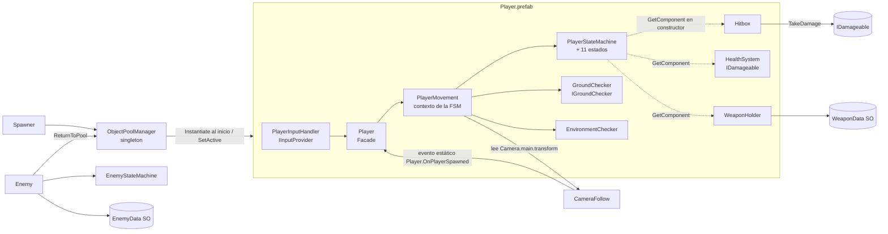
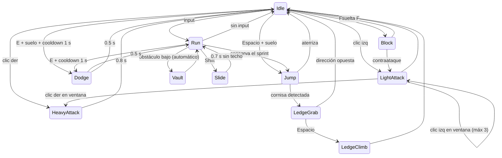

# Awakened Warrior — Arquitectura técnica

> Parte de la documentación del proyecto: [`contexto.md`](contexto.md) (qué es el juego) ·
> **`arquitectura.md`** (cómo está construido) · [`features.md`](features.md) (qué hay
> implementado y buenas prácticas). Los estados (✅ 🟡 🔧 📋 ⬜ ⚠️ ⏸️) y las marcas ✔/❓ se
> definen en `contexto.md` §1.
>
> Este documento describe el **estado real del código** al 2026-09-30 (limpieza contra el GDD;
> ver el historial en `features.md` §5). Lo que todavía no existe aparece marcado como 📋 Planeado
> o ⬜ Pendiente.

---

## 1. Stack y configuración del proyecto

| Elemento | Valor real | Dónde se ve |
|---|---|---|
| Unity | 6000.6.0f1 | `ProjectSettings/ProjectVersion.txt` |
| Render | URP 17.6.0 (`Universal Render Pipeline Asset.asset`) | `Packages/manifest.json` |
| Input | **Input System 1.20.0**, `activeInputHandler: 1` (solo el nuevo; `UnityEngine.Input` legacy **no** está disponible). Sin asset `.inputactions` ni project-wide actions registradas | `ProjectSettings/ProjectSettings.asset`, `EditorBuildSettings.asset` |
| Identidad del build | `productName: Awakened Warrior`, `companyName: SUNUX GAMES`, `com.SUNUXGAMES.AwakenedWarrior` | `ProjectSettings/ProjectSettings.asset` |
| Física | 3D (PhysX). Fixed Timestep **0.02 s** (50 Hz). Gravedad −9.81 | `TimeManager.asset`, `DynamicsManager.asset` |
| Navegación | `com.unity.ai.navigation` 2.0.14 instalado, **sin uso todavía** | manifest |
| Otros paquetes relevantes | ProBuilder 6.1.2, Timeline 6.6.0, uGUI 2.6.0, Test Framework 1.8.0, Profile Analyzer 1.4.0 | manifest |
| Paquetes instalados sin uso | Visual Scripting, AI Assistant (preview) / Inference, Collab Proxy, Device Simulator Devices, `com.unity.pipeline` 0.6.0-exp.1 (experimental), uGUI, Adaptive Performance settings | manifest / `Assets/` |
| Serialización | Force Text | `EditorSettings.asset` |
| Color space | Linear (`m_ActiveColorSpace: 1`) | `ProjectSettings.asset` |
| Lenguaje | C# puro, sin ECS/DOTS ni Visual Scripting | — |
| Namespaces | Solo las herramientas de Editor (`WarriorWoke.EditorTools`). El runtime está en el namespace global | — |
| Assembly definitions | Ninguna (todo compila en `Assembly-CSharp`) | — |
| Tests | Ninguno | — |

### Capas y tags (`ProjectSettings/TagManager.asset`)

| # | Layer | Uso actual |
|---|---|---|
| 6 | `Ground` | Suelo y edificios. Lo leen `GroundChecker` (Player) y `Enemy.groundLayer`. |
| 7 | `Obstacle` | Geometría de parkour. `EnvironmentChecker.obstacleLayer` en el Player. |
| 8 | `Player` | Objetos del Player.prefab. |
| 9 | `Enemy` | Enemy.prefab. `Hitbox.targetLayers` del Player apunta aquí (bits 512). |

Tags: solo los integrados (`Player`, `Untagged`, …). No hay tags personalizados.

## 2. Estructura de carpetas

```
Assets/
  scripts/                    ← todo el código del juego
    Camera/                   CameraFollow.cs
    Core/
      Combat/                 HealthSystem, Hitbox, WeaponData (SO), WeaponHolder, EnemyData (SO)
      Interfaces/             IDamageable, IGroundChecker, IInputProvider, IPoolable
      Spawning/               ObjectPoolManager, Spawner, ReturnToPoolDelay
    Enemy/
      Enemy.cs
      StateMachine/           EnemyState, EnemyStateMachine, States/EnemyGroundedStates.cs
    Player/
      Player.cs, PlayerMovement.cs, PlayerInputHandler.cs,
      GroundChecker.cs, EnvironmentChecker.cs
      StateMachine/           PlayerState, PlayerStateMachine,
                              States/{PlayerGroundedStates, PlayerAirStates,
                                      PlayerParkourStates, PlayerCombatStates}.cs
    Editor/                   SceneAutoLoader, PlayerCharacterSetup (no van al build)
  Prefabs/                    Player, Enemy, GameManager, Spawner, Main Camera,
                              Directional Light, Particle System
  Scenes/                     Level-1.unity (la iluminación horneada Scenes/<Escena>/ no se versiona)
  Characters/Player/          character.fbx (modelo del protagonista)
  LowPoly/                    HumanPlayer.prefab, LowPolyHumanAnimator.controller, Animations/*.fbx
  LowPolyCity/                asset pack de entorno (placeholder) + escena demo
  material/                   ball, enemy, floors, metal (.mat), ZeroFriction.physicMaterial
  ProBuilder Data/, URPDefaultResources/, Adaptive Performance/
docs/                         contexto.md, arquitectura.md, features.md
GDD_Awakened_Warrior.pdf      GDD final
```

**Convención de carpetas para código nuevo** (📋 propuesta, sigue la estructura existente):

| Tipo de código | Carpeta |
|---|---|
| Sistemas compartidos por jugador y enemigos | `scripts/Core/<Sistema>/` |
| Contratos | `scripts/Core/Interfaces/` |
| Jugador | `scripts/Player/…` |
| Enemigos y jefes | `scripts/Enemy/…` (jefes en `Enemy/Bosses/`) |
| Flujo de juego (checkpoints, guardado, escenas) | `scripts/Game/` (nueva) |
| UI (menús, pausa) | `scripts/UI/` (nueva) |
| Assets de datos (ScriptableObjects) | `Assets/Data/<Tipo>/` (nueva) |
| Audio | `Assets/Audio/` (nueva) |

## 3. Escena y prefabs (estado real)

### `Level-1.unity` (única escena en Build Settings)

Contiene instancias de `GameManager`, `Spawner`, `Main Camera`, `Directional Light` y `Enemy`, el
objeto `Ground` (plano de 100×100 con top en Y = 0, layer Ground, material `floors.mat`), un muro
de ProBuilder (`wall`) y dos casas de LowPolyCity. **El Player no está colocado en la escena:** lo
crea el `Spawner` al iniciar (ver §5.6). La escena no referencia datos de iluminación horneada
(`m_LightingDataAsset` vacío); la luz direccional es Mixed y alumbra en tiempo real.

### Prefabs y sus componentes

| Prefab | Componentes de scripts propios | Notas |
|---|---|---|
| `Player` | `Player`, `PlayerMovement`, `PlayerInputHandler`, `GroundChecker`, `EnvironmentChecker`, `HealthSystem` (i-frames 0.5 s), `Hitbox` (radio 0.6, `localOffset` z = 0.6, layer Enemy), `WeaponHolder` (sin arma inicial) | Tag `Player`, layer 8. Rigidbody 70 kg, **Interpolate: None**, rotaciones congeladas. Hijos `CenterPoint`, `HeadPoint`, `Model` (character.fbx). **No tiene** `Animator Controller`. |
| `Enemy` | `HealthSystem` (100 HP, i-frames 0.2 s), `Hitbox` (daño 5) | Tag `Untagged`, layer 9. ⚠️ **No tiene `Enemy.cs`**, así que la IA no corre, y `Hitbox.targetLayers = 0`. La vida y el daño no son valores del GDD: el prefab se rehace con P4. |
| `GameManager` | `ObjectPoolManager` | Pools: `player` → Player.prefab (1), `spawnVFX` → Particle System (1). |
| `Spawner` | `Spawner` | `entityId: player`, `triggerType: OnStart`. |
| `Main Camera` | `CameraFollow` | `autoDetectTarget` activo. |
| `Particle System` | `ReturnToPoolDelay` | VFX de spawn pooleado. |
| `Directional Light` | — | Luz Mixed. |

## 4. Mapa de dependencias



Las líneas punteadas son dependencias que se resuelven con `GetComponent` en el constructor del
estado. Si el componente no está en el prefab, la referencia queda en `null` y el estado usa `?.`
para no fallar. Los tres (`Hitbox`, `HealthSystem`, `WeaponHolder`) están en el Player.prefab.

## 5. Sistemas

### 5.1 Jugador: Facade + máquina de estados — ✅ Implementado

```
Player (Facade)                 FixedUpdate → RouteInputToMovement()
 ├─ IInputProvider              PlayerInputHandler (Update: lee y bufferiza)
 └─ PlayerMovement              contexto de la FSM, único dueño del Rigidbody
     ├─ ProcessMovement(...)    guarda inputs, CheckGrounded, UpdateMoveDirection, LogicUpdate
     ├─ FixedUpdate             ApplyFacingRotation + CurrentState.PhysicsUpdate
     └─ PlayerStateMachine      Initialize / ChangeState (Exit → Enter)
```

- **`Player.cs`**: singleton simple (`Player.Instance`) y evento estático
  `OnPlayerSpawned` (se dispara en `OnEnable`). En `FixedUpdate` consume los triggers del input y
  llama a `PlayerMovement.ProcessMovement(...)`. Si faltan `PlayerMovement`, `IInputProvider` o
  `IGroundChecker`, los agrega en `Awake`.
- **`PlayerMovement.cs`**: cachea `Rigidbody`, `CapsuleCollider`, `GroundChecker`,
  `EnvironmentChecker` y `Camera.main.transform` en `Awake`, y construye las 11 instancias de estado.
  Expone el estado de input (`InputX`, `InputZ`, `HasMoveInput`, `JumpTriggered`, …) y helpers de
  física (`SetVelocity(Vector3, float)`, `StopHorizontal(float)`, `SetKinematic`, `ShrinkCollider`,
  `ResetCollider`, `HasCeilingOverhead`).
  **Regla:** los estados solo mueven el cuerpo a través de estos helpers o de `Rb.MovePosition`.
- **Flujo de un tick:** `LogicUpdate` y `PhysicsUpdate` corren los dos dentro del paso de física
  (el input se enruta desde `Player.FixedUpdate`), así que la lógica de estados corre a 50 Hz y no
  por frame. El input se captura en `Update` y se **bufferiza** con métodos `Consume*()`, para que un
  tap no se pierda entre frames ni se procese dos veces.
- **Movimiento relativo a cámara:** `MoveDirection` es el input proyectado sobre el
  forward/right aplanado de la cámara. La rotación usa `Mathf.SmoothDampAngle` (`turnSmoothTime`) y
  se bloquea en Vault, LedgeGrab, LedgeClimb, Block y los ataques.
- **Transiciones:** cada estado decide sus salidas en `LogicUpdate`. `PlayerStateMachine` es
  genérica y no conoce estados concretos. Un estado nuevo se agrega creando la clase, instanciándola
  en `PlayerMovement.BuildStateMachine()` y agregando sus transiciones en los estados de origen.
- **Convención de pivote:** el origen del Player es el **centro del torso**
  (`CapsuleCollider.center = (0,0,0)`), `CenterPoint` está en el origen y `HeadPoint` en `height/2`.
  `GroundChecker` calcula el pie con `capsule.bounds.min.y`. Si cambias el modelo, usa
  **Tools → Warrior Woke → Configurar Modelo del Jugador** (respeta la convención).

**Estados** (archivos en `Player/StateMachine/States/`):

| Archivo | Estados |
|---|---|
| `PlayerGroundedStates.cs` | `Idle`, `Run` (auto-sprint), `Slide` |
| `PlayerAirStates.cs` | `Jump` |
| `PlayerParkourStates.cs` | `Vault`, `LedgeGrab`, `LedgeClimb` |
| `PlayerCombatStates.cs` | `LightAttack`, `HeavyAttack`, `Block`, `Dodge` |



> **Sprint:** `IsSprint` se limpia en `Idle.Enter` y en cada salida de `Run` salvo `Jump` y
> `Vault`, para que el salto y el vault conserven el impulso (GDD §5.2, §5.4).
>
> **No hay estado de caída:** si el jugador sale de una orilla caminando, sigue en `Run`/`Idle`
> mientras cae (la gravedad actúa igual). Ver T13.

### 5.2 Input — ✅ Implementado (modo prototipo)

`PlayerInputHandler : IInputProvider`. Cada acción tiene dos caminos: un `InputActionReference`
opcional (todos vacíos en el prefab) o la lectura directa de `Keyboard.current`/`Mouse.current`.
**Hoy se usa la lectura directa.** La documentación oficial del Input System la describe como
adecuada solo para prototipos, porque se salta el rebinding, los esquemas de control y el gamepad.
No hay ningún asset `.inputactions` en el proyecto (la plantilla por defecto se eliminó; P6).

### 5.3 Detección de entorno — ✅ Implementado

- **`GroundChecker : IGroundChecker`**: un `Physics.Raycast` hacia abajo desde
  `bounds.min.y + 0.1` con longitud `0.1 + extraDistance` contra `groundLayer` (Ground + Obstacle).
- **`EnvironmentChecker`**: pre-filtro `Physics.OverlapSphereNonAlloc` (buffer de 4, radio 1.2)
  antes de los raycasts. Vault = golpea el centro y no la cabeza. Cornisa = golpean centro y
  cabeza, más un raycast hacia abajo desde arriba y adelante para encontrar la esquina. Todo usa
  `transform.forward` como dirección (los gizmos también).

### 5.4 Combate — 🟡 Parcial

| Script | Responsabilidad |
|---|---|
| `HealthSystem : IDamageable` | Vida con clamp, i-frames por tiempo (`iFramesDuration`: 0.5 s el jugador, 0.2 s el enemigo para que entren los golpes del combo, que van cada ≥ 0.25 s), `ActivateIFrames(d)` (nunca acorta unos i-frames ya activos), `Heal` (no revive), `InstantKill`, `InitializeHealth(max)` (reinicia y revive). Eventos `OnHealthChanged`, `OnDeath`, `OnDamageReceived`. Sin `Update`. |
| `Hitbox` | `Activate()` hace un `OverlapSphereNonAlloc` (buffer de 10) centrado en `Center` (`transform` + `localOffset`) contra `targetLayers` y llama `TakeDamage` en cada `IDamageable`. `SetDamage`, `SetRadius`, evento `OnHit`. Es un pulso instantáneo, no un trigger persistente. En el jugador la esfera está 0.6 m al frente del torso. |
| `WeaponData` (SO) | Nombre, icono, daño ligero/pesado, radio de hitbox, knockback, `weaponId`. Menú `Create > WarriorWoke > Weapon Data`. **No hay assets creados.** |
| `WeaponHolder` | Arma equipada, `Equip(data)`, `GetLightDamage()` (10 desarmado), `GetHeavyDamage()` (20 desarmado), `GetKnockback()`, evento `OnWeaponChanged`. Está en el Player.prefab sin arma inicial. |

Limitaciones reales: el bloqueo no reduce daño (ningún sistema lee `DamageReductionMultiplier`,
que ya vale 0.3 = −70 % del GDD), `Hitbox` no verifica ángulo ni evita pegarle dos veces al mismo
objetivo si tiene varios colliders, el knockback no se aplica y no hay animaciones.

### 5.5 Enemigos — 🟡 Parcial / ⚠️ desalineado con el GDD

- **`Enemy : MonoBehaviour, IPoolable`**: el mismo patrón de contexto + FSM que el jugador, con una
  diferencia: `LogicUpdate` corre en `Update` y `PhysicsUpdate` en `FixedUpdate`. Lee sus valores de
  un `EnemyData` (SO). Estados en `EnemyGroundedStates.cs`: `Patrol`, `Chase`, `Attack`, `Dead`.
  La detección es un `OverlapSphereNonAlloc` filtrado por `playerLayer` (por defecto la layer
  `Player`) + `CompareTag("Player")` + raycast de línea de visión. Al morir espera 1.5 s y vuelve
  al pool; `OnSpawn` lo revive con `InitializeHealth`.
- ⚠️ **Es 2.5D:** congela Z, se mueve solo en X (`Move(float dir)`) y rota a ±90°. El jugador ya es
  3D libre, así que los enemigos **no pueden perseguirlo en profundidad**. Se reescribe con P4.
- ⚠️ No hay subclases por tipo: `Looter`/`Brute` (GDD anterior) se eliminaron; los tipos del GDD
  (arquero, guerrero ligero, guerrero pesado) llegan con P4.
- ⚠️ `Enemy.prefab` no usa este script (ver §3).

### 5.6 Spawning y object pooling — ✅ Implementado

- **`ObjectPoolManager`** (singleton en `GameManager`): pre-instancia `initialSize` copias por
  `poolId` en `Awake`, `Spawn(id, pos, rot)` las saca de una `Queue` (y crece si se vacía) y
  `ReturnToPool(obj, id)` las regresa. Llama `IPoolable.OnSpawn/OnDespawn`.
- **`Spawner`**: pide un `entityId` al pool según `OnStart` / `Timer` / `OnTriggerEnter` /
  `Manual`, y opcionalmente un `spawnEffectId`.
- **`ReturnToPoolDelay : IPoolable`**: devuelve el objeto al pool tras `delay` (usa un
  `WaitForSeconds` cacheado).
- **El jugador nace del pool:** `Spawner (OnStart) → ObjectPoolManager.Spawn("player")`. Para
  cambiar dónde aparece, mueve el `Spawner`.
- `Spawn` coloca el objeto (posición, rotación, sin padre) **antes** de activarlo, para que los
  `OnEnable` (p. ej. `OnPlayerSpawned` → snap de la cámara) vean la posición final y el Rigidbody
  no se teletransporte por su transform.
- Nota: el pool es propio. Unity 6 trae `UnityEngine.Pool.ObjectPool<T>`, con `collectionCheck`
  y `maxSize`. No hace falta migrar mientras el pool actual funcione.

### 5.7 Cámara — 🟡 Parcial

`CameraFollow` (en `Main Camera`, `LateUpdate`): se coloca en
`target + up·shoulderHeight + right·shoulderSide − forward·distance`, hace `SmoothDamp` de la
posición y `Slerp` de la rotación, y usa un `SphereCast` para no atravesar paredes. Encuentra al
jugador con `Player.OnPlayerSpawned`, luego `Player.Instance`, luego `FindAnyObjectByType` y al
final el tag.
**Falta lo del GDD:** control libre con el ratón (hoy la cámara solo sigue el `forward` del
jugador), camera shake, encuadre de combate y ajuste de zoom.

### 5.8 Sistemas eliminados — no reintroducir

| Sistema | Motivo | Fecha | Decisión |
|---|---|---|---|
| XP (`PlayerXpSystem`, `IXpReceiver`, `EnemyData.xpReward`) | GDD §7, §19: progresión solo por historia | 2026-09-29 | P3 |
| Wall jump (`PlayerWallJumpState`, `ConsecutiveWallJumps`, `EnvironmentChecker.IsTouchingWall`) | Fuera del GDD §28 y sin uso | 2026-09-30 | P2, P8 |
| Estamina y HUD (`PlayerStamina`, `PlayerHUD`) | GDD §5.2 (sprint sin recurso) y §16 (sin barras de vida) | 2026-09-30 | P7 |
| Enemigos `Looter`/`Brute` | GDD anterior; los tipos del GDD final llegan con P4 | 2026-09-30 | P8 |
| `initial_floor.prefab`, `InputSystem_Actions.inputactions` | Sin uso | 2026-09-30 | P8 |

### 5.9 Herramientas de Editor — ✅ Implementado

- `SceneAutoLoader` (`[InitializeOnLoad]` + `SessionState`): abre `Level-1.unity` una vez por sesión.
- `PlayerCharacterSetup` (menú **Tools → Warrior Woke → Configurar Modelo del Jugador**): configura
  `character.fbx` como Humanoid (o Generic), lo pone como hijo `Model` del Player.prefab, lo
  reescala si hace falta y ajusta `CapsuleCollider` y `HeadPoint`. Es idempotente.

### 5.10 Animación — ⬜ Pendiente

Existen `Assets/LowPoly/LowPolyHumanAnimator.controller` (1 estado: `Idle`) y clips `LowPoly`
(Idle, Run*, Sprint, Jumps, Roll*, Punch*, MeleeAttack*, Blocking, GetHit, Death, BowShot). Nada
está conectado al Player. Los estados tienen `// TODO: trigger animation`.

### 5.11 Sistemas que no existen todavía — ⬜ Pendiente

Checkpoints, muerte/reaparición, caída mortal, regeneración de vida, recoger armas, IA del arquero
(ataque a distancia), jefes, zonas de enemigo, guardado, menú principal, pausa, flujo de escenas y
niveles, audio, feedback de daño (VFX, camera shake, estado visual de salud) y build de Windows.

## 6. Decisiones técnicas vigentes

| # | Decisión | Motivo |
|---|---|---|
| D1 | Jugador con **Rigidbody dinámico** + velocidad escrita por los estados (no `CharacterController`) | Ya implementado y funcionando; permite `MovePosition` kinemático en parkour. |
| D2 | **FSM por clases** (una clase por estado, transiciones dentro del estado) para jugador y enemigos | Coincide con lo que pide el GDD para la IA (§21) y mantiene los estados testeables y aislados. |
| D3 | **Facade** (`Player`) + **contexto** (`PlayerMovement`) | Separa el enrutado de input de la física y la lógica. |
| D4 | **Interfaces** para desacoplar (`IDamageable`, `IInputProvider`, `IGroundChecker`, `IPoolable`) | `Hitbox` no conoce al jugador ni al enemigo; el input se puede cambiar sin tocar el movimiento. |
| D5 | **ScriptableObjects** para datos de diseño (`WeaponData`, `EnemyData`) | Los datos se comparten entre instancias y se ajustan sin tocar código. Son de **solo lectura en runtime** en builds. |
| D6 | **Object pooling** para todo lo que nace y muere seguido | Evita GC e `Instantiate` en el game loop. |
| D7 | **Eventos C# (`System.Action`)** para notificar (`OnDeath`, `OnHealthChanged`, `OnPlayerSpawned`) | La UI, el audio y la cámara se enganchan sin acoplarse. Se suscriben en `OnEnable` y se desuscriben en `OnDisable`. |
| D8 | Movimiento **relativo a cámara** y cámara que sigue el `forward` del jugador | Controlador estándar de tercera persona. La cámara libre con ratón llega con P5. |
| D9 | Cero allocations en código caliente (`NonAlloc`, buffers prealocados, sin LINQ ni strings en loops) | Ver buenas prácticas en `features.md`. |

## 7. Plan técnico para lo que falta — 📋 Propuesta

> Nada de esta sección está implementado. Las marcadas con **❓** siguen pendientes de aprobación
> (ver §8). Las marcadas con **✔** ya están aprobadas. Cuando algo se implemente, pasa a §5 y a `features.md`.

| Sistema | Diseño propuesto | Encaja con |
|---|---|---|
| **Input** ❓ | Crear `Assets/Input/AwakenedWarrior.inputactions` con el mapa `Gameplay` (Move, Look, Sprint, Jump, LightAttack, BlockHold, Dodge, Interact, Pause) usando los bindings del GDD §14 + gamepad, y asignar las referencias en `PlayerInputHandler`. El código **ya soporta** `InputActionReference`, así que no hace falta reescribirlo. | Input System, doc oficial ("Using Actions" es el flujo recomendado). |
| **Controles** ✔ | Adoptar los del GDD §14: J ligero, K fuerte, L bloqueo (mantener), Q esquiva + dirección, E recoger, Shift sprint (mantener), Espacio salto/vault, ESC pausa. El slide pierde Shift y necesita una tecla nueva (por definir). | GDD §14, decisión P1. |
| **Sprint** ✔ | Reemplazar el auto-sprint por "mantener Shift" (`IInputProvider.IsSprintHeld`), con `SprintSpeed = BaseSpeed × 1.4`. Se cancela al recibir daño, bloquear o atacar. | GDD §5.2. |
| **Vault** ✔ | Solo con Espacio + `IsObstacleVaultable` (hoy es automático al correr contra un obstáculo). | GDD §5.4. |
| **Bloqueo** | `HealthSystem` recibe un modificador de daño (p. ej. una interfaz `IDamageModifier` que implementa el estado de bloqueo, o un `float DamageMultiplier` que pone el estado). Reducción del 70 % solo si `Vector3.Dot(forward, dirHaciaAtacante) > umbral`. | GDD §5.8. |
| **Regeneración de vida** | Componente `HealthRegen` que escucha `OnDamageReceived` y, tras N segundos sin daño, llama a `Heal` por tick (con timer, sin corrutina por frame). | GDD §5.11, D7. |
| **Caída mortal** | En `PlayerMovement`/`GroundChecker`, registrar la altura al despegar y llamar `InstantKill()` al aterrizar si la caída supera X m. Los barrancos pueden usar un trigger `KillZone`. | GDD §5.11, §5.12. |
| **Checkpoints / respawn** | `Checkpoint` (trigger, una activación) → `CheckpointManager` (en la escena) guarda la posición. Al `OnDeath` del Player: reposicionar con `Rigidbody.position` (teleport), `HealthSystem.InitializeHealth(100)` y reiniciar la FSM en `Idle`. | GDD §5.13, §17. |
| **Guardado** | `SaveSystem` estático: `JsonUtility` → `Application.persistentDataPath/save.json` con `{nivel, checkpointId}`. Una sola partida. | GDD §26, doc oficial de JsonUtility. |
| **Armas** | `WeaponHolder` ya está en el Player.prefab (desarmado 10/20). Falta crear 3 `WeaponData` (katana 20/35, yari 18/30 con más radio, kanabo 30/50) y un prefab `WeaponPickup` (trigger + E). Al recoger, se suelta la actual como pickup. | GDD §5.10, §18, D5. |
| **Enemigos** ✔ | Reescribir `Enemy` para 3D: **NavMeshAgent** (paquete ya instalado) con **Rigidbody kinemático**, como recomienda la documentación de AI Navigation. `NavMeshSurface` en cada nivel. Estados del GDD §21 (Idle, Detectar, Acercarse, Atacar, Defenderse, Buscar, Regresar) y una zona asignada (`EnemyZone`) de la que no salen. Tipos por `EnemyData`: `Archer` (distancia + flecha pooleada), `LightWarrior`, `HeavyWarrior`. La apariencia (modelos) la entrega el equipo en un paquete aparte. | GDD §5.14, §12, §21, D2, D5, D6. |
| **Jefes** | `Boss : Enemy` con estados extra (Analizar distancia, Reposicionarse, Bloquear, Esquivar), sin fases. `BossArena` cierra la salida con un trigger. | GDD §5.15, §13. |
| **Cámara** ✔ | Extender `CameraFollow` (sin Cinemachine) con yaw/pitch del ratón (`Look`), límites de pitch, cursor bloqueado en gameplay, shake por evento y encuadre de combate. El movimiento sigue siendo relativo a la cámara, pero la cámara deja de depender del `forward` del jugador. | GDD §15. |
| **Animación** | Un `Animator Controller` del jugador con parámetros hasheados (`Animator.StringToHash`) en un componente `PlayerAnimator` que escucha los cambios de estado. Los estados no llaman al Animator directamente. | GDD pilar 2. |
| **Flujo de juego** | Escenas `MainMenu`, `World1_Level1`, `World1_Level2`, `World2_Level3`, cargadas con `SceneManager.LoadSceneAsync`. Pausa con `Time.timeScale = 0` y un panel de UI (uGUI). | GDD §17. |
| **Audio** | `AudioManager` con fuentes de audio pooleadas para SFX, que se suscribe a los eventos de combate. | GDD §23, D6, D7. |

## 8. Decisiones de alcance

| # | Tema | Decisión | Fecha | Estado |
|---|---|---|---|---|
| P1 | Controles | Adoptar los del GDD §14 (J/K/L/Q/E, Shift = sprint mantenido, Espacio = salto/vault). | 2026-09-29 | ✔ Aprobada, 📋 por implementar. **Abierto:** tecla nueva del slide. |
| P2 | Parkour fuera del GDD | Wall jump fuera (desactivado el 29-sep, **eliminado** el 30-sep por P8). Ledge grab/climb y slide se conservan activos. | 2026-09-29 / 30 | ✅ Implementada |
| P3 | Sistema de XP | Eliminarlo: el juego no tiene XP. | 2026-09-29 | ✅ Implementada |
| P4 | Enemigos | Reescribir en 3D con NavMeshAgent. El equipo entrega el paquete de apariencia. | 2026-09-29 | ✔ Aprobada, 📋 por implementar |
| P5 | Cámara | Extender `CameraFollow` con control de ratón (sin Cinemachine). | 2026-09-29 | ✔ Aprobada, 📋 por implementar |
| P6 | Input | Migrar a un asset `.inputactions` propio. La plantilla por defecto ya se eliminó. | — | ❓ Pendiente: el equipo pidió primero una explicación |
| P7 | Estamina y HUD | Quedan fuera del desarrollo: el GDD no tiene estamina (§5.2) ni barras de vida (§16). Se eliminaron. | 2026-09-30 | ✅ Implementada |
| P8 | Código fuera del GDD | Lo que está fuera del GDD y no se usa se **elimina**, no se desactiva (wall jump, `Looter`/`Brute`, `initial_floor`, `InputSystem_Actions`). | 2026-09-30 | ✅ Implementada |
| P9 | Iluminación horneada | No se versiona: `Assets/Scenes/*/` en `.gitignore`, `LightingData.asset` marcado `binary`. | 2026-09-30 | ✅ Implementada |
| P10 | Identidad del producto | `productName` = Awakened Warrior, `companyName` = SUNUX GAMES. | 2026-09-30 | ✅ Implementada |

## 9. Deuda técnica y bugs conocidos

Solo se listan los abiertos. Los IDs no se reutilizan; los resueltos están en el historial de
`features.md` §5 (T1, T5, T6, T8–T12 se resolvieron el 2026-09-30).

| # | Problema | Dónde | Impacto |
|---|---|---|---|
| T2 | `Enemy.prefab` no tiene `Enemy.cs`, `Hitbox.targetLayers = 0`, y su vida (100) y daño (5) no son del GDD | `Prefabs/Enemy.prefab` | El enemigo de la escena no tiene IA ni puede hacer daño. Se rehace con P4. |
| T3 | Enemigos 2.5D (freeze Z, eje X) | `Enemy.cs`, `EnemyGroundedStates.cs` | Incompatible con el jugador 3D. Se rehace con P4. |
| T4 | El bloqueo no reduce daño | `PlayerBlockState`, `HealthSystem` | El bloqueo solo inmoviliza al jugador. Diseño en §7. |
| T7 | Rigidbody sin interpolación mientras la cámara sigue en `LateUpdate` | Player.prefab, `CameraFollow` | Posible jitter visual. Según la documentación oficial, la interpolación se activa solo si se observa jitter. Hay que verificarlo en Play. |
| T13 | No hay estado de caída | `PlayerGroundedStates.cs` | Caer de una orilla sin saltar no pasa por un estado aéreo: no hay ledge grab al caer y la caída mortal (F15) necesitará ese estado. |
| T14 | `EnvironmentChecker.vaultHeightCheck` no se usa | `EnvironmentChecker.cs` | Campo muerto en el Inspector. Se resuelve al validar la altura del vault (F04). |
