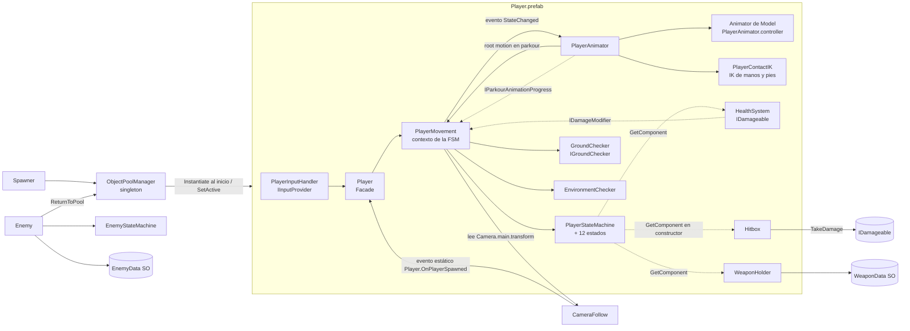
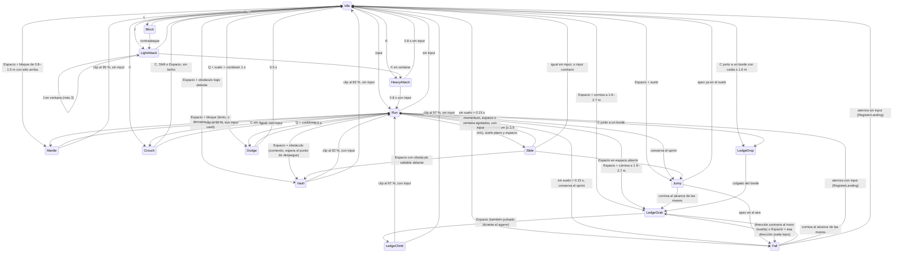

# Awakened Warrior — Arquitectura técnica

> Parte de la documentación del proyecto: [`contexto.md`](contexto.md) (qué es el juego) ·
> **`arquitectura.md`** (cómo está construido) · [`features.md`](features.md) (qué hay
> implementado y buenas prácticas). Los estados (✅ 🟡 🔧 📋 ⬜ ⚠️ ⏸️) y las marcas ✔/❓ se
> definen en `contexto.md` §1.
>
> Este documento describe el **estado real del código** al 2026-10-02 (Parkour Obstacle Standard,
> prefabs de obstáculos, Parkour Test Area reconstruida con ellos y segunda pasada de calidad de
> movimiento y **reconstrucción del movimiento y del parkour (P28)**: cámara orbital, locomoción
> direccional con marchas, agacharse, slide con clips nuevos, mantle, drop y salto de cornisa, roll
> de aterrizaje; ver el historial en `features.md` §5). Lo que todavía no existe
> aparece marcado como 📋 Planeado o ⬜ Pendiente.

---

## 1. Stack y configuración del proyecto

| Elemento | Valor real | Dónde se ve |
|---|---|---|
| Unity | 6000.6.0f1 | `ProjectSettings/ProjectVersion.txt` |
| Render | URP 17.6.0 (`Universal Render Pipeline Asset.asset`) | `Packages/manifest.json` |
| Input | **Input System 1.20.0**, `activeInputHandler: 1` (solo el nuevo; `UnityEngine.Input` legacy **no** está disponible). Sin asset `.inputactions` ni project-wide actions registradas | `ProjectSettings/ProjectSettings.asset`, `EditorBuildSettings.asset` |
| Identidad del build | `productName: Awakened Warrior`, `companyName: SUNUX GAMES`, `com.SUNUXGAMES.AwakenedWarrior` | `ProjectSettings/ProjectSettings.asset` |
| Física | 3D (PhysX). Fixed Timestep **0.02 s** (50 Hz). Gravedad −9.81 | `TimeManager.asset`, `DynamicsManager.asset` |
| Navegación | `com.unity.ai.navigation` 2.0.14 instalado, **sin uso todavía** | manifest |
| Otros paquetes relevantes | ProBuilder 6.1.2, Timeline 6.6.0, uGUI 2.6.0, Test Framework 1.8.0, Profile Analyzer 1.4.0 | manifest |
| Paquetes instalados sin uso | Visual Scripting, AI Assistant (preview) / Inference, Collab Proxy, Device Simulator Devices, `com.unity.pipeline` 0.6.0-exp.1 (experimental), uGUI, Adaptive Performance settings | manifest / `Assets/` |
| Serialización | Force Text | `EditorSettings.asset` |
| Color space | Linear (`m_ActiveColorSpace: 1`) | `ProjectSettings.asset` |
| Lenguaje | C# puro, sin ECS/DOTS ni Visual Scripting | — |
| Namespaces | Solo las herramientas de Editor (`WarriorWoke.EditorTools`). El runtime está en el namespace global | — |
| Assembly definitions | Ninguna (todo compila en `Assembly-CSharp`) | — |
| Tests | Sin assembly de Test Framework. Pruebas propias de Editor: validación en batch y recorrido en Play Mode real (§5.9) | `scripts/Editor/` |

### Capas y tags (`ProjectSettings/TagManager.asset`)

| # | Layer | Uso actual |
|---|---|---|
| 6 | `Ground` | Suelo y edificios. Lo leen `GroundChecker` (Player) y `Enemy.groundLayer`. |
| 7 | `Obstacle` | Geometría de parkour. `EnvironmentChecker.obstacleLayer` en el Player. |
| 8 | `Player` | Objetos del Player.prefab. |
| 9 | `Enemy` | Enemy.prefab. `Hitbox.targetLayers` del Player apunta aquí (bits 512). |

Tags: solo los integrados (`Player`, `Untagged`, …). No hay tags personalizados.

## 2. Estructura de carpetas

```
Assets/
  scripts/                    ← todo el código del juego
    Camera/                   CameraFollow.cs
    Core/
      Combat/                 HealthSystem, Hitbox, WeaponData (SO), WeaponHolder, EnemyData (SO)
      Interfaces/             IDamageable, IDamageModifier, IGroundChecker, IInputProvider, IPoolable
      Spawning/               ObjectPoolManager, Spawner, ReturnToPoolDelay
    Enemy/
      Enemy.cs
      StateMachine/           EnemyState, EnemyStateMachine, States/EnemyGroundedStates.cs
    Player/
      Player.cs, PlayerMovement.cs, PlayerInputHandler.cs,
      PlayerAnimator.cs, PlayerAnimatorIds.cs, PlayerAnimatorIK.cs, PlayerContactIK.cs,
      IParkourAnimationProgress.cs, ParkourTimings.cs, VaultInfo.cs, LedgeInfo.cs,
      GroundChecker.cs, EnvironmentChecker.cs
      StateMachine/           PlayerState, PlayerStateMachine,
                              States/{PlayerGroundedStates, PlayerAirStates,
                                      PlayerParkourStates, PlayerCombatStates}.cs
    Parkour/                  ParkourStandard (estándar de obstáculos + ParkourObstacleType),
                              ParkourObstacle (componente de los obstáculos estándar)
    Editor/                   SceneAutoLoader, PlayerCharacterSetup, PlayerAnimationSetup,
                              ClipMeasurement, ParkourObstaclePrefabs, ParkourTestCircuitBuilder,
                              ParkourPlayModeTest (no van al build)
  Prefabs/                    Player, Enemy, GameManager, Spawner, Main Camera,
                              Directional Light, Particle System
    Parkour/                  ParkourObstacle_{Step, LowVault, MediumVault, HighVault, Barrier,
                              Ledge, ClimbWall, Slide, JumpGap, Combined} (generados) +
                              Materials/ (Step, Vault, Mantle, Barrier, Ledge, Slide)
  Scenes/                     Level-1.unity (la iluminación horneada Scenes/<Escena>/ no se versiona)
  Characters/Player/          character.fbx (modelo Ch45 de Mixamo, Humanoid),
                              PlayerAnimator.controller (generado),
                              Textures/ (5 texturas extraídas de character.fbx),
                              Animations/ (2 transiciones de guardia Ch45) +
                              Animations/Generated/ (clips invertidos generados: WalkBackward,
                              CrouchToBracedHang)
  LowPoly/                    Animations/*.fbx (clips Humanoid usados por el jugador; paquete
                              "FREE Low Poly Human - RPG Character" de la Asset Store)
  ThirdParty/DynamicParkourSystem/
                              Animations/ (11 clips Mixamo del Dynamic Parkour System),
                              LICENSE.txt (MIT), README.md (qué se tomó y cómo se adaptó)
  ThirdParty/Quaternius/      Animations/UAL1_Standard.fbx, UAL2_Standard.fbx (CC0: agacharse, slide,
                              mantle, roll), LICENSE.txt, README.md (origen y uso)
  Tests/ParkourTestArea/      Materials/Losa.mat (suelo del área de pruebas)
  LowPolyCity/                asset pack de entorno (placeholder) + escena demo
  material/                   enemy, floors (.mat), ZeroFriction.physicMaterial
  ProBuilder Data/, URPDefaultResources/, Adaptive Performance/
docs/                         contexto.md, arquitectura.md, features.md
GDD_Awakened_Warrior.pdf      GDD final
```

**Convención de carpetas para código nuevo** (📋 propuesta, sigue la estructura existente):

| Tipo de código | Carpeta |
|---|---|
| Sistemas compartidos por jugador y enemigos | `scripts/Core/<Sistema>/` |
| Contratos | `scripts/Core/Interfaces/` |
| Jugador | `scripts/Player/…` |
| Enemigos y jefes | `scripts/Enemy/…` (jefes en `Enemy/Bosses/`) |
| Flujo de juego (checkpoints, guardado, escenas) | `scripts/Game/` (nueva) |
| UI (menús, pausa) | `scripts/UI/` (nueva) |
| Assets de datos (ScriptableObjects) | `Assets/Data/<Tipo>/` (nueva) |
| Audio | `Assets/Audio/` (nueva) |

## 3. Escena y prefabs (estado real)

### `Level-1.unity` (única escena en Build Settings): Parkour Test Area

Desde el 2026-10-01 (decisión P24) la escena es el área de pruebas del parkour, y desde el
2026-10-02 (P25) **todos sus obstáculos son instancias de los prefabs estándar** (§5.13). La construye
`ParkourTestCircuitBuilder` (**Tools → Warrior Woke → Construir Parkour Test Area**) y contiene:
instancias de `GameManager`, `Spawner`, `Main Camera` y `Directional Light`, y el objeto
`ParkourTestArea` (suelo, perímetro y once secciones). **El Player no está colocado en la escena:**
lo crea el `Spawner` al iniciar (ver §5.6). La escena no referencia datos de iluminación horneada
(`m_LightingDataAsset` vacío); la luz direccional es Mixed y alumbra en tiempo real. No hay textos,
UI de depuración ni objetos fuera del área; la validación comprueba que no queda ningún collider
fuera de ella y que cada obstáculo cumple el estándar.

| Objeto | Qué es |
|---|---|
| `Suelo` | Caja de 78 × 80 m con la cara superior en y = 0 (layer Ground), x −34…44, z 15…−65. Material `Tests/ParkourTestArea/Materials/Losa.mat`. |
| `Perimetro` | Cuatro `ParkourObstacle_Barrier` (1.5 m, layer Ground) estirados a lo largo del borde y mirando hacia dentro: no se saltan ni se agarran. |
| `S01_Locomocion` … `S11_Mantle` | Carriles paralelos que empiezan en z = 0 y avanzan hacia −Z. Contenido en `features.md` F32. |
| `Spawner` | (0, 1.2, 8), mirando a −Z, en la entrada del área. |

Layers del área: los obstáculos estándar llevan la layer de su tipo (§5.13). Las escaleras, las
plataformas de aterrizaje y los pilares de la locomoción son **fixtures** de prueba (cubos simples en
Ground, sin `ParkourObstacle`): no son parkour y el auto step puede subir los peldaños.

### Prefabs y sus componentes

| Prefab | Componentes de scripts propios | Notas |
|---|---|---|
| `Player` | `Player`, `PlayerMovement`, `PlayerInputHandler`, `PlayerAnimator`, `PlayerContactIK`, `GroundChecker`, `EnvironmentChecker`, `HealthSystem` (i-frames 0.5 s), `Hitbox` (radio 0.6, `localOffset` z = 0.6, layer Enemy), `WeaponHolder` (sin arma inicial); en `Model`: `PlayerAnimatorIK` | Tag `Player`, layer 8. Rigidbody 70 kg, **Interpolate**, rotaciones congeladas. Hijos `CenterPoint`, `HeadPoint`, `Model` (character.fbx, en y = −0.974: las suelas de la pose idle tocan la base del collider). El `Animator` de `Model` usa `PlayerAnimator.controller`, culling **Always Animate** y Apply Root Motion desactivado por defecto (`PlayerAnimator` lo activa solo en parkour, P22). `stepLayer`, `ceilingLayer`, `landingLayer` y las capas de `PlayerContactIK` = Ground + Obstacle (los muros del IK, solo Obstacle). |
| `Enemy` | `HealthSystem` (100 HP, i-frames 0.2 s), `Hitbox` (daño 5) | Tag `Untagged`, layer 9. ⚠️ **No tiene `Enemy.cs`**, así que la IA no corre, y `Hitbox.targetLayers = 0`. La vida y el daño no son valores del GDD: el prefab se rehace con P4. Desde P24 no está colocado en ninguna escena. |
| `GameManager` | `ObjectPoolManager` | Pools: `player` → Player.prefab (1), `spawnVFX` → Particle System (1). |
| `Spawner` | `Spawner` | `entityId: player`, `triggerType: OnStart`. |
| `Main Camera` | `CameraFollow` | `autoDetectTarget` activo. |
| `Particle System` | `ReturnToPoolDelay` | VFX de spawn pooleado. |
| `Directional Light` | — | Luz Mixed, intensidad 1 (antes 0.3). |
| `Parkour/ParkourObstacle_*` (10) | `ParkourObstacle` | Obstáculos estándar generados desde `ParkourStandard`: raíz + cubos con `BoxCollider` en la layer del tipo. `Combined` anida los demás. Ver §5.13. |

## 4. Mapa de dependencias



Las líneas punteadas son dependencias que se resuelven con `GetComponent` en el constructor del
estado. Si el componente no está en el prefab, la referencia queda en `null` y el estado usa `?.`
para no fallar. Los tres (`Hitbox`, `HealthSystem`, `WeaponHolder`) están en el Player.prefab.

## 5. Sistemas

### 5.1 Jugador: Facade + máquina de estados — ✅ Implementado

```
Player (Facade)                 FixedUpdate → RouteInputToMovement()
 ├─ IInputProvider              PlayerInputHandler (Update: lee y bufferiza)
 └─ PlayerMovement              contexto de la FSM, único dueño del Rigidbody
     ├─ ProcessMovement(...)    guarda inputs, CheckGrounded, UpdateMoveDirection, LogicUpdate
     ├─ FixedUpdate             ApplyFacingRotation + CurrentState.PhysicsUpdate
     └─ PlayerStateMachine      Initialize / ChangeState (Exit → Enter)
```

- **`Player.cs`**: singleton simple (`Player.Instance`) y evento estático
  `OnPlayerSpawned` (se dispara en `OnEnable`). En `FixedUpdate` consume los triggers del input y
  llama a `PlayerMovement.ProcessMovement(...)`. Si faltan `PlayerMovement`, `IInputProvider` o
  `IGroundChecker`, los agrega en `Awake`.
- **`PlayerMovement.cs`**: cachea `Rigidbody`, `CapsuleCollider`, `GroundChecker`,
  `EnvironmentChecker`, `HealthSystem` y `Camera.main.transform` en `Awake`, y construye las 12
  instancias de estado. Expone el estado de input (`InputX`, `InputZ`, `HasMoveInput`,
  `IsSprintHeld`, `JumpTriggered`, …), `AirTime` (segundos sin suelo), `AirPeakFeetY` (punto más
  alto desde que dejó el suelo), `IsBackpedaling`, `FeetY`, `HorizontalSpeed`,
  `StandingHalfHeight`, `PendingVault`, `CurrentLedge`, `ParkourProgress`, el evento
  `StateChanged`, el evento `Stepped` y helpers de física (`SetVelocity(Vector3, float)`,
  `StopHorizontal(float)`, `AccelerateHorizontal(Vector3)`, `AccelerateAir(Vector3)`,
  `FaceDirection`, `TryAutoStep`, `TryStepDown`, `SetKinematic`, `ShrinkCollider`,
  `ResetCollider`, `HasCeilingOverhead`, `BeginRootMotion`, `ApplyRootMotion`, `EndRootMotion`,
  `RegisterLanding`). Velocidades: `BaseSpeed` 5 (correr), `SprintSpeed = BaseSpeed ×
  SprintMultiplier (1.4)`, `WalkSpeed` 1.7 (Ctrl), `BackpedalSpeed` 3.5 (correr hacia atrás),
  `CrouchSpeed` 1.0, `JumpSpeed` 4.5 (~1 m de salto); `Acceleration`
  10 m/s² y `Deceleration` 13 m/s² en el suelo; `AirAcceleration` 4 m/s² y `AirDrag` 0.5 m/s² en
  el aire; slide contextual (§5.15): entra con la velocidad que lleva (máximo `SlideSpeed` 7.5, mínimo
  `SlideMinEntrySpeed` ≈ 3.9) y pierde `SlideFriction` 4 m/s² (9 si se suelta el input) hasta
  `SlideMinSpeed` 2.5 (P23, P27). Implementa `IDamageModifier` y lo delega
  en `BlockState` (ver §5.4). Escucha `HealthSystem.OnDamageReceived` para cancelar el sprint.
  **Regla:** los estados mueven el cuerpo con estos helpers. Mientras `IsRootMotionDriven` (vault,
  cornisa, subida), el cuerpo es kinemático, sin interpolación, y lo mueve la animación a través de
  `ApplyRootMotion` (ver §5.10).
- **Flujo de un tick:** `LogicUpdate` y `PhysicsUpdate` corren los dos dentro del paso de física
  (el input se enruta desde `Player.FixedUpdate`), así que la lógica de estados corre a 50 Hz y no
  por frame. El input se captura en `Update` y se **bufferiza** con métodos `Consume*()`, para que un
  tap no se pierda entre frames ni se procese dos veces.
- **Movimiento relativo a cámara:** `MoveDirection` es el input proyectado sobre el
  forward/right aplanado de la cámara. La rotación usa `Mathf.SmoothDampAngle` aplicado con
  `Rigidbody.MoveRotation` (interpolado como el movimiento); el tiempo de giro pasa de
  `turnSmoothTime` (0.12 s) corriendo a `sprintTurnSmoothTime` (0.2 s) esprintando, y la velocidad
  angular máxima la limita la aceleración lateral (`MaxTurnRate` = 9 m/s² / velocidad, tope 720°/s;
  P28): un cuerpo rápido gira más abierto y una media vuelta a la carrera frena antes. Se bloquea en Vault, LedgeGrab, LedgeClimb, Slide, Block, Dodge y los
  ataques. **Caminar hacia atrás** (`IsBackpedaling`: input con componente atrás y sin sprint, en
  `Run`): el cuerpo mira al forward aplanado de la cámara en lugar de girar hacia `MoveDirection`, y
  avanza a `BackpedalSpeed`.
- **Aceleración y momentum (P27):** `Run` y `Idle` no escriben la velocidad de golpe. Corriendo hacia
  delante, `AccelerateAlongFacing` hace que **la velocidad siga la orientación del cuerpo** (gira con
  él a la misma velocidad angular) en lugar de ir en línea recta hacia el input: un giro curva la
  carrera y pierde velocidad según lo cerrado que sea (hasta un 40 %), y un input a más de 135° de la
  orientación frena primero, como quien planta un pie para girar. Antes la velocidad iba en línea
  recta hacia el input mientras el cuerpo ya miraba al nuevo lado: el personaje patinaba de lado.
  Caminando hacia atrás y en `Idle` se usa `AccelerateHorizontal` (recto hacia el objetivo). El
  blend de locomoción pasa por Walk y Jog al arrancar y al frenar. En el aire, `AccelerateAir` solo corrige el impulso
  con el input (`AirAcceleration`); sin input lo conserva casi intacto.
- **Aterrizaje (P23):** al tocar el suelo, `Fall` llama `RegisterLanding`: la caída desde
  `AirPeakFeetY` define una severidad (0 bajo 0.6 m, 1 hacia 3.2 m). En ese instante se absorbe
  parte de la velocidad horizontal y el resto vuelve durante la recuperación
  (`RecoverySpeedScale`, hasta 0.7 s). El control nunca se bloquea.
- **Transiciones:** cada estado decide sus salidas en `LogicUpdate`. `PlayerStateMachine` es
  genérica y no conoce estados concretos. Un estado nuevo se agrega creando la clase, instanciándola
  en `PlayerMovement.BuildStateMachine()` y agregando sus transiciones en los estados de origen.
- **Convención de pivote:** el origen del Player es el **centro del torso**
  (`CapsuleCollider.center = (0,0,0)`), `CenterPoint` está en el origen y `HeadPoint` en `height/2`.
  `GroundChecker` calcula el pie con `capsule.bounds.min.y`. Si cambias el modelo, usa
  **Tools → Warrior Woke → Configurar Modelo del Jugador** (respeta la convención).

**Estados** (archivos en `Player/StateMachine/States/`):

| Archivo | Estados |
|---|---|
| `PlayerGroundedStates.cs` | `Idle`, `Run` (marchas: caminar con Ctrl, correr, sprint con Shift), `Crouch`, `Slide` |
| `PlayerAirStates.cs` | `Jump` (subida), `Fall` (caída) |
| `PlayerParkourStates.cs` | `Vault`, `Mantle`, `LedgeGrab`, `LedgeClimb`, `LedgeDrop` |
| `PlayerCombatStates.cs` | `LightAttack`, `HeavyAttack`, `Block`, `Dodge` |



> **Sprint (GDD §5.2):** en `Run`, `IsSprint = CanSprint` en cada tick (Shift mantenido y sprint no
> cancelado). `CancelSprint()` lo apaga al atacar, bloquear o recibir daño y no se reactiva hasta
> soltar Shift. `IsSprint` no se limpia al pasar a `Jump`, `Fall` o `Vault`, así que conservan el
> impulso (GDD §5.2, §5.4); `Idle.Enter` lo reinicia.
>
> **Caída:** `PlayerFallState` cubre la caída después del apex del salto y la caída al salir de una
> orilla (`AirTime > FallGraceTime`, 0.15 s, para no reaccionar a escalones). Ahí irá la caída
> mortal (F15).

### 5.2 Input — ✅ Implementado (modo prototipo)

`PlayerInputHandler : IInputProvider`. Cada acción tiene dos caminos: un `InputActionReference`
opcional (todos vacíos en el prefab) o la lectura directa de `Keyboard.current`.
**Hoy se usa la lectura directa**, con los bindings del GDD §14 (P1) más Ctrl mantenido (caminar)
y C contextual (slide, agacharse o drop; P28); el ratón mueve la cámara (§5.7): WASD/flechas, Shift (sprint
mantenido, `IsSprintHeld`), Espacio, J, K, L (mantener), Q y C (slide). El ratón ya no se usa. La documentación oficial del Input System la describe como
adecuada solo para prototipos, porque se salta el rebinding, los esquemas de control y el gamepad.
No hay ningún asset `.inputactions` en el proyecto (la plantilla por defecto se eliminó; P6).

### 5.3 Detección de entorno — ✅ Implementado

- **`GroundChecker : IGroundChecker`**: un `Physics.SphereCast` corto hacia abajo con radio del 90 %
  del collider, desde justo encima de los pies, contra `groundLayer` (Ground + Obstacle). Cubre la
  huella de los pies, no solo un rayo bajo el centro, así que el cuerpo sigue "en el suelo" sobre el
  borde de un escalón en lugar de parpadear al aire.
- **`EnvironmentChecker`**: pre-filtro `Physics.OverlapSphereNonAlloc` (buffer de 4, radio 1.4)
  antes de los raycasts, y una comprobación de espacio libre (`CheckCapsule` de un cuerpo de pie).
  Todo lo que devuelve está medido sobre la geometría real. **Todos los límites (alcances, rangos de
  altura, profundidad, inset, alturas de los rayos, radio del pre-filtro) son constantes de
  `ParkourStandard` (§5.13)**; el componente ya no tiene campos serializados para ellos (antes el
  prefab tenía 1.2 m de pre-filtro y el código 1.4: el de 1.2 no cubría un obstáculo de 0.45 m a
  1.1 m de distancia). Los offsets de la mano del vault (0.12 m tras el borde, 0.3 m a la izquierda)
  son medidas del clip y están en `ParkourTimings`.
  - **Vault (`TryFindVault`, adaptado del Dynamic Parkour System, ver §5.12):** rayos sin
    allocations en layer Obstacle: (1) cara frontal a la altura de la rodilla dentro de `VaultReach`
    (1.1 m) y de frente (`Dot ≥ 0.6`); **la dirección del vault es perpendicular a la cara**, no la
    del input; (2) cima entre `VaultMinHeight` (0.45 m) y `VaultMaxHeight` (1.2 m) sobre los pies;
    (3) profundidad ≤ `VaultMaxDepth` (1.5 m), con un rayo de regreso desde detrás; (4) aterrizaje:
    prueba a 1.6 m de la cara trasera (donde aterriza el clip corriendo), luego 1.1 y 0.6 m, y acepta
    el primero con suelo y espacio para estar de pie. Devuelve un `VaultInfo`: dirección, punto de
    aterrizaje, punto de la mano izquierda (sobre la cima, 0.12 m tras el borde y 0.3 m a la
    izquierda, como en el clip), altura de la cima, borde frontal, profundidad y distancia a la mano.
  - **Medición común de una cima (`TryFindTop`, P28):** cornisa y mantle comparten la misma medición:
    cara con dos rayos horizontales, normal, cima plana dentro del rango de altura, borde exacto sobre
    el plano de la cara y sitio para quedar de pie a cierta distancia del borde.
  - **Mantle (`TryFindMantle`):** rayos de cara a 0.5 y 1.0 m sobre los pies, alcance 1.0 m (más al
    correr, como el vault), cima a 0.8–1.5 m y sitio para quedar de pie a 0.9 m del borde (donde termina
    el clip).
  - **Drop (`TryFindDrop`):** de pie sobre una cima, el suelo se acaba a ≤ 0.9 m en la dirección del
    movimiento, debajo hay ≥ 1.6 m de caída, el bloque tiene cara para apoyar los pies y cabe un cuerpo
    colgado delante de ella. Devuelve el borde como un `LedgeInfo` (normal hacia fuera del bloque).
  - **Cornisa (`TryFindLedge`):** cara del muro con rayos a 1.2 m y 1.75 m sobre los pies (alcance
    1.0 m desde el suelo, 0.75 m en el aire) que mire al jugador (`Dot ≥ 0.5`); cima plana entre una
    altura mínima y máxima sobre los pies (1.9–2.7 m desde el suelo, 1.5–2.6 m en el aire); el
    **borde exacto** con un rayo horizontal justo bajo la cima; y espacio para estar de pie en el
    punto donde termina la subida (0.45 m tras el borde). Devuelve un `LedgeInfo`: borde, normal,
    cima, punto de pie, rotación de frente al muro y `EdgeAt(punto)` (el borde a la altura lateral
    de cualquier mano).
- **Auto step (`PlayerMovement.TryAutoStep`, adaptado del DPS):** en `Run`, si un rayo a 5 cm del
  suelo choca en la dirección de movimiento y otro a `ParkourStandard.StepMaxHeight` (0.4 m) no, busca la cima con un
  rayo hacia abajo y sube el cuerpo hasta ella (`stepLayer` = Ground + Obstacle). Los obstáculos de
  vault (≥ 0.45 m) no se suben así. **Step down (`TryStepDown`):** al bajar un escalón de hasta
  0.4 m, el cuerpo baja con él en lugar de pasar a `Fall` en cada peldaño (no actúa durante 0.3 s
  después de subir un escalón). Los dos disparan `Stepped`, y `PlayerAnimator` suaviza el modelo en
  0.1 s para que el salto de posición no se vea.

### 5.4 Combate — 🟡 Parcial

| Script | Responsabilidad |
|---|---|
| `HealthSystem : IDamageable` | Vida con clamp, i-frames por tiempo (`iFramesDuration`: 0.5 s el jugador, 0.2 s el enemigo para que entren los golpes del combo, que van cada ≥ 0.25 s), `ActivateIFrames(d)` (nunca acorta unos i-frames ya activos), `Heal` (no revive), `InstantKill`, `InitializeHealth(max)` (reinicia y revive). Eventos `OnHealthChanged`, `OnDeath`, `OnDamageReceived`. Sin `Update`. |
| `Hitbox` | `Activate()` hace un `OverlapSphereNonAlloc` (buffer de 10) centrado en `Center` (`transform` + `localOffset`) contra `targetLayers` y llama `TakeDamage` en cada `IDamageable`. `SetDamage`, `SetRadius`, evento `OnHit`. Es un pulso instantáneo, no un trigger persistente. En el jugador la esfera está 0.6 m al frente del torso. |
| `WeaponData` (SO) | Nombre, icono, daño ligero/pesado, radio de hitbox, knockback, `weaponId`. Menú `Create > WarriorWoke > Weapon Data`. **No hay assets creados.** |
| `WeaponHolder` | Arma equipada, `Equip(data)`, `GetLightDamage()` (10 desarmado), `GetHeavyDamage()` (20 desarmado), `GetKnockback()`, evento `OnWeaponChanged`. Está en el Player.prefab sin arma inicial. |

**Bloqueo (GDD §5.8):** `HealthSystem.Awake` busca un `IDamageModifier` en su GameObject y, si
existe, lo llama en `TakeDamage` (después del chequeo de i-frames). En el Player lo implementa
`PlayerMovement`, que delega en `PlayerBlockState.ModifyIncomingDamage` solo mientras el estado
actual es `Block`: si la fuente está dentro de ±60° del frente (`Dot ≥ 0.5`, en XZ), el daño se
multiplica por 0.3 (−70 %, redondeado); si no, pasa completo. Los enemigos no tienen modificador.

Limitaciones reales: `Hitbox` no verifica ángulo ni evita pegarle dos veces al mismo objetivo si
tiene varios colliders y el knockback no se aplica.

### 5.5 Enemigos — 🟡 Parcial / ⚠️ desalineado con el GDD

- **`Enemy : MonoBehaviour, IPoolable`**: el mismo patrón de contexto + FSM que el jugador, con una
  diferencia: `LogicUpdate` corre en `Update` y `PhysicsUpdate` en `FixedUpdate`. Lee sus valores de
  un `EnemyData` (SO). Estados en `EnemyGroundedStates.cs`: `Patrol`, `Chase`, `Attack`, `Dead`.
  La detección es un `OverlapSphereNonAlloc` filtrado por `playerLayer` (por defecto la layer
  `Player`) + `CompareTag("Player")` + raycast de línea de visión. Al morir espera 1.5 s y vuelve
  al pool; `OnSpawn` lo revive con `InitializeHealth`.
- ⚠️ **Es 2.5D:** congela Z, se mueve solo en X (`Move(float dir)`) y rota a ±90°. El jugador ya es
  3D libre, así que los enemigos **no pueden perseguirlo en profundidad**. Se reescribe con P4.
- ⚠️ No hay subclases por tipo: `Looter`/`Brute` (GDD anterior) se eliminaron; los tipos del GDD
  (arquero, guerrero ligero, guerrero pesado) llegan con P4.
- ⚠️ `Enemy.prefab` no usa este script (ver §3).

### 5.6 Spawning y object pooling — ✅ Implementado

- **`ObjectPoolManager`** (singleton en `GameManager`): pre-instancia `initialSize` copias por
  `poolId` en `Awake`, `Spawn(id, pos, rot)` las saca de una `Queue` (y crece si se vacía) y
  `ReturnToPool(obj, id)` las regresa. Llama `IPoolable.OnSpawn/OnDespawn`.
- **`Spawner`**: pide un `entityId` al pool según `OnStart` / `Timer` / `OnTriggerEnter` /
  `Manual`, y opcionalmente un `spawnEffectId`.
- **`ReturnToPoolDelay : IPoolable`**: devuelve el objeto al pool tras `delay` (usa un
  `WaitForSeconds` cacheado).
- **El jugador nace del pool:** `Spawner (OnStart) → ObjectPoolManager.Spawn("player")`. Para
  cambiar dónde aparece, mueve el `Spawner`.
- `Spawn` coloca el objeto (posición, rotación, sin padre) **antes** de activarlo, para que los
  `OnEnable` (p. ej. `OnPlayerSpawned` → snap de la cámara) vean la posición final y el Rigidbody
  no se teletransporte por su transform.
- Nota: el pool es propio. Unity 6 trae `UnityEngine.Pool.ObjectPool<T>`, con `collectionCheck`
  y `maxSize`. No hace falta migrar mientras el pool actual funcione.

### 5.7 Cámara — 🟡 Parcial (orbital con ratón desde el 2026-10-02, P5)

`CameraFollow` (en `Main Camera`) es una **cámara orbital al hombro con yaw y pitch propios**: el
ratón la gira (`Mouse.current.delta`, 0.12°/px; pitch entre −30° y 60°), se coloca detrás del punto
del hombro (`shoulderHeight` 1.6, `shoulderSide` 0.5 a lo largo de su propio right, `distance` 3.5)
con `SmoothDamp` de la posición, y un `SphereCast` (que ignora la layer Player) la acerca si hay
geometría detrás. Bloquea el cursor; Escape lo libera y un clic lo vuelve a bloquear (hasta que
exista la pausa, F26). `SnapToTarget` la coloca detrás del personaje (spawn, pruebas).

**Por qué se rehízo:** antes se colocaba y miraba según `target.forward`. Como el movimiento es
relativo a la cámara, girar el cuerpo giraba la cámara y cambiaba lo que significa "adelante" o
"atrás": S esprintando hacía dar vueltas en círculo y no se podía retroceder con la cámara quieta.
Ahora la cámara solo se mueve con el ratón. Se probó un recentrado automático detrás del cuerpo y se
quitó: reintroducía el mismo bucle.

Encuentra al jugador con `Player.OnPlayerSpawned`, luego `Player.Instance`, luego
`FindAnyObjectByType` y al final el tag. **Falta lo del GDD:** camera shake, encuadre de combate,
zoom por contexto y stick de gamepad.

### 5.8 Sistemas eliminados — no reintroducir

| Sistema | Motivo | Fecha | Decisión |
|---|---|---|---|
| XP (`PlayerXpSystem`, `IXpReceiver`, `EnemyData.xpReward`) | GDD §7, §19: progresión solo por historia | 2026-09-29 | P3 |
| Wall jump (`PlayerWallJumpState`, `ConsecutiveWallJumps`, `EnvironmentChecker.IsTouchingWall`) | Fuera del GDD §28 y sin uso | 2026-09-30 | P2, P8 |
| Estamina y HUD (`PlayerStamina`, `PlayerHUD`) | GDD §5.2 (sprint sin recurso) y §16 (sin barras de vida) | 2026-09-30 | P7 |
| Enemigos `Looter`/`Brute` | GDD anterior; los tipos del GDD final llegan con P4 | 2026-09-30 | P8 |
| `initial_floor.prefab`, `InputSystem_Actions.inputactions` | Sin uso | 2026-09-30 | P8 |
| Blockout anterior de `Level-1` (casas `House_01_cyber`, `wall`, instancia de `Enemy`, `Ground` cápsula) y carteles del circuito | `Level-1` es el Parkour Test Area | 2026-10-01 | P24 |
| `LowPoly/HumanPlayer.prefab`, `LowPolyHumanAnimator.controller`, `ball.mat`, `metal.mat`, `Sign.mat`, 10 FBX Ch45 de la raíz | Sin uso ni referencias | 2026-10-01 | P8, P24 |
| Obstáculos del área creados uno a uno por código, campos de detección serializados en `EnvironmentChecker`, constantes de alcance en `PlayerLedgeGrabState`, `PlayerMovement.StepHeight` serializado, `Combo.mat` y el código que limpiaba el blockout anterior | Reemplazados por el Parkour Obstacle Standard y sus prefabs (§5.13). `Combo.mat` quedó sin referencias | 2026-10-02 | P25 |

### 5.9 Herramientas de Editor — ✅ Implementado

- `SceneAutoLoader` (`[InitializeOnLoad]` + `SessionState`): abre `Level-1.unity` una vez por sesión.
- `PlayerCharacterSetup` (menú **Tools → Warrior Woke → Configurar Modelo del Jugador**): configura
  `character.fbx` como Humanoid (o Generic), lo pone como hijo `Model` del Player.prefab, lo
  reescala si hace falta y ajusta `CapsuleCollider` y `HeadPoint`. Es idempotente.
- `PlayerAnimationSetup` (menús **Tools → Warrior Woke → Configurar Animaciones del Jugador** y
  **Validar Personaje**; también en batch con `-executeMethod
  WarriorWoke.EditorTools.PlayerAnimationSetup.SetupAndValidateBatch` o `ValidateBatch`): extrae
  las texturas embebidas de `character.fbx`, importa las transiciones de guardia Ch45, configura el
  root motion de cada clip que usa el jugador (§5.10) y restaura la curva `LHandCurve`, regenera
  `PlayerAnimator.controller` (conserva su GUID) y lo asigna al prefab: coloca el `Model` con las
  suelas en la base del collider (medidas con `SkinnedMeshRenderer.BakeMesh` sobre la pose idle),
  activa la interpolación del Rigidbody, el IK Pass y agrega `PlayerAnimatorIK` y
  `PlayerContactIK`. La validación revisa Avatars, material, clips de cada estado, la curva del
  vault, el contacto de las suelas, Missing Scripts (prefab y `Level-1`), el Parkour Test Area, los
  prefabs de obstáculos y cada obstáculo de la escena contra el estándar, y muestrea cada clip sobre
  Ch45 con `AnimationMode` en 5 momentos para detectar poses rotas. Es idempotente. El batch
  (`SetupAndValidateBatch`) además regenera los prefabs de obstáculos y construye el área.
- `ParkourObstaclePrefabs` (menús **Generar Prefabs de Obstáculos** y **Validar Obstáculos de
  Parkour**): genera los 10 prefabs de `Assets/Prefabs/Parkour` desde `ParkourStandard` (conserva sus
  GUID al regenerar) y valida prefabs y escena. Incluye el inspector de `ParkourObstacle`, que dice
  si el obstáculo cumple el estándar y por qué no. Ver §5.13.
- `ParkourTestCircuitBuilder` (menús **Construir Parkour Test Area** y **Listar límites de la
  escena**): reconstruye `ParkourTestArea` en `Level-1` con instancias de los prefabs estándar (y
  fixtures simples para escaleras y plataformas), coloca el `Spawner` en la entrada y valida que no
  quede ningún collider fuera del área y que todo obstáculo cumpla el estándar. Ver `features.md` F32.
- `ParkourPlayModeTest` (menú **Probar Personaje en Play Mode**; batch sin `-quit`:
  `-executeMethod WarriorWoke.EditorTools.ParkourPlayModeTest.RunBatch`): entra a Play Mode, agrega
  un teclado virtual del Input System y recorre las diez secciones, probando cada obstáculo estándar
  desde varias posiciones (centro, laterales, en ángulo, parado, corriendo y esprintando) y
  comprobando que el mismo tipo da el mismo resultado. Además del flujo de estados, mide el contacto
  sobre el esqueleto animado, y la calidad del movimiento: velocidad sin saltos ni teleport, slide sin
  reinicios, transiciones encadenadas e inclinación del torso (detalle en `features.md` F32).
  Sale con código 0 si todo pasa.

### 5.10 Animación y contacto físico — 🟡 Parcial (funciona, con clips provisionales)

**Modelo y materiales.** `character.fbx` es el personaje Ch45 de Mixamo (rig `mixamorig1:`, 1
material `Ch45_Body`), importado como **Humanoid** con su propio Avatar. Sus 5 texturas (Diffuse,
Normal, Specular, Glossiness, Emissive, 2048²) venían **embebidas** en el FBX y Unity no las usa
hasta extraerlas: por eso el personaje se veía sin textura. Se extrajeron a
`Characters/Player/Textures/` (Normal → tipo *Normal Map*, Glossiness → lineal) y el importador de
materiales de URP las asigna al material del FBX (`_BaseMap` = Diffuse, `_BumpMap` = Normal,
emisión activa). El material del FBX se conserva; no hay materiales propios.

**Colocación del modelo.** El `Model` se había centrado con los bounds del `SkinnedMeshRenderer`,
que traen margen, y de pie las suelas quedaban **11 cm sobre el suelo**. Ahora `PlayerAnimationSetup`
mide el vértice más bajo de la pose idle y coloca el modelo en y = −0.974, con las suelas en la base
del collider.

**Arquitectura.** La FSM es la única fuente de verdad (D10); el parkour usa root motion (P22):

```
PlayerStateMachine.OnStateChanged → PlayerMovement.StateChanged → PlayerAnimator
PlayerAnimator: CrossFadeInFixedTime(estado del Animator, 0.2 s por defecto; 0.05–0.1 s en ataques,
                aterrizajes y parkour; 0.3 s hacia la caída) + Speed cada frame + MatchTarget
Model/PlayerAnimatorIK.OnAnimatorMove → PlayerAnimator.ApplyRootMotion → PlayerMovement.ApplyRootMotion
Model/PlayerAnimatorIK.OnAnimatorIK   → PlayerAnimator.ApplyIK → PlayerContactIK.Solve
PlayerAnimator implementa IParkourAnimationProgress → PlayerMovement.ParkourProgress (lo leen los estados)
```

- `PlayerAnimator` (en la raíz del Player) busca el `Animator` de `Model` y traduce cada estado de
  la FSM a un estado del Animator. Los estados de la FSM no llaman al Animator: leen el progreso del
  clip de su acción por la interfaz `IParkourAnimationProgress` y terminan o encadenan en momentos
  medidos (`ParkourTimings`), no tras un tiempo fijo.
- `PlayerAnimatorIds` guarda nombres y hashes (`Animator.StringToHash`, una sola vez); los comparten
  `PlayerAnimator` y la herramienta de Editor.
- `MoveX`/`MoveZ` son la velocidad real bajo el cuerpo (en m/s, en el espacio del personaje): como
  la velocidad sigue la orientación al correr, un giro brusco nunca muestra la caminata hacia atrás.

**Root motion por clip (P22).** Como `PlayerAnimatorIK` implementa `OnAnimatorMove`, Unity nunca
aplica el root motion por su cuenta: lo decide `PlayerAnimator`.

| Modo | Clips | Qué pasa |
|---|---|---|
| En el sitio (el avance horizontal no queda en la pose; la altura sí) | Walk, Jog Forward, Run, WalkBackward (generado), clips direccionales LowPoly, Crouch_Fwd, Fall A Loop, Falling To Landing, Fall A Land To Run Forward, Slide_Start, Slide_Loop, Slide_Exit, Roll | El Rigidbody mueve el cuerpo. Antes Walk y Jog tenían horneado en la pose un avance de 1.6–2.2 m por ciclo: la pose patinaba y regresaba en cada ciclo. |
| Root motion (horizontal según el centro de masa) | Vault1, ClimbUp_1m (mantle), Idle To Braced Hang, Braced Hang To Crouch, CrouchToBracedHang (generado: la subida invertida, el drop), Jump_Up | Vault, agarre y subida: `PlayerAnimator` aplica el movimiento del clip al cuerpo (kinemático) y lo warpea con `MatchTarget`. Jump_Up: su subida no se aplica (la hace la física), así la pose ya no flota 0.58 m sobre el collider. "Centro de masa": Vault1 empieza a mitad de una carrera y, con la base "Original", su pose arrancaba 0.9 m por delante del cuerpo. |
| Todo en la pose | Hanging Idle, transiciones de guardia Ch45, clips LowPoly en el sitio | Bucles y clips sin desplazamiento. |

Los ajustes de importación se escriben con `SerializedObject` sobre `m_ClipAnimations`: en esta
versión de Unity el getter `ModelImporter.clipAnimations` falla (`Cannot unmarshal intptr objects in
structs`) y devuelve los clips sin sus curvas. Al reescribirlos se perdió `LHandCurve` (el peso de la
mano del vault), así que el IK de la mano del vault nunca había funcionado. Ahora se restaura desde
el `.meta` original del DPS (T22).

**MatchTarget (warp del root motion hacia el contacto medido).** Unity acepta un match a la vez;
`PlayerAnimator` los encola por fases. Las rotaciones no se warpean (peso 0, como en el DPS):
`ApplyRootMotion` gira el cuerpo a 540°/s hasta quedar de frente a la cara del obstáculo o del muro.

| Acción | Fase | Parte | Destino | Ventana (tiempo normalizado del clip) |
|---|---|---|---|---|
| Vault | Despegue (solo si la cima supera 0.8 m) | Raíz, solo Y | Sube lo que el obstáculo excede, antes de que llegue la pierna delantera | inicio → 0.16 |
| Vault | Apoyo | Mano izquierda | Punto de la mano sobre la cima (+ altura de la muñeca) | inicio → 0.30 |
| Vault | Aterrizaje | Raíz | Punto de aterrizaje medido | 0.53 → 0.78 |
| LedgeGrab | Agarre | Mano izquierda | Borde medido (+ muñeca, a la izquierda del cuerpo) | 0.30 desde el suelo, o desde la entrada en el aire → 0.56 |
| LedgeClimb | Cima | Raíz | Punto de pie sobre la cima | 0.40 → 0.95 |

El vault se reproduce a la velocidad de la aproximación (`ParkourSpeed` = velocidad / 5.45 m/s, la
velocidad de la carrera de entrada y salida del clip, entre 0.8 y 1.5): el cuerpo entra y sale del
vault a la velocidad con la que llegó (5.00 → 4.99 m/s corriendo, 7.00 → 7.2 m/s esprintando). Antes
se usaba la media del clip (4.35 m/s, lenta sobre el obstáculo) y el vault aceleraba al personaje un
24 %. Al terminar, el cuerpo recibe la velocidad real del root motion (`RootMotionVelocity`), no una
velocidad fija; igual al terminar la subida de la cornisa.

**Aproximación contextual (P27).** Corriendo (≥ 3.5 m/s), Espacio mira hasta
`VaultSpotReach` = 1.2 m + 0.35 s de carrera por delante. Si el obstáculo está más lejos que la
distancia ideal de despegue (`VaultTakeoffDistance`, 1.2 m: donde la carrera del clip llega al
obstáculo sin saltarse frames), `Run` guarda la intención hasta 0.6 s y el vault arranca justo en ese
punto. Desde parado o caminando, el vault empieza donde está el cuerpo, más tarde en el clip si está
cerca. Un obstáculo que necesita la fase de despegue (> 0.8 m) no se vaultea desde parado o
caminando a menos de ~0.91 m de la cara: no quedaría ventana para subir el cuerpo antes de que llegue
la pierna, y Espacio salta en su lugar. El inicio del clip nunca deja sin ventana a la fase de
despegue, descontando el cross-fade de entrada (0.05 s), porque `MatchTarget` no corre durante un
cross-fade: sin eso, el warp subía 0.4 m en ~0.03 s (un pop de hasta 22 m/s).
El agarre desde el suelo reproduce el clip desde 0.12 (incluye el salto); en el aire entra en 0.40,
con los brazos ya arriba.

**`PlayerContactIK` (IK Pass Humanoid).** Mantiene manos y pies sobre las superficies reales:

| Situación | Manos | Pies |
|---|---|---|
| Vault | Izquierda sobre la cima, con el peso de `LHandCurve` | Un pie que pasa sobre el obstáculo (o está por entrar) nunca baja de la cima |
| Colgado | Ambas en el borde, a su altura lateral; el cuerpo se desplaza para que la mano animada llegue sola y el IK solo corrija los últimos centímetros | Apoyados en el muro (tobillo a 0.13 m); un pie dentro del muro siempre se saca |
| Subida | En el borde mientras tira del cuerpo (el cuerpo sigue a las manos), luego apoyadas sobre la cima sin atravesarla | En el muro al inicio, luego libres |
| En el suelo (Idle, Run, Slide, Block, ataques) | — | Siguen el terreno (escalones, bordillos) y nunca se hunden en él; la pelvis baja hasta 0.35 m si un pie pisa más abajo (enfoque del IK de pies del DPS). Se aplica de inmediato al aterrizar, se mantiene durante un hueco de un tick en el ground check (el auto step sube el cuerpo de golpe; antes el IK se desvanecía y un pie se hundía hasta 7 cm, T24) y se apaga al entrar en una acción de parkour. |

**Salvaguarda de los pies (P28).** Como última regla, sobre la pose final (después de la animación,
el IK y la inclinación, en `PlayerAnimator.LateUpdate`): en el suelo, si una suela quedó por debajo
de la superficie que tiene debajo, el modelo sube esa diferencia en ese frame (máximo 0.3 m). Nunca
baja el modelo y no actúa durante el parkour. Existe porque durante la mezcla entre dos estados del
Animator los objetivos del IK no siempre llegaban a los huesos (T25).

**Postura procedural (P27).** Después de la animación y del IK, `PlayerAnimator.LateUpdate` inclina
el torso (huesos Spine y Chest, la mitad cada uno) con la aceleración real del cuerpo, medida en
`FixedUpdate`: hacia la curva en un giro (aceleración centrípeta = velocidad × velocidad angular,
hasta 10°), hacia delante al acelerar (hasta 8°) y hacia atrás al frenar (hasta 6°), con un 60 % de
la inclinación física y 0.15 s de suavizado. Solo en `Idle`/`Run` en el suelo; en parkour vale 0 (el
clip y los contactos mandan). La pelvis y los pies no se tocan, así que el contacto se conserva.

**`PlayerAnimator.controller`** (generado por `PlayerAnimationSetup`, IK Pass activo). Parámetros:
`MoveX`, `MoveZ` (velocidad bajo el cuerpo, derecha y adelante en m/s), `LocomotionRate` (reproducción
de la locomoción más allá de su clip más rápido: el sprint), `DodgeX`, `DodgeY`, `LHandCurve` (la curva
del clip de vault), `ParkourSpeed` (velocidad del vault) y `SlideEnterRate` (bajada del slide:
0.85–1.2 según la velocidad de entrada). Transiciones propias, todas por exit time hacia un bucle o
hacia la locomoción: `BlockEnter → BlockLoop`, `BlockExit → Locomotion`,
`Land / LandRun / LandHard / LandRoll → Locomotion`, `Slide → SlideLoop` (en seco al final del clip:
su último frame es el primero del bucle), `SlideExit → Locomotion`, `LedgeGrab → LedgeHang`. El resto
los decide la FSM. 25 estados.

**Locomoción direccional (P28).** `Locomotion` es un blend **2D Freeform Directional** sobre
`MoveX`/`MoveZ`. Cada clip está en su **velocidad medida** (`ClipMeasurement`, muestreando el clip
sobre Ch45 en el marco de su raíz): así el blend elige los clips cuyo ritmo y dirección coinciden con
el movimiento real y los pies no patinan.

| Clip (origen) | Posición medida (m/s, derecha / adelante) | Uso |
|---|---|---|
| Idle (LowPoly) | (0, 0) | quieto |
| Walk (DPS) | (0, 1.67) | caminar |
| Jog Forward (DPS) | (−0.24, 2.63) | trotar (acelerando, frenando) |
| Run (DPS) | (−0.19, 5.91) | correr; esprintando se reproduce más rápido (`LocomotionRate` = velocidad / 5.91) |
| WalkBackward (Walk invertido, generado) | (0, −1.67) | caminar hacia atrás |
| RunBackward (LowPoly) | (0, −3.51) | correr hacia atrás |
| RunBackwardLeft / Right (LowPoly) | (∓2.49, −2.49) | diagonales hacia atrás |
| RunLeft / RunRight (LowPoly) | (±2.6, 2.6) | diagonales hacia delante (sus nombres están invertidos respecto a la medición) |
| StrafeLeft / Right (LowPoly) | (∓1.72, 0) | strafe caminando |

`Crouch` es otro blend directional: Crouch_Idle en el origen y Crouch_Fwd en su velocidad medida
(el cuerpo agachado gira hacia donde avanza). El `Speed` 1D anterior se eliminó: solo sabía "cuán
rápido", no "hacia dónde respecto al cuerpo", y no podía representar strafe ni retroceso real.

| Estado del Animator | Estado FSM | Clip (origen) | Velocidad |
|---|---|---|---|
| `Locomotion` (2D `MoveX`/`MoveZ`) | Idle, Run | ver la tabla anterior | `LocomotionRate` |
| `Crouch` (2D) | Crouch | Crouch_Idle / Crouch_Fwd — Quaternius | 1 |
| `Jump` | Jump | Jump_Up — LowPoly | 1 |
| `Fall` | Fall | Fall A Loop — DPS | 1 |
| `Land` / `LandRun` / `LandHard` | (al aterrizar, según la severidad) | Falling To Landing / Fall A Land To Run Forward / Falling To Landing — DPS | 0.45 s / 0.4 s / 0.9 s |
| `LandRoll` | (aterrizaje fuerte a la carrera) | Roll — Quaternius | 1.1 s |
| `Vault` | Vault | Vault1 (VaultFence) — DPS, root motion, curva `LHandCurve` | `ParkourSpeed` |
| `Mantle` | Mantle | ClimbUp_1m — Quaternius, root motion | 1 |
| `Slide` → `SlideLoop`; `SlideExit` | Slide; al salir del slide | Slide_Start → Slide_Loop (bucle real); Slide_Exit — Quaternius | `SlideEnterRate`; 1; 1 |
| `LedgeGrab` → `LedgeHang` | LedgeGrab | Idle To Braced Hang (root motion) → Hanging Idle — DPS | 1.1 / 1 |
| `LedgeClimb` | LedgeClimb | Braced Hang To Crouch (root motion) — DPS | 1.1 |
| `LedgeDrop` | LedgeDrop | CrouchToBracedHang (la subida invertida, generado) | 1 |
| `LightAttackRight` / `LightAttackLeft` | LightAttack (golpes 1-3 / 2) | PunchRight / PunchLeft — LowPoly | ajustada a 0.5 s |
| `HeavyAttack` | HeavyAttack | MeleeAttack_OneHanded — LowPoly (**placeholder: no hay patada**) | ajustada a 0.8 s |
| `BlockEnter` → `BlockLoop` → `BlockExit` | Block | Standing Idle To Fight Idle (Ch45) → BlockingLoop (LowPoly) → Fight Idle To Standing Idle (Ch45) | transiciones a 0.3 s |
| `Dodge` (Blend 2D `DodgeX`/`DodgeY`) | Dodge | RollForward/Backward/Left/Right — LowPoly | ajustada a 0.5 s |

Aterrizaje: severidad < 0.35 → `LandRun` con input o `Land` sin input; 0.35–0.75 → `Land`;
≥ 0.75 → `LandHard`; y si la severidad es ≥ 0.6, va a ≥ 3 m/s y hay input → `LandRoll` (el roll
convierte el impacto en avance: conserva el 70 % de la velocidad y se recupera en 0.45 s).

**Clips generados (invertidos).** `PlayerAnimationSetup.GenerateReversedClip` copia todas las curvas
(músculos y raíz) de un clip invertidas en el tiempo: el walk invertido es una caminata hacia atrás
con el mismo ritmo y apoyo, y la subida a la cornisa invertida es bajar del borde hasta colgarse. No
hace falta descargarlos.

**Clips que existen pero no se usan:****Clips que existen pero no se usan:** de LowPoly, `GetHit`, `Death`, `IdleCombat`, `StunnedLoop`,
`BowShot`, `Buff`, `CastingLoop`, `SpellCast`, `Gathering`, `MiningLoop`, `MeleeAttack_TwoHanded`,
`RunForward`, `FallingLoop`, `JumpWhileRunning`, `Jump_Down`. (`Sprint.fbx`, más lento que *Run*, y el
`Slide.fbx` del DPS se eliminaron el 2026-10-02: sin referencias.)
`GetHit`/`Death` tendrán uso con F19/F29. De Ch45, solo están en el proyecto las 2 transiciones de
guardia (los demás FBX descargados se borraron el 2026-10-01). De Quaternius solo se importan las 7
tomas que se usan.

### 5.11 Sistemas que no existen todavía — ⬜ Pendiente

Checkpoints, muerte/reaparición, caída mortal, regeneración de vida, recoger armas, IA del arquero
(ataque a distancia), jefes, zonas de enemigo, guardado, menú principal, pausa, flujo de escenas y
niveles, audio, feedback de daño (VFX, camera shake, estado visual de salud) y build de Windows.

### 5.12 Parkour: integración del Dynamic Parkour System — ✅ Implementado (parcial respecto al recurso)

Recurso: **Dynamic Parkour System** de Èric Canela, licencia MIT, animaciones de Mixamo
(`Recursos/Dynamic-Parkour-System-main`, Unity 2019.4, depende de Cinemachine 2.6 e Input System).
Es un controlador completo (`ThirdPersonController` exige `InputCharacterController`,
`MovementCharacterController`, `AnimationCharacterController`, `DetectionCharacterController`,
`CameraController` con Cinemachine y `VaultingController`) y todas sus acciones dependen de él.

**Decisión P15: adaptar, no reemplazar.** No se importó ningún script del recurso. Se portó su
lógica a nuestra FSM y se usan 11 de sus FBX (13 clips):

| Del DPS | En el proyecto |
|---|---|
| `VaultObstacle`: rayo de rodilla → aterrizaje detrás → cuerpo movido durante el clip, IK de mano izquierda con la curva `LHandCurve` | `EnvironmentChecker.TryFindVault` + `PlayerVaultState` + `PlayerContactIK`. Mide la cara, la altura y la profundidad con rayos (el original usa `localScale` y tags). El cuerpo lo mueve el root motion del clip warpeado con `MatchTarget` (el original interpola la posición), con la fase extra de despegue. |
| `AnimationCharacterController`: root motion activo en estados con tag "Root" y `MatchTarget` | `PlayerAnimator`: root motion solo en Vault, LedgeGrab y LedgeClimb, aplicado por `OnAnimatorMove` al cuerpo kinemático, y `MatchTarget` por fases (§5.10). |
| `ClimbController` (braced hang): `MatchTarget` de la mano al agarrar y del pie al subir; IK de manos en el borde y de pies en el muro | `PlayerLedgeGrabState` / `PlayerLedgeClimbState` + `TryFindLedge` + `PlayerContactIK`. Agarre desde el suelo (como el original) o en el aire; la subida warpea la raíz hacia el punto de pie medido. Animaciones *Idle To Braced Hang*, *Hanging Idle* y *Braced Hang To Crouch*. |
| `MovementCharacterController`: `AutoStep`, IK de pies con ajuste de pelvis | `PlayerMovement.TryAutoStep` (sube hasta la cima medida, no 0.2 m por tick) y `TryStepDown`; IK de pies en el suelo en `PlayerContactIK`, con la regla extra de no penetración. |
| `VaultSlide` (slide bajo obstáculos) | Se conservó nuestro `PlayerSlideState` (contextual, §5.15). Sus clips se reemplazaron por los de Quaternius (P28) y `Slide.fbx` se eliminó. |
| Animaciones de locomoción y aire | *Walk*, *Jog Forward*, *Run*, *Fall A Loop*, *Falling To Landing*, *Fall A Land To Run Forward* |

**No se usó (fuera del GDD §28, que limita el parkour a salto, sprint y vault):** escalar paredes
y obstáculos (`HandlePoints`), saltar a postes y la predicción de saltos
(`JumpPredictionController`, `VaultJumpPrediction`), salto de cornisa a cornisa, *drop* a cornisa
(`VaultDown`), free hang, desplazamiento lateral colgado, *Vault Over* (caja) y *Reach*.
**Tampoco:** su cámara Cinemachine (usamos `CameraFollow`), su input (usamos `PlayerInputHandler`)
ni su prevención de caídas en bordes (`CheckBoundaries`), que cambiaría el control. Las curvas de
pies de Walk/Jog/Run del original no se restauraron: nuestro IK de pies no las necesita.

### 5.13 Parkour Obstacle Standard — ✅ Implementado (P25)

El molde con el que se construyen todos los obstáculos del juego. Tiene tres piezas:

| Pieza | Archivo | Qué hace |
|---|---|---|
| Estándar | `scripts/Parkour/ParkourStandard.cs` | **Único lugar** con las medidas del catálogo y los límites de detección del parkour (clase estática, como `ParkourTimings`). Lo leen `EnvironmentChecker`, `PlayerLedgeGrabState`, el auto step de `PlayerMovement`, `ParkourObstacle`, el generador de prefabs, el área de pruebas y la prueba de Play Mode. |
| Componente | `scripts/Parkour/ParkourObstacle.cs` | Marca un obstáculo con su tipo, mide su geometría (colliders relativos al pivote), lo **valida** contra el estándar y dibuja sus puntos de contacto como gizmos. No tiene lógica en runtime. |
| Prefabs | `Assets/Prefabs/Parkour/ParkourObstacle_*.prefab` | Generados desde el estándar por `ParkourObstaclePrefabs` (**Tools → Warrior Woke → Generar Prefabs de Obstáculos**). No se editan a mano: se cambia `ParkourStandard` y se regeneran (conservan su GUID, así que las escenas no pierden la referencia). |

**De dónde salen las medidas.** Del personaje y de los clips, no de gusto: la cápsula del Player
mide 1.975 m (radio 0.54), el salto sube ~1 m, el clip del vault libra 0.8 m solo y aterriza 1.6 m
detrás, y los clips de cornisa ponen las manos ~2.1 m sobre los pies. Cada altura estándar queda
**dentro** del rango de detección con margen a los dos lados, así que un obstáculo estándar nunca cae
en un límite. Entre 1.2 m (vault más alto) y 1.9 m (agarre más bajo) no hay ninguna acción: esa banda
es la **barrera**, que bloquea a propósito.

| Tipo (prefab) | Altura estándar | Rango válido | Fondo | Ancho mín. | Layer | Acción |
|---|---|---|---|---|---|---|
| `Step` | 0.25 | 0.05–0.35 | 0.6 (≥ 0.3) | 1.0 | Ground | Auto step / step down (≤ 0.4) |
| `LowVault` | 0.60 | 0.45–0.80 | 0.4 (0.2–1.5) | 1.0 | Obstacle | Vault; el clip lo libra sin warp de despegue |
| `MediumVault` | 1.00 | 0.80–1.10 | 0.5 (0.2–1.5) | 1.0 | Obstacle | Vault con despegue warpeado (+0.2 m) |
| `HighVault` | 1.20 | 1.10–1.20 | 0.6 (0.2–1.5) | 1.0 | Obstacle | Vault en el límite superior |
| `Mantle` | 1.30 | 0.80–1.50 | 1.5 (≥ 1.25) | 1.0 | Obstacle | Subirse encima (lento, o si es demasiado alto para el vault); P28 |
| `Barrier` | 1.70 | 1.55–1.85 | 0.5 | 0.2 | **Ground** | Ninguna: ni vault, ni mantle, ni agarre (perímetro del área) |
| `Ledge` | 2.20 | 1.90–2.70 | 1.5 (≥ 0.8) | 1.0 | Obstacle | Agarre desde el suelo → colgarse → subir |
| `ClimbWall` | 3.00 | 2.70–3.30 | 1.5 (≥ 0.8) | 1.0 | Obstacle | Salto → agarre en el aire → subir |
| `Slide` | paso libre 1.20 | 1.10–1.50 | barra de 1.0 (0.3–6), 0.3 de grosor | 1.5 | Obstacle | Slide (C corriendo con momentum) |
| `JumpGap` | plataformas de 1.0 | 0.5–3.0 | hueco 2.0 (1.0–3.0) | 1.5 | Ground | Salto con impulso |
| `Combined` | — | — | — | — | — | Recorrido de prefabs estándar: Step → MediumVault → Slide → Ledge (fondo 3) → LowVault → Mantle, con ≥ 5 m de suelo libre entre acciones |

Los prefabs miden 4 m de ancho (el ancho es libre en un nivel, por encima del mínimo). El fondo
mínimo de `Ledge`/`ClimbWall` (0.8 m) es el espacio para quedar de pie arriba: 0.45 m de inset +
0.3 m de radio + margen. `ChainSpacing` (5 m entre acciones encadenadas) sale del aterrizaje del vault
(1.6 m), el alcance de detección (1.1 m) y una zancada de recuperación.

**Convención del prefab.** Pivote en el suelo, en el centro de la cara por la que se llega; el
obstáculo se extiende hacia +Z local (la dirección de la aproximación) y el ancho es X local. Solo
gira sobre el eje vertical. Cada prefab es una raíz con `ParkourObstacle` y cubos hijos con
`BoxCollider` en la layer del tipo (`Geometry`; `Barra` + 2 postes; `Despegue` + `Aterrizaje`).
Nada más: ni scripts de runtime, ni triggers, ni transforms de marcadores.

**Puntos de contacto (decisión P25: derivados, no marcadores).** La detección sigue midiendo la
geometría real con rayos (como el DPS), así que un obstáculo girado, escalado en ancho o con otra
profundidad dentro del rango sigue funcionando sin recalibrar. `ParkourObstacle` deriva los puntos del
estándar y de `ParkourTimings` y los dibuja al seleccionar el obstáculo:

| Punto | Vault | Ledge / ClimbWall | Slide | JumpGap |
|---|---|---|---|---|
| Detección (cian) | Rayo de rodilla (0.27 m) hasta 1.1 m antes de la cara; banda 0.45–1.2 m | Rayos de pecho (1.2 m) y cabeza (1.75 m) hasta 1.0 m; banda 1.9–2.7 m | Banda de paso libre | — |
| Inicio (verde) | 1.22 m antes de la cara (alcance de la mano del clip) | 0.75 m antes del muro | Pulsar C a ≤ 3 m de la barra | Borde de despegue |
| Interacción / agarre (amarillo) | Mano izquierda 0.12 m tras el borde, 0.3 m a la izquierda | Muñecas a ±0.3 m, 6 cm sobre el borde y 5 cm fuera de la cara | — | — |
| Aterrizaje / pie (magenta) | 1.6 m tras la cara trasera (mínimo aceptado: 0.6 m) | 0.45 m tras el borde, sobre la cima | — | 1 m dentro de la plataforma de aterrizaje |

**Validación.** `ParkourObstacle.Validate` comprueba: pivote en el suelo y en la cara de
aproximación, que no esté inclinado, altura (o paso libre, o altura de plataforma) y fondo (o hueco)
dentro del rango, ancho mínimo y la layer de cada collider. En un `Combined` valida cada hijo y el
espacio entre acciones. El diseñador lo ve en el Inspector (✔ "Cumple el Parkour Obstacle Standard" o
la lista de problemas) y en la etiqueta del gizmo; **Tools → Warrior Woke → Validar Obstáculos de
Parkour** revisa los prefabs y la escena abierta, y `PlayerAnimationSetup` lo incluye en su
validación en batch.

**Uso en un nivel.** Arrastrar el prefab, apoyar el pivote en el suelo y girarlo para que su +Z
apunte en la dirección de llegada. Ancho: escalar X del hijo `Geometry`. Para otra altura o fondo
dentro del rango, cambiar el tamaño del hijo conservando el pivote (el Inspector avisa si no cumple).
Una altura fuera de todos los rangos no es un obstáculo de parkour.

### 5.14 Evaluación de sistemas físicos avanzados (P26) — sin implementar a propósito

Referencias de calidad: Tricking 0 (contacto físico y peso), Uncharted, The Last of Us y Assassin's
Creed Unity (interacción contextual). Solo se tomaron como criterio de **peso, contacto, momentum,
timing y recuperación**; no se copia nada. Qué resolvería cada herramienta y por qué no se usa:

| Herramienta | Qué resuelve | Por qué no ahora |
|---|---|---|
| Active ragdoll (PuppetMaster o propio) | Reacciones físicas a impactos y caídas, cuerpo que "pelea" con la gravedad | Ningún movimiento del GDD lo necesita: el parkour son acciones contextuales con clip, que root motion + `MatchTarget` + IK ya colocan sobre el contacto medido. Sería útil para golpes y muertes (F29), no para el parkour. PuppetMaster es de pago. |
| Final IK | IK de cuerpo completo (manos, pies y torso a la vez) | El IK Humanoid nativo cubre manos y pies, y `PlayerContactIK` corrige el cuerpo moviendo la raíz. De pago. |
| Animation Rigging | Restricciones de rig en tiempo real (two-bone IK, multi-aim) | Duplicaría el IK Pass actual. Tendría sentido si se necesita IK con capas o restricciones sobre huesos no Humanoid. |
| Animancer | Reproducción de clips por código sin Animator Controller | La FSM ya decide y el controller es generado; no hay limitación. |
| Motion Warping (Unreal) | Deformar el root motion hacia un objetivo | Su equivalente en Unity es `MatchTarget`, que ya se usa por fases (§5.10). |

**Lo que realmente limita el realismo** son los clips provisionales (T17): un solo vault de una mano,
solo braced hang (sin muro bajo el borde los pies cuelgan), y no hay patada. La arquitectura está
lista para una segunda fase física si se necesita: el Rigidbody ya pasa a kinemático por estado
(`BeginRootMotion`/`EndRootMotion`), el IK está aislado en `PlayerContactIK` y los obstáculos son
estándar, así que un ragdoll parcial podría activarse solo en estados concretos (daño, muerte) sin
tocar el parkour.

### 5.15 Slide contextual (P27) — ✅ Implementado

El slide es la solución a una situación, no un clip disparado. `PlayerSlideState`:

```
C en Run → ¿momentum? (≥ SlideMinEntrySpeed ≈ 3.9 m/s) → ¿suelo plano? → ¿espacio a la altura del
slide para al menos su tramo mínimo? → entrar (collider al 50 %, base en el suelo)
        → velocidad de entrada (≤ 7.5) − fricción 4 m/s² (9 si se suelta el input)
        → frena más fuerte para no chocar con lo que haya delante (SphereCast a 0.45 m)
        → bajo techo sigue a 2.5 m/s hasta tener sitio
        → termina por: momentum agotado · espacio agotado (obstáculo) · input soltado o contrario ·
          ventana de 2 s · o Espacio (encadena)
        → Run (con input) / Idle → la animación se levanta ("Slide Up")
```

- **Entrada lenta vs. rápida:** corriendo (5 m/s) el slide recorre ~2 m en 0.6 s; esprintando
  (7 m/s), ~5 m en 1.1 s; caminando no hay slide. La bajada se reproduce más rápida cuanto más
  rápida es la entrada y el bucle del slide (Quaternius, continuo) dura lo que dura el slide; la
  duración prevista (velocidad, fricción y espacio libre) solo decide cuándo terminar.
- **Espacio corto:** si delante hay un obstáculo a la altura del slide, frena para detenerse antes y
  se levanta ("obstáculo"). Las barras y túneles estándar pasan por encima de la sonda.
- **Encadenar:** Espacio durante el slide (después de los 0.35 s de bajada) hace la acción que
  permite la geometría: si hay un obstáculo saltable delante pero aún fuera de alcance, el slide
  guarda la intención 0.5 s, lo alcanza y hace el vault; en espacio abierto, salta conservando la
  velocidad del slide.
- **Limitación:** atascado bajo un techo contra un muro (un túnel cerrado) el slide se detiene y no
  puede levantarse; ningún nivel estándar lo permite.

### 5.16 Calidad de movimiento: qué causaba la rigidez y qué depende de clips

**Causas encontradas en la auditoría (2026-10-02) y su corrección:**

| Causa | Efecto | Corrección |
|---|---|---|
| Velocidad dirigida en línea recta al input mientras el cuerpo giraba aparte | Patinaje lateral y giros "de robot" | `AccelerateAlongFacing` + velocidad angular según la rapidez |
| Postura 100 % del clip | Sin peso ni inercia visibles | Inclinación procedural del torso por aceleración |
| Sub-clip del slide en bucle sin serlo, y slide de duración fija (0.8 s) | El slide "se reinicia" y siempre es igual | Pose mantenida, slide contextual (§5.15) |
| Reproducción del vault con la velocidad media del clip | Acelerón del 24 % al saltar | Velocidad de carrera del clip (5.45 m/s) |
| Salidas del parkour con velocidad fija (aprox., 4 m/s o 0) | Cambio de velocidad al terminar | Velocidad real del root motion |
| El vault empezaba donde se pulsaba Espacio | Corriendo cerca, pop del warp o pierna dentro del obstáculo | Aproximación al punto de despegue |
| IK de pies apagándose en un hueco de un tick del ground check | Pie hundido hasta 7 cm en escalones (T24) | Mismo margen que la FSM (`FallGraceTime`) |

**Se resolvió con lo existente** (P26 vigente): Rigidbody, FSM, Animator, `MatchTarget`, IK Humanoid
y transforms en `LateUpdate`. Ninguna limitación obligó a cambiar de arquitectura.

**Lo que depende de mejores clips** (ninguno se descargó):

| Clip | Problema que resolvería |
|---|---|
| Vault de parado/caminando (step vault, dos manos) | El vault actual es de carrera: caminando el clip lleva el cuerpo a ≥ 3.5 m/s |
| Vault alto / *mantle* (subirse a 1.2–1.9 m) | La banda 1.2–1.9 m no tiene acción (es la barrera) y desde parado junto a 1.2 m Espacio salta |
| Vault bilateral (dos manos) y en espejo | Un solo vault de una mano izquierda para todo |
| Agarre a la carrera (*running grab*) | El agarre empieza de parado: corriendo hacia una cornisa la carrera se corta |
| *Free hang* | Sin muro bajo el borde los pies cuelgan en pose de braced hang |
| Variantes de slide (corta, larga, salida a la carrera) | Un solo slide para todas las velocidades; la salida siempre es "Slide Up" |
| Aterrizajes con roll y recepción a la carrera | Solo dos aterrizajes; una caída alta a la carrera no tiene roll |
| *Push-off* / recuperación tras el vault | La salida del vault depende de la carrera del clip |
| Giro en el sitio y *pivot* de carrera | Los giros cerrados se resuelven solo con la física y el blend |
| Patada (ataque fuerte) | El ataque fuerte usa un clip de arma (T17) |

## 6. Decisiones técnicas vigentes

| # | Decisión | Motivo |
|---|---|---|
| D1 | Jugador con **Rigidbody dinámico** + velocidad escrita por los estados (no `CharacterController`). En parkour el cuerpo pasa a kinemático y lo mueve el root motion (P22) | Ya implementado y funcionando; el modo kinemático permite que la animación lleve el cuerpo sin pelear con la física. |
| D2 | **FSM por clases** (una clase por estado, transiciones dentro del estado) para jugador y enemigos | Coincide con lo que pide el GDD para la IA (§21) y mantiene los estados testeables y aislados. |
| D3 | **Facade** (`Player`) + **contexto** (`PlayerMovement`) | Separa el enrutado de input de la física y la lógica. |
| D4 | **Interfaces** para desacoplar (`IDamageable`, `IInputProvider`, `IGroundChecker`, `IPoolable`) | `Hitbox` no conoce al jugador ni al enemigo; el input se puede cambiar sin tocar el movimiento. |
| D5 | **ScriptableObjects** para datos de diseño (`WeaponData`, `EnemyData`) | Los datos se comparten entre instancias y se ajustan sin tocar código. Son de **solo lectura en runtime** en builds. |
| D6 | **Object pooling** para todo lo que nace y muere seguido | Evita GC e `Instantiate` en el game loop. |
| D7 | **Eventos C# (`System.Action`)** para notificar (`OnDeath`, `OnHealthChanged`, `OnPlayerSpawned`) | La UI, el audio y la cámara se enganchan sin acoplarse. Se suscriben en `OnEnable` y se desuscriben en `OnDisable`. |
| D8 | Movimiento **relativo a cámara** y cámara orbital independiente del cuerpo (P5) | Controlador estándar de tercera persona. Una cámara que sigue al cuerpo convierte cada giro en un cambio de "adelante" (bucle de giro con S esprintando). |
| D9 | Cero allocations en código caliente (`NonAlloc`, buffers prealocados, sin LINQ ni strings en loops) | Ver buenas prácticas en `features.md`. |
| D10 | **Animación dirigida por la FSM:** `PlayerAnimator` hace cross-fade al estado del Animator según el estado de la FSM; el controller casi no tiene transiciones. Root motion solo en las acciones de parkour (P22), y los estados de parkour terminan según el progreso de su clip | Evita duplicar la lógica de transiciones en dos sistemas que podrían desincronizarse. Fuera del parkour, el Rigidbody lo mueve el código (D1). |
| D11 | **Un único estándar de obstáculos** (`ParkourStandard`, clase estática) que leen la detección, los prefabs, la validación y las pruebas; los obstáculos son prefabs generados desde él y los puntos de contacto se derivan, no se colocan a mano (P25) | Los límites estaban repartidos en cuatro sitios (y el prefab ya contradecía al código). Con una sola fuente, un obstáculo estándar siempre está dentro de lo que la detección acepta, y la detección sigue midiendo la geometría real, así que girar o ensanchar un obstáculo no obliga a recalibrar. |

## 7. Plan técnico para lo que falta — 📋 Propuesta

### 7.1 Reconstrucción del movimiento y del parkour (P28) — 🔧 En desarrollo

**Diagnóstico (auditoría del 2026-10-02):** la rigidez venía de (1) la cámara atada al `forward`
del cuerpo (resuelto en la fase 1), (2) orientación y desplazamiento sin separar (solo "girar hacia
el input" o un retroceso lento), (3) un blend 1D por rapidez que no sabe hacia dónde se mueve el
cuerpo (no hay strafe ni retroceso real, aunque hay clips LowPoly direccionales sin usar), (4) una
situación → un clip, adaptado solo con `MatchTarget` (un objetivo a la vez, nada durante un
cross-fade), y (5) el parkour como sistema aparte (detectar → kinemático → clip → soltar).

**Arquitectura aprobada (D):** un `CharacterMotor` único donde locomoción y traversal comparten
velocidad, orientación y momentum: intención → motor (velocidad objetivo/actual, giro limitado,
orientación desacoplada) → percepción (`ObstacleProfile`: altura, ancho, fondo, normal, distancia,
ángulo, holgura, aterrizaje, puntos de mano y pie) → selector de acciones puntuadas por geometría,
velocidad, ángulo e input → ejecución con warping propio por segmentos → IK de contacto →
recuperación según el momentum. Sin Cinemachine, motion matching ni ragdoll.

**Repositorios evaluados:** Traverser (MIT; animaciones de Mixamo y de la demo de Kinematica 0.8,
Unity 2020.2, Animation Rigging) es la referencia principal y su código puede adaptarse con
atribución; JLPM22/MotionMatching (MIT) necesita mocap continuo; NaughtyCharacter (MIT) y Erbium
(BSD-3) son referencias de controlador; genesis03230/Parkour-System,
prototypesDeprakash/ThirdPerson_ParkourSystem_with_TargetMatching y
MrAlvaroRamirez/Unity-TPS-CharacterCombat **no tienen licencia** y su código no se reutiliza.

**Clips pedidos a Mixamo** (FBX for Unity, Without Skin, 30 fps, sin In Place): Walking Backwards,
Running Backward, strafe caminando izquierda/derecha, giros de 90° y 180° de pie, Running Turn 180,
Run To Stop / Stop Walking, Crouch Idle / Crouched Walking / Crouch To Stand, Step Over, vault a dos
manos, mantle, Running Jump / Jump To Hang, free hang (Hanging Idle + Freehang Climb), Drop To Hang,
salto desde la cornisa, Running Slide, Falling To Roll, Hard Landing y Land To Run. Cada uno se
registra (fuente, licencia, uso) al importarlo. Blender solo para recortar, partir o retemporizar.

**Estado de las fases (2026-10-02):**

| Fase | Estado | Qué quedó |
|---|---|---|
| 1 Cámara | ✅ | Cámara orbital con ratón (§5.7); giro limitado por la aceleración lateral |
| 2 Locomoción | ✅ | Marchas (caminar con Ctrl, correr, sprint), orientación desacoplada (caminar y correr hacia atrás miran a la cámara), blend 2D direccional con velocidades medidas, retroceso a 3.5 m/s, strafe, diagonales, sprint sin patinar, agacharse |
| 3 Percepción | ✅ | Medición común de cimas (`TryFindTop`), mantle y drop; alcance según la velocidad |
| 4 Selector y warping | ✅ | `ResolveSpace` elige por geometría + velocidad + distancia (mantle, vault, cornisa, salto); la intención espera al punto de inicio de la acción. **Warping:** se mantiene `MatchTarget` por fases; un warper propio no hizo falta |
| 5 Acciones | ✅ | Vault (sin cambios de velocidad), mantle de 0.8–1.5 m, slide con clips de bucle real |
| 6 Cornisa | ✅ | Drop a la cornisa (clip invertido) y salto desde ella; agarre y subida existentes |
| 7 Contacto y recuperación | ✅ | Mano de apoyo del mantle sobre la cima (0 cm), pies fuera del bloque, manos del slide sobre el suelo, roll al aterrizar a la carrera, salidas con la velocidad del root motion |
| 8 Laboratorio y pruebas | ✅ | Sección S11 (mantle), pruebas de marchas, orientación de la pose, mantle, drop y salto de cornisa |
| 9 Limpieza | ✅ | `Slide.fbx` (DPS), `Sprint.fbx` (LowPoly), parámetro `Speed`, sonda temporal |
| 10 Documentación | ✅ | Este documento, `features.md`, `contexto.md`, README de Quaternius y del DPS |

**Lo que sigue dependiendo de clips de Mixamo** (no hay equivalente gratuito descargable sin
cuenta): vault a dos manos, step over, agarre a la carrera, free hang, giros en el sitio, pivot y
frenada animados, y patada. Mientras no estén, esas situaciones usan los clips actuales (el vault de
una mano, el agarre desde parado) y la física hace el pivot y la frenada.

> Nada de esta sección está implementado. Las marcadas con **❓** siguen pendientes de aprobación
> (ver §8). Las marcadas con **✔** ya están aprobadas. Cuando algo se implemente, pasa a §5 y a `features.md`.

| Sistema | Diseño propuesto | Encaja con |
|---|---|---|
| **Input** ❓ | Crear `Assets/Input/AwakenedWarrior.inputactions` con el mapa `Gameplay` (Move, Look, Sprint, Jump, LightAttack, BlockHold, Dodge, Interact, Pause) usando los bindings del GDD §14 + gamepad, y asignar las referencias en `PlayerInputHandler`. El código **ya soporta** `InputActionReference` (también para Sprint), así que no hace falta reescribirlo. | Input System, doc oficial ("Using Actions" es el flujo recomendado). |
| **Regeneración de vida** | Componente `HealthRegen` que escucha `OnDamageReceived` y, tras N segundos sin daño, llama a `Heal` por tick (con timer, sin corrutina por frame). | GDD §5.11, D7. |
| **Caída mortal** | En `PlayerMovement`/`GroundChecker`, registrar la altura al despegar y llamar `InstantKill()` al aterrizar si la caída supera X m. Los barrancos pueden usar un trigger `KillZone`. | GDD §5.11, §5.12. |
| **Checkpoints / respawn** | `Checkpoint` (trigger, una activación) → `CheckpointManager` (en la escena) guarda la posición. Al `OnDeath` del Player: reposicionar con `Rigidbody.position` (teleport), `HealthSystem.InitializeHealth(100)` y reiniciar la FSM en `Idle`. | GDD §5.13, §17. |
| **Guardado** | `SaveSystem` estático: `JsonUtility` → `Application.persistentDataPath/save.json` con `{nivel, checkpointId}`. Una sola partida. | GDD §26, doc oficial de JsonUtility. |
| **Armas** | `WeaponHolder` ya está en el Player.prefab (desarmado 10/20). Falta crear 3 `WeaponData` (katana 20/35, yari 18/30 con más radio, kanabo 30/50) y un prefab `WeaponPickup` (trigger + E). Al recoger, se suelta la actual como pickup. | GDD §5.10, §18, D5. |
| **Enemigos** ✔ | Reescribir `Enemy` para 3D: **NavMeshAgent** (paquete ya instalado) con **Rigidbody kinemático**, como recomienda la documentación de AI Navigation. `NavMeshSurface` en cada nivel. Estados del GDD §21 (Idle, Detectar, Acercarse, Atacar, Defenderse, Buscar, Regresar) y una zona asignada (`EnemyZone`) de la que no salen. Tipos por `EnemyData`: `Archer` (distancia + flecha pooleada), `LightWarrior`, `HeavyWarrior`. La apariencia (modelos) la entrega el equipo en un paquete aparte. | GDD §5.14, §12, §21, D2, D5, D6. |
| **Jefes** | `Boss : Enemy` con estados extra (Analizar distancia, Reposicionarse, Bloquear, Esquivar), sin fases. `BossArena` cierra la salida con un trigger. | GDD §5.15, §13. |
| **Cámara** ✔ | Extender `CameraFollow` (sin Cinemachine) con yaw/pitch del ratón (`Look`), límites de pitch, cursor bloqueado en gameplay, shake por evento y encuadre de combate. El movimiento sigue siendo relativo a la cámara, pero la cámara deja de depender del `forward` del jugador. | GDD §15. |
| **Flujo de juego** | Escenas `MainMenu`, `World1_Level1`, `World1_Level2`, `World2_Level3`, cargadas con `SceneManager.LoadSceneAsync`. Pausa con `Time.timeScale = 0` y un panel de UI (uGUI). | GDD §17. |
| **Audio** | `AudioManager` con fuentes de audio pooleadas para SFX, que se suscribe a los eventos de combate. | GDD §23, D6, D7. |

## 8. Decisiones de alcance

| # | Tema | Decisión | Fecha | Estado |
|---|---|---|---|---|
| P1 | Controles | Adoptar los del GDD §14 (J/K/L/Q/E, Shift = sprint mantenido, Espacio = salto/vault). El slide pasa a **C** (solo mientras se esprinta; desde P27, corriendo con momentum). | 2026-09-29 / 30 | ✅ Implementada (J/K/L/Q, Shift, Espacio para salto y vault, C). Faltan E (sin sistema de armas) y ESC (sin pausa). |
| P2 | Parkour fuera del GDD | Wall jump fuera (desactivado el 29-sep, **eliminado** el 30-sep por P8). Ledge grab/climb y slide se conservan activos. | 2026-09-29 / 30 | ✅ Implementada |
| P3 | Sistema de XP | Eliminarlo: el juego no tiene XP. | 2026-09-29 | ✅ Implementada |
| P4 | Enemigos | Reescribir en 3D con NavMeshAgent. El equipo entrega el paquete de apariencia. | 2026-09-29 | ✔ Aprobada, 📋 por implementar |
| P5 | Cámara | Extender `CameraFollow` con control de ratón (sin Cinemachine). | 2026-09-29 | ✅ Implementada el 2026-10-02 (cámara orbital, §5.7). Faltan shake, encuadre de combate y gamepad. |
| P6 | Input | Migrar a un asset `.inputactions` propio. La plantilla por defecto ya se eliminó. | — | ❓ Pendiente: el equipo pidió primero una explicación |
| P7 | Estamina y HUD | Quedan fuera del desarrollo: el GDD no tiene estamina (§5.2) ni barras de vida (§16). Se eliminaron. | 2026-09-30 | ✅ Implementada |
| P8 | Código fuera del GDD | Lo que está fuera del GDD y no se usa se **elimina**, no se desactiva (wall jump, `Looter`/`Brute`, `initial_floor`, `InputSystem_Actions`). | 2026-09-30 | ✅ Implementada |
| P9 | Iluminación horneada | No se versiona: `Assets/Scenes/*/` en `.gitignore`, `LightingData.asset` marcado `binary`. | 2026-09-30 | ✅ Implementada |
| P10 | Identidad del producto | `productName` = Awakened Warrior, `companyName` = SUNUX GAMES. | 2026-09-30 | ✅ Implementada |
| P11 | Animaciones del jugador | Usar los clips Humanoid `LowPoly` del proyecto retargeteados a Ch45, más las transiciones de guardia Ch45 en el bloqueo. Solo esos 2 FBX Ch45 entran al proyecto; los otros 10 (caminatas, strafes, maletín, mandoble) quedan fuera. No se descarga nada. Hit y Death quedan para F19/F29. | 2026-09-30 | ✅ Implementada |
| P12 | Locomoción | WASD = correr (`BaseSpeed` 5) y Shift = sprint (+40 %). Actualizada el mismo día: la velocidad acelera y frena gradualmente y el blend pasa por Walk y Jog (clips del DPS); los controles y las velocidades finales no cambian. | 2026-09-30 | ✅ Implementada (T16) |
| P13 | Root motion | Todo el movimiento por código; Apply Root Motion desactivado. Estado de caída nuevo (`PlayerFallState`, resuelve T13). **Modificada por P22**: el parkour usa root motion. | 2026-09-30 | ✅ Implementada (salvo el parkour) |
| P14 | Alcance de la pasada "personaje jugable" | Animaciones de ataques, bloqueo real −70 % frontal, esquiva direccional con roll. Parkour solo con animaciones placeholder (el vault seguía automático; lo reemplazó P17). Color del personaje: extraer texturas embebidas y subir la luz direccional de 0.3 a 1. | 2026-09-30 | ✅ Implementada |
| P15 | Integración del Dynamic Parkour System | Adaptar su lógica y animaciones a nuestra FSM + Rigidbody. No se importan sus scripts, su cámara Cinemachine ni su input. Ver §5.12. | 2026-09-30 | ✅ Implementada |
| P16 | Caminar hacia atrás | Con S (y diagonales atrás) sin sprint el personaje retrocede mirando al frente a 1.5 m/s. Con sprint gira y esprinta normal. Clip: LowPoly *RunBackward* a ×0.6 (la caminata Ch45 resultó agachada). | 2026-09-30 | ✅ Implementada |
| P17 | Alcance del parkour | Vault con Espacio (GDD), slide con animación del DPS (P2), auto step y ledge con animaciones del DPS (P2). Fuera: escalar, postes, predicción de saltos, cornisa a cornisa, drops. | 2026-09-30 | ✅ Implementada |
| P18 | Combate más dinámico | Con los clips existentes: giro hacia el input e impulso hacia adelante al atacar, daño sincronizado con el golpe, buffer de input en el combo, cross-fades cortos. | 2026-09-30 | ✅ Implementada |
| P19 | Aterrizaje | Solo visual (Land / LandRun del DPS); no bloquea el control. **Reemplazada por P23** (aterrizaje según la altura, con recuperación). | 2026-09-30 | ⏸️ Reemplazada |
| P20 | Circuito de pruebas | Zona `ParkourTestCircuit` dentro de `Level-1` (losa propia) y `Spawner` movido a su entrada, porque el spawn original quedaba encerrado por la casa. **Reemplazada por P24.** | 2026-09-30 | ⏸️ Reemplazada |
| P21 | `Ground` con malla Capsule | Solo documentarlo (T19); no se cambia la malla. **Obsoleta:** el `Ground` se eliminó con P24. | 2026-09-30 | ⏸️ Obsoleta |
| P22 | Contacto físico del parkour | Root motion solo durante vault, agarre y subida, warpeado con `Animator.MatchTarget` hacia los puntos medidos, más IK de manos y pies (`PlayerContactIK`). Como hace el DPS; sin paquetes nuevos (ni Animation Rigging). | 2026-10-01 | ✅ Implementada |
| P23 | Movimiento humano y aterrizaje | Salto de ~1 m (`JumpSpeed` 4.5), inercia en el aire, aceleración 10 / frenado 13 m/s², giro más abierto a mayor velocidad, slide con fricción y sin impulso extra, step down, y aterrizaje según la altura: Fall → Landing → Recovery → Locomotion (absorbe velocidad y la devuelve en hasta 0.7 s, sin bloquear el control). | 2026-10-01 | ✅ Implementada |
| P24 | Parkour Test Area | `Level-1` pasa a ser el área de pruebas: suelo plano, perímetro y siete secciones sin textos. Se eliminan el blockout anterior (casas, `wall`, `Enemy` de la escena, `Ground` cápsula), los carteles y, como recursos sin uso, `HumanPlayer.prefab`, `LowPolyHumanAnimator.controller`, `ball.mat`, `metal.mat`, `Sign.mat` y los 10 FBX Ch45 de la raíz del repo. Ampliada por P25 (nueve secciones con prefabs estándar). | 2026-10-01 | ✅ Implementada |
| P25 | Parkour Obstacle Standard | Medidas derivadas del personaje y de los obstáculos que ya funcionaban (Step 0.25, LowVault 0.6, MediumVault 1.0, HighVault 1.2, Barrier 1.5, Ledge 2.2, ClimbWall 3.0, Slide con paso libre de 1.2, JumpGap de 2 m; §5.13), centralizadas en una clase estática. Diez prefabs generados. Puntos de contacto derivados y dibujados como gizmos (no transforms). El área de pruebas pasa a nueve secciones construidas solo con esos prefabs. | 2026-10-02 | ✅ Implementada |
| P27 | Calidad de movimiento (segunda fase) | Sin cambiar la arquitectura ni agregar dependencias (P26): velocidad que sigue la orientación y giro limitado por la rapidez, inclinación procedural del torso, slide contextual con pose mantenida (C con momentum, ya no solo esprintando), aproximación del vault al punto de despegue, reproducción del vault a la velocidad de carrera del clip y salidas del parkour con la velocidad del root motion. Sección de laboratorio S10 en el área. §5.15–§5.16. | 2026-10-02 | ✅ Implementada |
| P28 | Reconstrucción del movimiento y del parkour | Auditoría del 2026-10-02 (§7.1): arquitectura **D, híbrido propio** (un único motor de locomoción + percepción + selector de acciones + warping + IK; código MIT de Traverser adaptable con atribución). Clips nuevos de **Mixamo** que el equipo descarga (lista en §7.1). Alcance ampliado sobre el GDD §28: caminar/agacharse, strafe y retroceso rápido, mantle y step over, drop y salto de cornisa. Cámara orbital primero. Se ejecuta por fases con revisión jugando en cada una. | 2026-10-02 | ✅ Fases 1–10 hechas (§7.1). Clips nuevos de Quaternius (CC0, descargables) en lugar de esperar a Mixamo; los de Mixamo quedan para lo que Quaternius gratuito no cubre |
| P26 | Active ragdoll y plugins de animación | Evaluados contra la referencia de calidad (Tricking 0, Uncharted, TLOU, AC Unity): **no se agregan** PuppetMaster, Final IK, Animancer, Animation Rigging ni un active ragdoll. Lo que falta para el realismo no es física sino clips (vault de una mano, solo braced hang, sin patada; T17). La arquitectura queda preparada: el cuerpo ya alterna dinámico/kinemático por estado y el IK está aislado en `PlayerContactIK`. | 2026-10-02 | ✔ Recomendación; ❓ pendiente de confirmar por el equipo |

## 9. Deuda técnica y bugs conocidos

Solo se listan los abiertos. Los IDs no se reutilizan; los resueltos están en el historial de
`features.md` §5 (T1, T5, T6, T8–T12 se resolvieron el 2026-09-30; T4 y T13, también el 30-sep en
la integración del personaje; T14, en la integración del parkour; T7, T19, T20 y T21, el
2026-10-01 en la pasada de contacto físico; T24, el 2026-10-02 en la pasada de calidad de
movimiento; T16, el 2026-10-02 en la reconstrucción: *Run* se midió a 5.9 m/s y el sprint lo reproduce
más rápido).

| # | Problema | Dónde | Impacto |
|---|---|---|---|
| T2 | `Enemy.prefab` no tiene `Enemy.cs`, `Hitbox.targetLayers = 0`, y su vida (100) y daño (5) no son del GDD | `Prefabs/Enemy.prefab` | El prefab no tiene IA ni puede hacer daño. Se rehace con P4. |
| T3 | Enemigos 2.5D (freeze Z, eje X) | `Enemy.cs`, `EnemyGroundedStates.cs` | Incompatible con el jugador 3D. Se rehace con P4. |
| T15 | Licencia de las animaciones `LowPoly` sin confirmar | `Assets/LowPoly/` | Su origen ya se conoce: el `AssetOrigin` de los `.meta` indica el paquete gratuito *FREE Low Poly Human - RPG Character* de la Unity Asset Store (productId 219979). Falta confirmar sus términos en la página del paquete antes de publicar. |
| T17 | Animaciones provisionales | `PlayerAnimator.controller` | No hay patada (K usa un ataque de arma). Las transiciones de guardia Ch45 se aceleran de ~1 s a 0.3 s. Un solo vault (de una mano), solo braced hang (sin muro bajo el borde los pies cuelgan), agarre solo desde parado, sin giros en el sitio ni frenadas animadas. Los clips que lo resolverían están en §7.1 (Mixamo). |
| T18 | Los FBX de las transiciones Ch45 incluyen la malla y las texturas | `Characters/Player/Animations/` | ~16 MB cada uno y el importador avisa de polígonos autointersectados de esa malla, que no se usa. Re-descargarlos de Mixamo "Without Skin" los reduciría a ~1 MB. |
| T22 | `ModelImporter.clipAnimations` falla en Unity 6000.6 | API de Editor | El getter registra `Cannot unmarshal intptr objects in structs` y devuelve los clips sin curvas; reescribirlos borra las curvas (así se perdió `LHandCurve`). **Regla:** editar los clips con `SerializedObject` sobre `m_ClipAnimations`, como `PlayerAnimationSetup`. |
| T23 | Las constantes del parkour dependen de los clips | `ParkourTimings.cs` | Los tiempos de contacto y los offsets se miden muestreando los clips (**Tools → Warrior Woke → Medir Clips**, `ClipMeasurement`; la locomoción se coloca sola con sus velocidades medidas). Si se cambia un clip de vault, agarre o subida, hay que volver a medir; la prueba de Play Mode detecta el desajuste (manos lejos del borde, pies dentro de la geometría). Las medidas del Parkour Obstacle Standard se derivan de estas (fence 0.8 m, aterrizaje 1.6 m, alcance de la mano), así que un clip nuevo obliga a revisar también `ParkourStandard` y regenerar los prefabs. |
| T25 | El IK no siempre llega a los huesos durante una transición del Animator | `PlayerContactIK` | Medido en dos casos: la mano del slide en la mezcla hacia su bucle (el objetivo pedía 5 cm y el hueso quedaba en 1 cm, ni subir el cuerpo lo cambiaba) y un pie al subir una escalera durante la mezcla de un aterrizaje (11–23 cm dentro del peldaño, intermitente). Mitigado: la entrada al bucle del slide es en seco y la salvaguarda de los pies corrige la pose final. Falta entender la causa (orden de evaluación del IK en las transiciones de Humanoid). |
